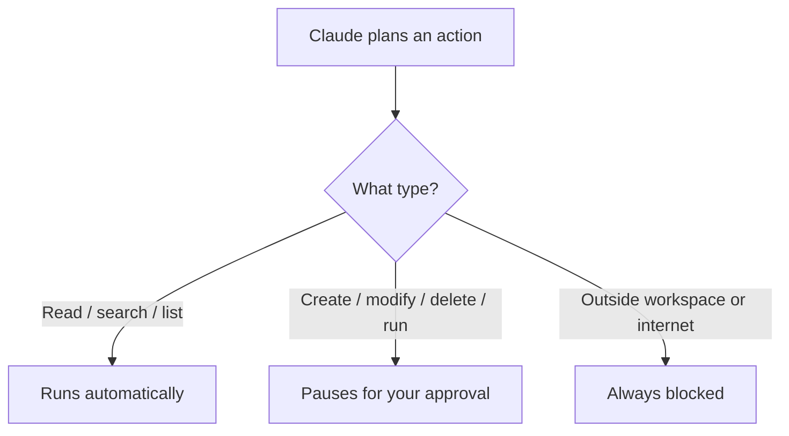
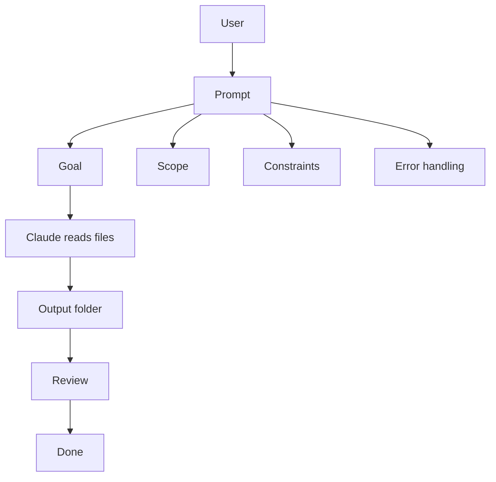
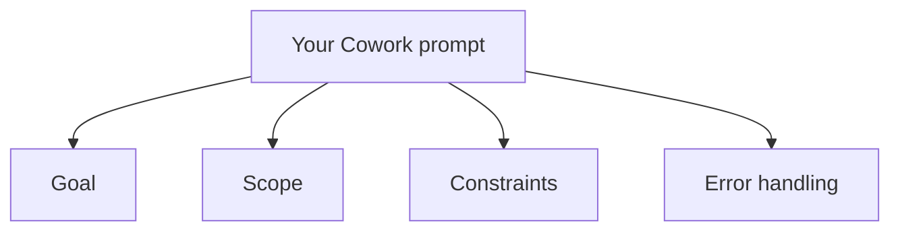
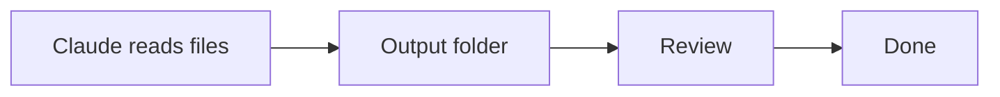

# Brand Voice Rules

This file is the single source of truth for quality rules enforced by the `brand-voice-cowork` skill. Add or update rules here without touching `skill.md`.

---

## Wording

### Rule 1 — No Em Dashes in Prose

Em dashes (`—`, `&mdash;`, or `--` used as one) are banned in body text. Replace them with the closest correct punctuation based on their role in the sentence.

| Em dash role | Replace with |
|---|---|
| Parenthetical aside enclosed by two dashes | `(...)` |
| Clause continuation ("x — so y") | `,` or `;` |
| Explanation / amplification ("x — y") | `:` |
| Simple pause between clauses | `;` |

**Not affected:** em dashes inside module link text (`[01 — Intro]`) or inside code fences — these are intentional and must not be changed.

**Examples:**

```
Before: "They run in your OS shell — outside the LLM entirely — so they are deterministic."
After:  "They run in your OS shell, outside the LLM entirely, so they are deterministic."

Before: "Clients discover tools by querying the schema—giving you full control."
After:  "Clients discover tools by querying the schema, giving you full control."

Before: "A MEMORY.md index acts as a table of contents — it is always loaded into context."
After:  "A MEMORY.md index acts as a table of contents: it is always loaded into context."
```

---

### Rule 2 — Paragraph Length

No paragraph body may exceed 4 sentences. At the 5th sentence, start a new paragraph (blank line before it).

Count only declarative and imperative sentences ending with `.`, `!`, or `?`. Do not count:
- Sentences inside code fences
- Sentences inside blockquotes
- Sentences inside table cells
- List items

When splitting, find the natural break: prefer splitting after a topic shift, not mid-argument. Do not rewrite sentences — only insert the paragraph break.

---

### Rule 3 — Audience Inclusivity: Not Enterprise-Only

Content must not assume every reader works in a large organisation with a dedicated IT department. Phrases like "your IT administrator", "enterprise configuration", and "compliance requirements" are appropriate when directly relevant, but must not be the only framing. Where IT-specific guidance appears, add a `> Note:` callout acknowledging solo users and small teams, and clarify that they can perform the same steps themselves.

**Signs the content is too enterprise-focused:**
- Every permission, configuration, or deployment step is framed as something "IT" does
- Small-team or individual users would feel the content does not apply to them
- No acknowledgement that the defaults work without any configuration

**Fix:** add a `> Note:` at the start of the section, or rephrase the opening sentence to include both audiences before going into IT-specific detail.

**Example:**
```
Before: "IT administrators configure the permission system through configuration files..."
After:  "> Note: Not every team has a dedicated IT department. If you are a solo user or
         work in a small team, you are the administrator. The defaults ship ready to use."
        "IT administrators configure the permission system through configuration files..."
```

---

## Presentation

### Rule 4 — Callout Notes

Use a Markdown blockquote prefixed with `Note:` to surface important tips, caveats, or recommendations that are relevant but secondary to the main prose. The note must be a single blockquote paragraph.

**Format:**
```
> Note: <message>
```

Use when:
- A tip applies to a subset of users or an edge case worth knowing
- An alternative or escape hatch exists that would help users who encounter a limitation
- A best-practice recommendation adds value without being required reading for everyone
- A technical or abstract term needs a plain-language anchor (e.g. connecting "sandbox" to the concrete desktop app action it represents)

**Limit:** no more than 2 to 3 `> Note:` callouts per file. Beyond that, the notes lose their emphasis and the main prose should be rewritten to carry the explanation instead.

**Do not** use for warnings about data loss, security, or permission issues — those belong in the main prose, not a callout.

**Example:**
```
> Note: If your files are in a format not listed above, convert them first using any standard tool, an MCP integration, or a short script. Markdown (.md) is the most efficient format for Claude to read.
```

---

### Rule 5 — Mermaid Node Labels

Inside Mermaid diagrams, `\n` does not render as a newline in node labels. Use `<br/>` instead, and wrap the label in double quotes.

**Pattern to find:** any Mermaid code fence containing `\n` inside `[...]` or `(...)` node syntax.

**Fix:**
```
Before: O[Orchestrator] --> R[Research Agent\nfinds facts]
After:  O[Orchestrator] --> R["Research Agent<br/>finds facts"]
```

Apply to all node styles: `[]`, `()`, `([])`, `[/\]`, `{{}}`.

Do not modify edge labels (`-->|"label"|`) — those do not use `<br/>`.

---

### Rule 6 — Mermaid Diagrams: Placement and Count

Each sub-module readme must include 1 to 3 Mermaid diagrams that visualize a key concept covered in that file. Place each diagram immediately after the section whose concept it illustrates, not at the end of the file. A diagram must add visual understanding that the prose alone does not provide; do not add one that merely repeats what a sentence already says clearly.

All diagrams must comply with Rule 5 (quoted labels, `<br/>` for line breaks inside node labels).

Use `flowchart LR` or `flowchart TD` as the default layout. Only use subgraphs when a containment or boundary relationship is the point the diagram is illustrating.

**Placement example:**
```
## The three categories of action
[prose describing the three categories]



## How approval prompts look
[next section continues here]
```

---

### Rule 7 — Simple Diagrams

Each Mermaid diagram must illustrate one concept using no more than 6 nodes. Do not combine multiple concepts into a single diagram; split them into separate diagrams if needed. Prefer flat, linear, or single-level tree layouts. Avoid nested subgraphs inside subgraphs, complex styling, or many crossing edges.

If a diagram needs more than 6 nodes to make sense, the concept it is illustrating probably belongs in the prose, not a diagram.

**Before (too complex):**


**After (split into two focused diagrams):**



---

### Rule 8 — Slash Command Tables

Every module README contains a "Helpful Claude Slash Commands" table. Commands in that table must be specific to the module's topic. The same generic set (`/update-config`, `/fewer-permission-prompts`, `/find-skills`, `/init`) must not appear unchanged across every module.

**Do not include `/init` unless the module is explicitly about starting a new project or initializing a `CLAUDE.md`.** Modules where `/init` is appropriate: `01-intro`, `07-memory`.

#### Approved command sets by module topic

| Module topic | Preferred commands |
|---|---|
| Harness intro / settings | `/init`, `/update-config`, `/memory`, `/config` |
| Slash commands | `/review`, `/security-review`, `/cost`, `/help` |
| Hooks | `/update-config`, `/fewer-permission-prompts`, `/doctor` |
| MCP | `/update-config`, `/doctor`, `/find-skills` |
| Skills | `/find-skills`, `/update-config`, `/model` |
| Plugins | `/update-config`, `/doctor`, `/find-skills` |
| Memory | `/memory`, `/init`, `/update-config` |
| Checkpoints | `/undo`, `/update-config`, `/clear` |
| Subagents | `/model`, `/cost`, `/find-skills` |

When a module topic is not listed, flag it in the output rather than guessing a command set.

#### Built-in vs custom commands

| Command | Type | Description |
|---|---|---|
| `/help` | built-in | Show available commands and keyboard shortcuts |
| `/clear` | built-in | Clear conversation context |
| `/config` | built-in | Open interactive settings panel |
| `/cost` | built-in | Display token usage and session cost |
| `/doctor` | built-in | Health check on installation, MCP servers, hooks |
| `/memory` | built-in | Open global `CLAUDE.md` for editing |
| `/model` | built-in | Switch active model mid-session |
| `/undo` | built-in | Revert most recent file changes |
| `/vim` | built-in | Toggle vim keybindings |
| `/init` | built-in | Generate `CLAUDE.md` for current project |
| `/review` | custom (global) | Structured code review of the current branch |
| `/security-review` | custom (global) | Security audit of branch changes |
| `/update-config` | custom (project) | Edit `settings.json` via guided prompts |
| `/fewer-permission-prompts` | custom (project) | Scan transcripts and build a tool allowlist |
| `/find-skills` | custom (project) | Discover and install agent skills |

---

### Rule 9 — Practical Example Section

Every sub-module readme must include a practical example section immediately before `## Key Topics Covered in This Module`. This position is fixed; no other section may appear between the practical example and the key topics section.

The section heading uses the fixed prefix `## In Practice:` followed by a colon and a scenario-specific title. The prefix is always exactly `In Practice:` — do not vary it.

**Format:**
```markdown
## In Practice: [scenario-specific title]

[200–400 words of prose, written for information workers, managers, and business owners. No technical jargon. Plain business language throughout.]

[Optional Mermaid diagram if it adds visual clarity beyond what the prose already conveys.]
```

Content rules:
- Write for an audience of information workers, managers, and business owners, not IT professionals or developers
- Use a realistic workplace scenario: a person with a recognizable job title performing a recognizable task
- Show the problem the reader would encounter without the technique, then show the solution
- 200 words minimum, 400 words maximum
- Include a Mermaid diagram only when it makes the process flow clearer than words alone; omit it when the prose is self-contained
- All diagrams must comply with Rules 5 and 7 (quoted labels, `<br/>` for line breaks, max 6 nodes)
- Apply all wording rules: no em dashes, max 4 sentences per paragraph, American English

**Example title forms:**
```
## In Practice: Year-End Report Analysis
## In Practice: A Contract Review Workflow
## In Practice: Weekly Status Updates from a Shared Drive
```

---

### Rule 10 — Key Topics Covered in This Module

Every sub-module readme must end with a `## Key Topics Covered in This Module` section containing 1 to 4 links to official documentation relevant to the module's content. This section must be the last section in the file; no content of any kind may follow it. Each link must be a real URL, written as a Markdown link followed by an em-dash-free description (use ` — ` with a regular hyphen-minus on each side, not an em dash).

**Format:**
```markdown
## Key Topics Covered in This Module

- [Page title](https://url) — one-line description of what the reader will find there
```

Rules for the links:
- 1 link minimum, 4 links maximum
- All URLs must be official documentation (docs.anthropic.com, learn.microsoft.com, official framework docs, etc.); no blog posts or third-party tutorials
- Descriptions must be specific: say what the reader will find, not just what the page is called
- Keep existing links if they are accurate; remove or replace broken or off-topic ones
- Do not include `/create-learning` or `/create-lab` in the link list

**Example:**
```markdown
## Key Topics Covered in This Module

- [Claude Code Skills documentation](https://docs.anthropic.com/en/docs/claude-code/skills) — official reference for skill frontmatter fields and directory layout
- [Claude Code Slash Commands documentation](https://docs.anthropic.com/en/docs/claude-code/slash-commands) — built-in and custom slash command reference
- [Claude Code Settings and Permissions](https://docs.anthropic.com/en/docs/claude-code/settings) — configuring `tools:` allowlists and project-level permissions
```

---

### Rule 11 — No HTML Tables

Markdown files must never contain HTML table elements. Use standard Markdown pipe tables (`|col|col|`) for all tabular content.

Banned elements: `<table>`, `<thead>`, `<tbody>`, `<tr>`, `<td>`, `<th>`, `<col>`, `<colgroup>`.

**Exception:** HTML tables are permitted only when the user explicitly requests them. Without that explicit request, always convert to Markdown syntax.

**Before:**
```html
<table>
  <tr><th>Plan</th><th>Price</th></tr>
  <tr><td>Team</td><td>$30</td></tr>
</table>
```

**After:**
```markdown
| Plan | Price |
|------|-------|
| Team | $30   |
```

---

## Adding New Rules

When a new quality pattern is discovered during editing:
1. Add a numbered rule section under the appropriate topic group (Wording or Presentation).
2. Include a "Before / After" example.
3. Update the skill summary comment in `skill.md` description if the rule type is new.

Do not modify `skill.md` instructions for new rules — the instructions deliberately stay generic ("apply the rules from references/rules.md").
