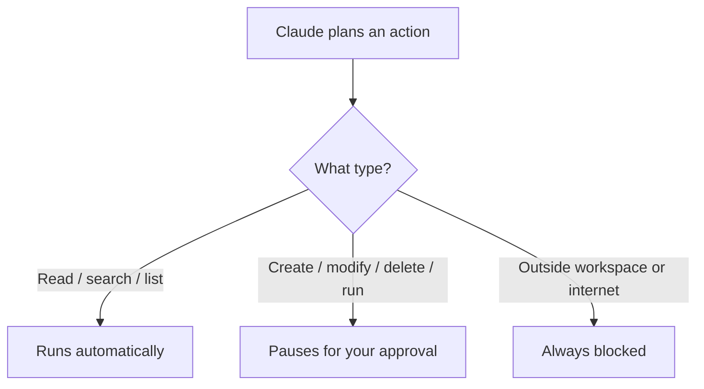
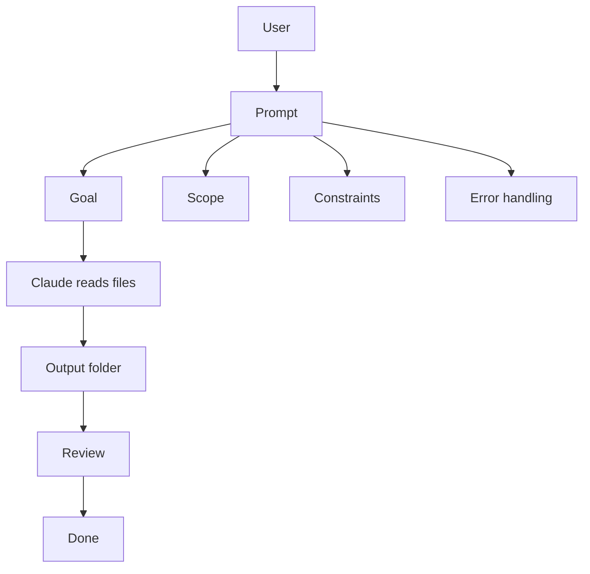
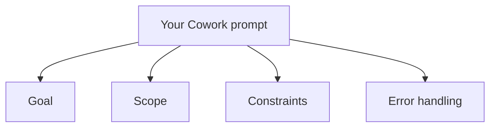
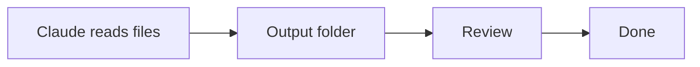

# Brand Voice Rules

This file is the single source of truth for quality rules enforced by the `brand-voice-gh-copilot` skill. Add or update rules here without touching `SKILL.md`.

---

## Wording

### Rule 1 — No Em Dashes in Prose

Em dashes (`—`, `&mdash;`, or `--` used as one) are banned in body text. Replace them with the closest correct punctuation based on their role in the sentence.

| Em dash role | Replace with |
|---|---|
| Parenthetical aside enclosed by two dashes | `(...)` |
| Clause continuation ("x — so y") | `,` or `;` |
| Explanation / amplification ("x — y") | `:` |
| Simple pause between clauses | `;` |

**Not affected:** em dashes inside module link text (`[01 — Intro]`) or inside code fences — these are intentional and must not be changed.

**Examples:**

```
Before: "They run in your OS shell — outside the LLM entirely — so they are deterministic."
After:  "They run in your OS shell, outside the LLM entirely, so they are deterministic."

Before: "Clients discover tools by querying the schema—giving you full control."
After:  "Clients discover tools by querying the schema, giving you full control."

Before: "A MEMORY.md index acts as a table of contents — it is always loaded into context."
After:  "A MEMORY.md index acts as a table of contents: it is always loaded into context."
```

---

### Rule 2 — Paragraph Length

No paragraph body may exceed 4 sentences. At the 5th sentence, start a new paragraph (blank line before it).

Count only declarative and imperative sentences ending with `.`, `!`, or `?`. Do not count:
- Sentences inside code fences
- Sentences inside blockquotes
- Sentences inside table cells
- List items

When splitting, find the natural break: prefer splitting after a topic shift, not mid-argument. Do not rewrite sentences — only insert the paragraph break.

---

### Rule 3 — Audience Inclusivity: Not One Toolchain Only

Content must not assume every reader uses the same IDE, licence tier, or enterprise setup. GitHub Copilot ships across VS Code, Visual Studio, JetBrains IDEs, and GitHub.com, and readers may be on Individual, Business, or Enterprise plans. IDE-specific or plan-specific steps are appropriate when directly relevant, but must not be the only framing. Where a step is specific to one surface, name the surface and add a `> Note:` callout pointing to the equivalent elsewhere when one exists.

**Signs the content is too narrow:**
- Every instruction assumes VS Code (or a single IDE) with no acknowledgement of the others
- A capability gated behind Business/Enterprise is presented as if every reader has it
- No acknowledgement that the defaults work without extra configuration

**Fix:** name the surface a step applies to, or add a `> Note:` calling out the equivalent path on another supported IDE or plan.

**Example:**
```
Before: "Open the Copilot settings panel and enable agent mode."
After:  "> Note: The path below is for VS Code. In Visual Studio and JetBrains IDEs the same
         toggle lives under the Copilot settings for that IDE."
        "In VS Code, open the Copilot settings panel and enable agent mode."
```

---

## Presentation

### Rule 4 — Callout Notes

Use a Markdown blockquote prefixed with `Note:` to surface important tips, caveats, or recommendations that are relevant but secondary to the main prose. The note must be a single blockquote paragraph.

**Format:**
```
> Note: <message>
```

Use when:
- A tip applies to a subset of users or an edge case worth knowing
- An alternative or escape hatch exists that would help users who encounter a limitation
- A best-practice recommendation adds value without being required reading for everyone
- A technical or abstract term needs a plain-language anchor (e.g. connecting "sandbox" to the concrete desktop app action it represents)

**Limit:** no more than 2 to 3 `> Note:` callouts per file. Beyond that, the notes lose their emphasis and the main prose should be rewritten to carry the explanation instead.

**Do not** use for warnings about data loss, security, or permission issues — those belong in the main prose, not a callout.

**Example:**
```
> Note: If your files are in a format not listed above, convert them first using any standard tool, an MCP integration, or a short script. Markdown (.md) is the most efficient format for Claude to read.
```

---

### Rule 5 — Mermaid Node Labels

Inside Mermaid diagrams, `\n` does not render as a newline in node labels. Use `<br/>` instead, and wrap the label in double quotes.

**Pattern to find:** any Mermaid code fence containing `\n` inside `[...]` or `(...)` node syntax.

**Fix:**
```
Before: O[Orchestrator] --> R[Research Agent\nfinds facts]
After:  O[Orchestrator] --> R["Research Agent<br/>finds facts"]
```

Apply to all node styles: `[]`, `()`, `([])`, `[/\]`, `{{}}`.

Do not modify edge labels (`-->|"label"|`) — those do not use `<br/>`.

---

### Rule 6 — Mermaid Diagrams: Placement and Count

Each sub-module readme must include 1 to 3 Mermaid diagrams that visualize a key concept covered in that file. Place each diagram immediately after the section whose concept it illustrates, not at the end of the file. A diagram must add visual understanding that the prose alone does not provide; do not add one that merely repeats what a sentence already says clearly.

All diagrams must comply with Rule 5 (quoted labels, `<br/>` for line breaks inside node labels).

Use `flowchart LR` or `flowchart TD` as the default layout. Only use subgraphs when a containment or boundary relationship is the point the diagram is illustrating.

**Placement example:**
```
## The three categories of action
[prose describing the three categories]



## How approval prompts look
[next section continues here]
```

---

### Rule 7 — Simple Diagrams

Each Mermaid diagram must illustrate one concept using no more than 6 nodes. Do not combine multiple concepts into a single diagram; split them into separate diagrams if needed. Prefer flat, linear, or single-level tree layouts. Avoid nested subgraphs inside subgraphs, complex styling, or many crossing edges.

If a diagram needs more than 6 nodes to make sense, the concept it is illustrating probably belongs in the prose, not a diagram.

**Before (too complex):**


**After (split into two focused diagrams):**



---

### Rule 8 — Slash Command Tables

Module READMEs that surface a GitHub Copilot slash command table must keep the commands specific to the module's topic. The same generic set (`/help`, `/explain`, `/fix`, `/tests`) must not appear unchanged across every module. Where the module is about Copilot Chat itself, prefer the chat participants (`@workspace`, `@terminal`, `@vscode`, `@github`) alongside the slash commands so the reader sees the intent-routing story, not just a flat command list.

**Do not include a project-initialization command (`/new`, or the Claude Code `/init` where Module 3 covers Claude Code) unless the module is explicitly about starting a new project or scaffolding.** Everywhere else, keep task-shaped commands (`/explain`, `/fix`, `/tests`, `/doc`, `/optimize`).

#### Approved command sets by module topic

| Module topic | Preferred commands |
|---|---|
| Fundamentals / getting started (`01-fundamentals`) | `/help`, `/explain`, `@workspace` |
| Slash commands (`01-fundamentals/04-slash-commands`) | `/explain`, `/fix`, `/tests`, `/doc`, `/optimize` |
| Copilot tools (`02-agentic-harness`) | `/explain`, `/fix`, `@workspace`, `@terminal` |
| Agentic coding (`03-agentic-coding`) | `/fix`, `/tests`, `@workspace`, `@github` |
| Claude Code in Module 3 (`03-agentic-coding/05-claude-code`) | `/init`, `/review`, `/help` |
| Advanced topics / CLI (`04-advanced-topics`) | `/explain`, `/fix`, `@terminal` |
| Agentic DevOps (`05-agentic-devops`) | `/fix`, `/tests`, `@github`, `@terminal` |
| Spec-driven development (`06-spec-driven-dev`) | `/new`, `/doc`, `@workspace` |
| Capstone project (`07-capstone-project`) | `/new`, `/tests`, `/fix`, `@workspace` |

When a module topic is not listed, flag it in the output rather than guessing a command set.

#### GitHub Copilot commands and chat participants

| Token | Type | Description |
|---|---|---|
| `/help` | slash command | Get usage help for Copilot Chat |
| `/explain` | slash command | Explain the selected or referenced code |
| `/fix` | slash command | Propose a fix for problems in the selected code |
| `/tests` | slash command | Generate unit tests for the selected code |
| `/doc` | slash command | Add documentation comments for the selected code |
| `/optimize` | slash command | Analyze and propose performance optimizations |
| `/new` | slash command | Scaffold a new project or file from a description |
| `/clear` | slash command | Clear the current chat conversation |
| `@workspace` | chat participant | Answer using the context of the whole workspace |
| `@terminal` | chat participant | Answer about the integrated terminal and shell commands |
| `@vscode` | chat participant | Answer about VS Code features and settings |
| `@github` | chat participant | Answer using GitHub knowledge (repos, issues, PRs) |
| `/init` | Claude Code (Module 3 only) | Generate a `CLAUDE.md` for the current project |
| `/review` | Claude Code (Module 3 only) | Structured code review of the current branch |

---

### Rule 9 — Practical Example Section

A sub-module readme may include a practical example section. When present, place it immediately before the closing `## Links & Resources` section; no other section may appear between them.

The section heading uses the fixed prefix `## In Practice:` followed by a colon and a scenario-specific title. The prefix is always exactly `In Practice:` — do not vary it.

**Format:**
```markdown
## In Practice: [scenario-specific title]

[200–400 words of prose, written for software engineers. Concrete about the tool, the IDE, and the code involved; no marketing filler.]

[Optional Mermaid diagram if it adds visual clarity beyond what the prose already conveys.]
```

Content rules:
- Write for an audience of software engineers using GitHub Copilot, not business owners or non-technical readers
- Use a realistic engineering scenario: a developer with a recognizable task (fixing a failing test, refactoring a service, scaffolding an endpoint)
- Show the friction the reader would hit without the technique, then show how Copilot removes it
- 200 words minimum, 400 words maximum
- Include a Mermaid diagram only when it makes the process flow clearer than words alone; omit it when the prose is self-contained
- All diagrams must comply with Rules 5 and 7 (quoted labels, `<br/>` for line breaks, max 6 nodes)
- Apply all wording rules: no em dashes, max 4 sentences per paragraph, American English

**Example title forms:**
```
## In Practice: Fixing a Failing Test with /fix
## In Practice: Scaffolding a REST Endpoint from a Spec
## In Practice: Refactoring a Service with @workspace Context
```

---

### Rule 10 — Links & Resources

Every sub-module readme must end with a `## Links & Resources` section containing 1 to 4 links to official documentation relevant to the module's content. This section must be the last section in the file; no content of any kind may follow it. Each link must be a real URL, written as a Markdown link followed by an em-dash-free description (use ` - ` with a regular hyphen-minus on each side, not an em dash).

**Format:**
```markdown
## Links & Resources

- [Page title](https://url) - one-line description of what the reader will find there
```

Rules for the links:
- 1 link minimum, 4 links maximum
- All URLs must be official documentation (docs.github.com, learn.microsoft.com, official framework docs, and docs.anthropic.com for the Module 3 Claude Code topic); no blog posts or third-party tutorials
- Descriptions must be specific: say what the reader will find, not just what the page is called
- Keep existing links if they are accurate; remove or replace broken or off-topic ones

**Example:**
```markdown
## Links & Resources

- [GitHub Copilot Chat cheat sheet](https://docs.github.com/en/copilot/using-github-copilot/copilot-chat/github-copilot-chat-cheat-sheet) - slash commands and chat participants reference
- [Asking Copilot questions in your IDE](https://docs.github.com/en/copilot/using-github-copilot/asking-github-copilot-questions-in-your-ide) - how to use slash commands and context in chat
- [GitHub Copilot documentation](https://docs.github.com/en/copilot) - full product documentation and feature reference
```

---

### Rule 11 — No HTML Tables

Markdown files must never contain HTML table elements. Use standard Markdown pipe tables (`|col|col|`) for all tabular content.

Banned elements: `<table>`, `<thead>`, `<tbody>`, `<tr>`, `<td>`, `<th>`, `<col>`, `<colgroup>`.

**Exception:** HTML tables are permitted only when the user explicitly requests them. Without that explicit request, always convert to Markdown syntax.

**Before:**
```html
<table>
  <tr><th>Plan</th><th>Price</th></tr>
  <tr><td>Team</td><td>$30</td></tr>
</table>
```

**After:**
```markdown
| Plan | Price |
|------|-------|
| Team | $30   |
```

---

## Adding New Rules

When a new quality pattern is discovered during editing:
1. Add a numbered rule section under the appropriate topic group (Wording or Presentation).
2. Include a "Before / After" example.
3. Update the skill summary comment in `SKILL.md` description if the rule type is new.

Do not modify `SKILL.md` instructions for new rules — the instructions deliberately stay generic ("apply the rules from references/rules.md").
