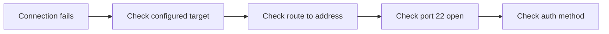

# SSH Ops

Procedures for operating a remote Linux host from an agent session. Read the one reference that matches the task; do not load all three.

| Situation | Reference |
|-----------|-----------|
| Configuring the `ssh-mcp` server, or its handshake is failing | [references/ssh-mcp.md](references/ssh-mcp.md) |
| Authentication is rejected, or you do not know which key the host trusts | [references/keys-and-access.md](references/keys-and-access.md) |
| Running commands, copying files, or deploying a stack on the box | [references/remote-ops.md](references/remote-ops.md) |

## Rules that apply to every remote session

Never place a real host address, username, password, or private key path into a file that is tracked by git. Configuration that must hold a credential is git-ignored, and the repository carries a placeholder example alongside it.

Diagnose before you change anything. A failed connection has four possible causes and they are distinguishable without touching the host: the client configuration points at the wrong target, there is no route to the address, the host is down, or the authentication method is not one the host accepts. Working through them in that order costs a minute; guessing costs a reboot.

Prefer a read-only probe as the first command of any session. Reporting the OS release, disk, and running services proves the transport before a destructive command depends on it.

State the actual command output when reporting a result. A remote operation that says "deployed successfully" without the health check response has not been verified, only claimed.

## Connection order of operations

