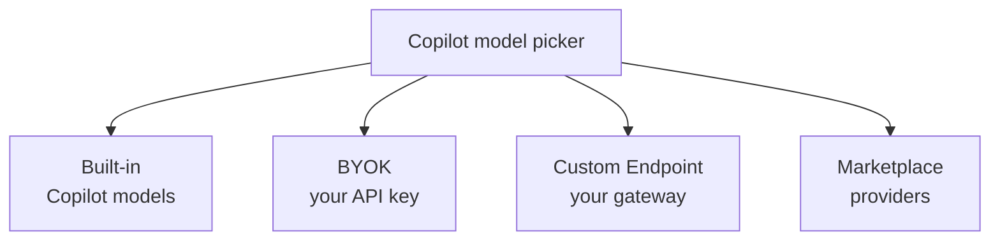
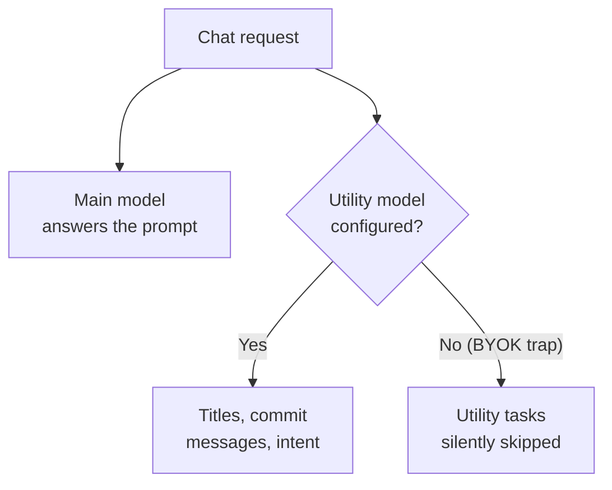

# Selecting Models

GitHub Copilot lets you drive chat and agent sessions with more than one model, and the right choice is a capability decision rather than a brand-name decision. What matters for a given task is the model's context size, its reasoning depth, and its cost per request, not which vendor shipped it. VS Code exposes these tradeoffs directly in the model picker, so you can match a fast, cheap model to routine edits and a deeper model to architectural work. This topic covers how models reach Copilot, how you tune them, and the settings that keep background tasks like commit messages and titles working.

> Note: The paths below describe VS Code. In Visual Studio and JetBrains IDEs the equivalent model controls live under the Copilot settings for that IDE.

## How models reach Copilot

A model can arrive through several provider types, and each type has a different tradeoff between convenience, privacy, and setup effort. Built-in models need only a signed-in Copilot license. Bring your own key (BYOK) and Custom Endpoint providers let you point Copilot at models you host or pay for directly. Additional providers install from the Marketplace like any other extension.

| Provider type | How it connects | When to reach for it |
|---|---|---|
| Built-in Copilot models | Signed-in Copilot license | Default path, no extra configuration |
| BYOK (bring your own key) | Your API key, no GitHub sign-in required | Air-gapped or offline work, direct billing |
| Custom Endpoint | Your endpoint URL and request shape | Self-hosted or proxied models behind your own gateway |
| Marketplace providers | Installed as an extension | Adding a provider Copilot does not ship by default |

## Working offline with BYOK

BYOK lets you configure a model with your own API key and use Copilot chat and agent sessions without signing in to GitHub. This unlocks air-gapped and fully offline workflows where a self-hosted model answers every request and no traffic leaves your network. You supply the key and endpoint, Copilot routes chat and agent traffic to it, and the built-in credit allowance is never touched.

The tradeoff is that only the interactive surfaces work without sign-in. Inline suggestions and Next Edit Suggestions still require a signed-in Copilot license, so a BYOK-only setup gives you chat and agents but not ghost-text completions.

> Note: If you need both inline completions and an offline chat model, sign in for the completions and configure BYOK for the chat and agent model separately.

## Custom Endpoint provider

The Custom Endpoint provider reached Stable in VS Code 1.122 and replaces the legacy OpenAI-compatible provider. It understands three request shapes, so you can front most self-hosted or proxied models without a shim. Pick the shape your endpoint speaks and Copilot formats requests accordingly.

| Request shape | Typical backend |
|---|---|
| `chat-completions` | OpenAI-style chat APIs and compatible gateways |
| `responses` | OpenAI Responses API endpoints |
| `messages` | Anthropic-style messages endpoints |

## Tuning a model with modelOptions

Per-model `modelOptions` let you set sampling parameters like `temperature` and `top_p` for an individual model rather than globally. Lower the temperature for deterministic refactors and code generation, raise it when you want the model to explore alternatives. Because the setting is per model, a deterministic utility model and an exploratory main model can coexist in the same workspace.

## Utility models and the BYOK trap

Copilot runs small background tasks that are separate from your main prompt: generating chat titles, writing commit messages, and detecting intent. These tasks are driven by dedicated utility model settings so they do not consume your strongest, most expensive model.

| Setting | What it drives |
|---|---|
| `chat.utilityModel` | The main utility model for titles, commit messages, and intent detection |
| `chat.utilitySmallModel` | A smaller, cheaper model for the lightest utility tasks |
| `chat.byokUtilityModelDefault` | The default utility model used when your main model is BYOK |

The trap appears when you switch your main model to BYOK without configuring a utility model. Built-in utility defaults do not apply to a BYOK main model, so titles, commit messages, and intent detection silently stop running with no error. Set `chat.byokUtilityModelDefault` (or an explicit `chat.utilityModel`) whenever you go BYOK so the background tasks keep working.

## Context size and reasoning effort

Supported Anthropic and OpenAI models offer 1M-token context windows, enough to hold a large codebase, long conversation history, and detailed instructions at once. A wider window costs more per request, so it is a budget decision as much as a capability one. VS Code surfaces both dials in a unified picker: you choose the context size and the reasoning effort (thinking effort) for a model in the same place. Raise reasoning effort for hard debugging or design work, and keep it low for routine edits to save cost and latency.

## Switching providers between turns

Since VS Code 1.133 the model picker shows Copilot models and Anthropic models in one unified list, and you can switch providers between turns without reconfiguring the session. A turn that needs deep reasoning can run on one provider while the follow-up cleanup runs on a cheaper model from another, inside the same conversation. BYOK models are also available in the Agents window when it runs the Copilot harness (1.129), so a bring-your-own-key model is no longer confined to the sidebar chat.

## Marketplace providers and Ollama

New model providers install from the Marketplace, so adding a provider Copilot does not ship by default is the same one-click flow as installing any extension. The previously built-in Ollama provider is deprecated in favor of the official Ollama extension, which you install from the Marketplace like any other provider. If you relied on the built-in Ollama integration, move to the extension to keep receiving updates.

## Cost in the model picker

The model picker surfaces the cost of each model alongside its name, so the budget impact of your choice is visible at the moment you make it. Because context size and reasoning effort both raise cost, the picker is where model selection becomes a spending decision. Governance, credit accounting, and per-session cost are covered in [Governance: Cost](../../08-governance/02-cost/).

Two readouts make the spend concrete after the fact. Hovering the footer of a chat response shows a per-model breakdown of input, cached input, and output tokens (1.135), which is where you find out whether prompt caching is actually working for you. The status menu shows aggregate credit usage for the current billing cycle on Copilot Business and Enterprise plans (1.130).

## Exercise

1. Open the Command Palette and run `Preferences: Open User Settings (JSON)`.
2. Add a Custom Endpoint or BYOK model by supplying your endpoint URL, the matching request shape (`chat-completions`, `responses`, or `messages`), and your API key.
3. Open the model picker in Copilot Chat and confirm your new model appears with its cost shown beside it.
4. Select the new model, start a chat, and notice that with BYOK you did not need to sign in to GitHub for the chat to work.
5. Set `chat.byokUtilityModelDefault` to a small model, then make a small edit and generate a commit message; confirm the commit message and chat title are produced.
6. Temporarily remove the utility model setting, repeat the commit-message step, and observe that the title and commit message no longer generate. This is the BYOK utility trap.
7. Restore the utility model setting and confirm background tasks resume.
8. Send a chat request, then hover the footer of the response to read the per-model input, cached input, and output token counts.

## Links & Resources

- [Visual Studio Code 1.122 release notes](https://code.visualstudio.com/updates/v1_122) - Custom Endpoint provider reaching Stable and the request shapes it supports
- [Visual Studio Code 1.129 release notes](https://code.visualstudio.com/updates/v1_129) - BYOK models in the Agents window with the Copilot harness
- [Visual Studio Code 1.130 release notes](https://code.visualstudio.com/updates/v1_130) - aggregate credit usage in the status menu
- [Visual Studio Code 1.133 release notes](https://code.visualstudio.com/updates/v1_133) - switching providers between turns and the unified model picker
- [Visual Studio Code 1.135 release notes](https://code.visualstudio.com/updates/v1_135) - detailed per-model token usage on the response footer
- [Language models in VS Code](https://code.visualstudio.com/docs/copilot/language-models) - configuring BYOK, custom endpoints, and per-model options
- [Changing the AI model for Copilot Chat](https://docs.github.com/en/copilot/using-github-copilot/ai-models/changing-the-ai-model-for-copilot-chat) - selecting and comparing models across supported IDEs
