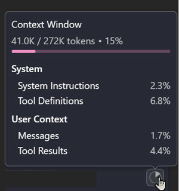
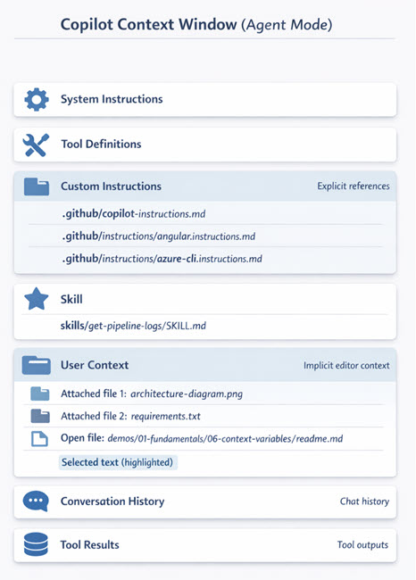

# Context Window Optimization & Prompt Caching

Context engineering is the practice of deliberately designing what information GitHub Copilot receives. When you understand what fills the context window and compose it on purpose, first drafts fit your style and stack, and you spend fewer cycles correcting guesses about your conventions.

Context Window indicator showing token usage:

## What Fills Your Context Window

Each model has a fixed context window, and several layers compete for it. System instructions and tool definitions (provided by GitHub Copilot) form the base. Custom instructions, skills, and conversation history consume additional tokens. User context (attached files, open files, selections, references) uses the remaining budget for the problem at hand.

GitHub Copilot Agent Mode Context Window showing all component layers:

## Prompt Caching and Cached Requests

Many of the models behind GitHub Copilot cache the stable prefix of a request. The system instructions, tool definitions, custom instructions, and large attached files that lead your context are processed once and reused on the next turn, so a repeated prefix costs less and returns faster. This turns context engineering from a one-time composition into a decision about ordering.

Keep the cacheable part stable and up front, and let the volatile part (your latest question, the current selection) come last. Editing or reordering early context invalidates the cache, so a small change near the top forces the whole prefix to be reprocessed. Cached tokens are billed at a lower rate, which ties directly to the cost model in the [Governance module](../../08-governance/02-cost-byok/).

## Strategies for Effective Context Engineering

Attach project instructions so Copilot knows your naming conventions, preferred libraries, and architectural patterns. Reference the relevant source files instead of attaching everything, so the tokens go to what helps with this specific task.

> ProTip: Summarize your context in a feature-xxx.md file, start a new conversation, and attach that file to continue with a fresh context window that holds only the relevant information.

## Links & Resources

- [Context Engineering Guide](https://code.visualstudio.com/docs/copilot/guides/context-engineering-guide)

[← Previous: Selecting Models](../02-models/readme.md) | [Back to Fundamentals](../readme.md) | [Next: AI-Assisted Coding Essentials →](../04-ai-assisted-coding/readme.md)
