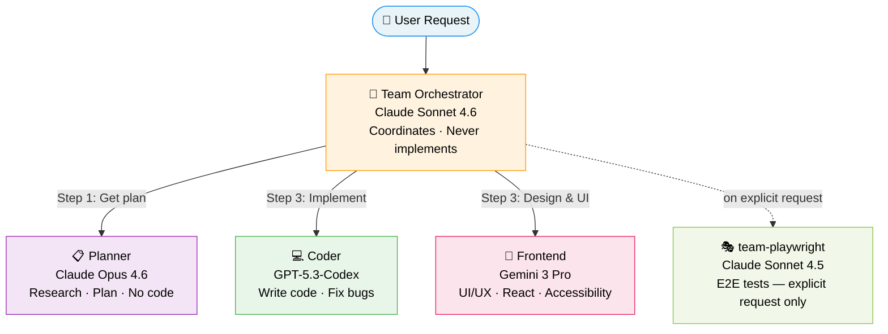
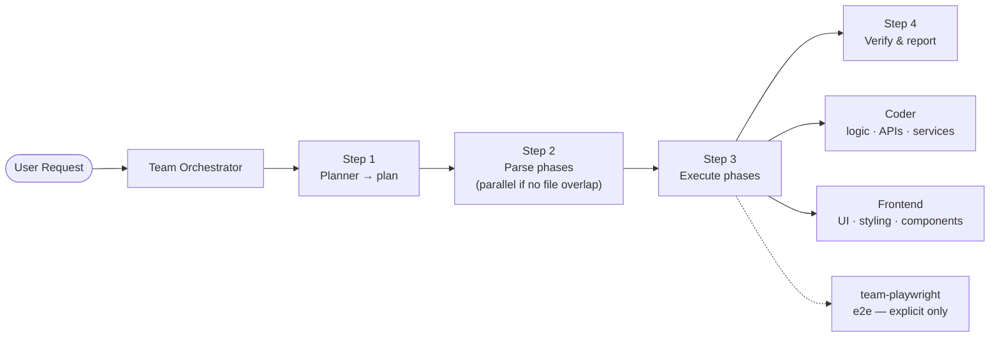

# Agentic Team

## Team Structure

## Workflow

## Agents

| Agent | Model | Role | Tools |
|---|---|---|---|
| **Team Orchestrator** | Claude Sonnet 4.6 | Breaks down tasks, delegates, never implements | `read`, `agent`, `memory` |
| **Planner** | Claude Opus 4.6 | Research, plan implementation steps, no code | `read`, `search`, `web`, `microsoft-learn/*` |
| **Coder** | GPT-5.3-Codex | Write code, fix bugs, implement features | `edit`, `execute`, `search`, `vscode` |
| **Frontend** | Gemini 3 Pro | UI/UX design, React components, accessibility | `edit`, `figma/*`, `context7/*`, `chrome-devtools/*` |
| **team-playwright** | Claude Sonnet 4.5 | E2E tests — only on explicit request | `execute`, `playwright/*` |
