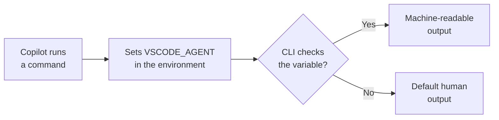

# Working in the Terminal

Agents interact with your shell differently from humans, and two features make that interaction efficient. The `VSCODE_AGENT` environment variable lets command-line tools detect when they are invoked by an agent and switch to machine-readable output. Terminal output compression condenses the verbose output of test runners, build tools, linters, Docker, and package managers so it fits the model's context without losing the signal.

## The VSCODE_AGENT environment variable

When Copilot runs a command on your behalf, it sets `VSCODE_AGENT` in the environment of that command. A CLI that checks for the variable can tell it is talking to an agent rather than a person at a keyboard, and adapt its output. Instead of colored, animated, human-friendly output, the tool can emit stable, parseable text: JSON, plain lines, or a machine format the model reads reliably. Many modern CLIs already branch on similar signals, and `VSCODE_AGENT` gives them a Copilot-specific hook.

The practical payoff is fewer parsing mistakes. Progress spinners, ANSI color codes, and interactive prompts are noise to a model, and they can push it toward wrong conclusions about whether a command succeeded. Machine-readable output removes that ambiguity, so the agent reasons over facts rather than decorated terminal chrome.

## Terminal output compression

Some commands produce far more output than a model needs. A full test run, a clean build, or a large dependency install can emit thousands of lines, most of which repeat the same signal. Terminal output compression condenses this verbose output before it enters the context window, keeping the parts that carry meaning and dropping the padding.

Compression is tuned for the tools that most often flood the terminal. The goal is to preserve failures, warnings, and summary lines while collapsing progress bars, repeated success lines, and download chatter.

| Target | Verbose output | What compression keeps |
|---|---|---|
| Test runners | Per-test pass lines, timing noise | Failures, error messages, the final summary |
| Build tools | Per-file compile logs | Errors, warnings, the build result |
| Linters | One line per checked file | Rule violations and their locations |
| Docker | Layer pull and build progress | Final image status and any failed step |
| Package managers | Download and resolution chatter | Installed versions and resolution errors |

Compression keeps the terminal readable for the agent without you having to add flags or redirect output. The model sees a tight summary, spends fewer tokens on boilerplate, and reaches the real signal faster.

## Exercise

1. Open a workspace with a test suite and start a Copilot agent session.
2. Ask the agent to run the test suite, then open the terminal it used and compare what the agent received against the raw scrollback.
3. Note how failures and the summary survive while repeated pass lines and progress output are condensed.
4. In your own terminal, run `echo $VSCODE_AGENT` (or `echo %VSCODE_AGENT%` on Windows cmd) and confirm it is empty, since you are a human, not an agent.
5. Run a build or install command yourself and watch the full, colored, human output.
6. Ask the agent to run the same command and observe that its view is shorter and free of animation, because the tool can detect the agent context and compression trims the rest.

## Links & Resources

- [Agent mode in VS Code](https://code.visualstudio.com/docs/copilot/chat/copilot-chat-agent-mode) - how Copilot runs terminal commands during an agent session
- [Visual Studio Code release notes](https://code.visualstudio.com/updates) - agent terminal integration and output handling across versions 1.119 to 1.128
