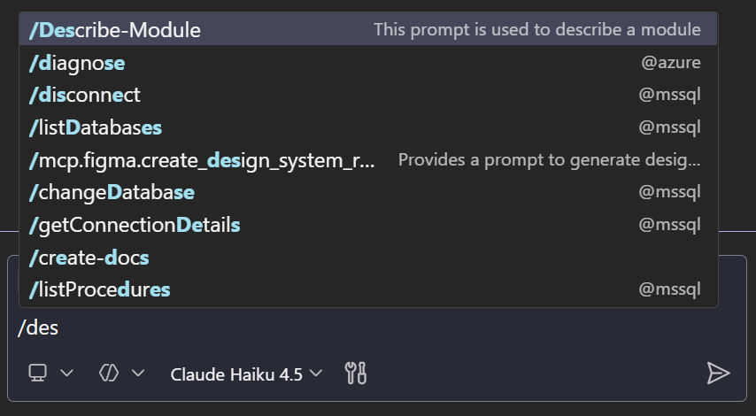
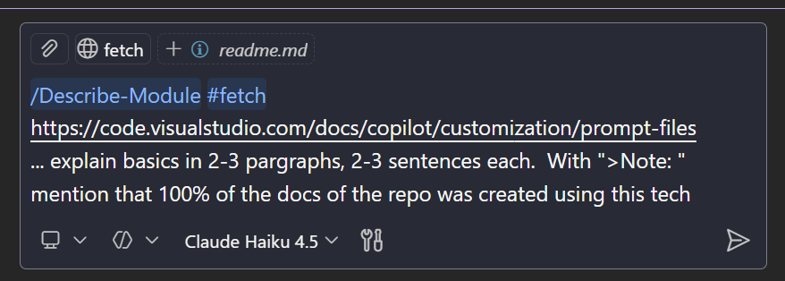

# Reusable Prompt Workflows

## What Are Prompt Files?

Prompt files are Markdown documents (`.prompt.md` extension) that define reusable, on-demand prompts for common development tasks like generating code, performing code reviews, documenting modules, or scaffolding project components. They live in your workspace under [.github/prompts/](/.github/prompts/) or in your user profile, making them available whenever you need to run a standardized workflow. Unlike custom instructions that apply to all requests, prompt files are triggered explicitly by typing `/` followed by the prompt name in the chat input.

Prompt files combine structured metadata with task-specific instructions, allowing you to encapsulate complex guidelines and ensure consistent execution across your team. You can configure them with specific agents, tools, models, and even reference other files in your workspace. This makes them powerful for creating a library of standardized development workflows that scale across your entire organization.

## Enable Prompt Files

Ensure Copilot Chat is enabled and prompt discovery is active:

```json
{
  "chat.agent.enabled": true,
  "chat.detectParticipant.enabled": true,
  "github.copilot.chat.customAgents.showOrganizationAndEnterpriseAgents": true
}
```



> **Note:** 100% of the documentation in this repository was created using prompt files. They enable consistent, high-quality documentation across demos, modules, and infrastructure code without manual effort.



## Reusable Prompt Workflows in This Repository

| Prompt Name                                                                | Description                                                                                                                                                                                                |
| -------------------------------------------------------------------------- | ---------------------------------------------------------------------------------------------------------------------------------------------------------------------------------------------------------- |
| [Describe Module](/.github/prompts/describe-module.prompt.md)              | Enhances markdown documentation by analyzing folder contents and rewriting descriptions with consistent tone and technical details. Used throughout the repo to document modules, labs, and features.      |
| [C# XUnit](/.github/prompts/csharp-xunit.prompt.md)                        | Provides XUnit testing best practices for C# projects, including test structure, data-driven testing, and assertions. Covers test naming conventions, fixtures, and both standard and theory-based tests.  |
| [Scaffold App](/.github/prompts/scaffold-app.prompt.md)                    | Scaffolds new ASP.NET Core API projects with custom structure and conventions. Removes boilerplate, applies coding standards, adds custom controllers, and validates the application with browser testing. |
| [Summarize Conversation](/.github/prompts/sumarize-copilot-conv.prompt.md) | Summarizes a GitHub Copilot chat session into markdown format for continuity and reference. Captures context window, user prompts, assistant responses, and all tool usage with outcomes.                  |

## Migrating Prompt Files to Skills

Prompt files are a VS Code format; agent skills are the cross-harness one. Since VS Code 1.129 you can convert a `*.prompt.md` file into a skill so the same workflow also runs under the Copilot CLI and the coding agent instead of only in the editor. Turn the conversion offer on with `chat.customizations.promptMigration.enabled`, then let VS Code migrate the prompt files it finds in your workspace.

Migrate the workflows your team and your CI agents should share, and keep as prompt files the ones that are genuinely editor-bound. [Agent Skills](../04-skills/) covers the target format and how skills load on demand.

## Topics

| Demo                                                             | Description                                                           |
| ---------------------------------------------------------------- | --------------------------------------------------------------------- |
| **[Transform & Enhance a Module README](./01-transform-readme/)** | Transform and enhance markdown documentation for repository modules.  |
| **[Create Unit Tests with XUnit](./02-create-test/)**            | Generate comprehensive unit tests using XUnit testing best practices. |

## Links & Resources

- [VS Code 1.129 release notes](https://code.visualstudio.com/updates/v1_129) - prompt file to skill migration and `chat.customizations.promptMigration.enabled`
- [VS Code Prompt Files Documentation](https://code.visualstudio.com/docs/copilot/customization/prompt-files)
- [Awesome Copilot - Community Contributions](https://github.com/github/awesome-copilot)
