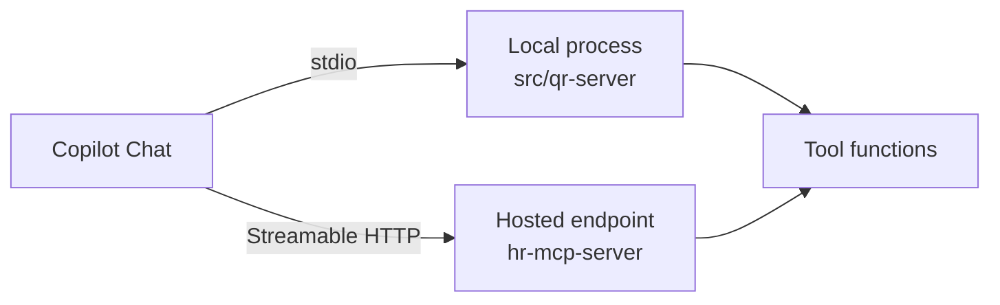
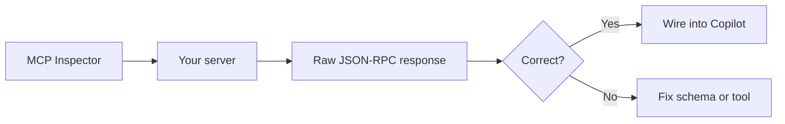

# Implementing MCP Servers

Building on the protocol basics in [MCP Basics & the MCP Registry](../01-basics/), this topic moves from consuming MCP servers to writing them. Consuming means wiring an existing server into a workspace and calling its tools from chat; implementing means exposing your own functions over the protocol so Copilot can reach them. This repository ships three working servers under [/src](/src/) so you can read real code instead of a spec.

The servers are deliberately different in shape. One is Python, one is the same tool rewritten in C#, and one is a stateful line-of-business server backed by a database. Together they cover the decisions you face every time you build one: language and SDK, transport, state, and how you debug the thing before a client ever sees it.

## The reference servers in `src/`

| Server | Stack | Transport | What it teaches |
|--------|-------|-----------|-----------------|
| [qr-server](/src/qr-server/) | Python, `FastMCP` from the `mcp` SDK | stdio and Streamable HTTP | The smallest useful server: one decorator turns a function into a tool |
| [qr-server-cs](/src/qr-server-cs/) | C# / .NET, `ModelContextProtocol` SDK | stdio and Streamable HTTP | The same tool contract expressed with attributes instead of decorators |
| [hr-mcp-server](/src/hr-mcp-server/) | C# / .NET, EF Core, SQLite | Streamable HTTP | A stateful server with dependency injection, five CRUD tools, and seeded data |

Read them in that order. The QR pair isolates the protocol mechanics by keeping the business logic trivial, and the HR server then shows what changes when real data and a service layer arrive.

## Anatomy of a Python server

[src/qr-server/server.py](/src/qr-server/server.py) is the shortest path from a Python function to a Copilot tool. You create a `FastMCP` instance, decorate a function with `@mcp.tool()`, and the SDK derives the tool schema from the signature and the docstring. Parameter names, type hints, and defaults become the JSON schema the client sees; the docstring becomes the description the model reads when deciding whether to call it.

```python
from mcp.server.fastmcp import FastMCP

mcp = FastMCP("QR Code Server", stateless_http=True)

@mcp.tool()
def generate_qr(text: str, box_size: int = 5, error_correction: str = "M"):
    """Generate a QR code from text or URL.

    Args:
        text: URL or text to encode
        box_size: Size of each box in pixels (default: 5, range: 1-20)
        error_correction: Error correction level - L(7%), M(15%), Q(25%), H(30%)
    """
```

This is the single most important habit to form: the docstring is not documentation, it is prompt. A vague description produces a tool the model never calls, or calls with the wrong arguments. Write it as instructions to a colleague who cannot see your code, and state units, ranges, and defaults explicitly.

## Choosing a transport

The same server file supports both transports, selected by a command-line flag. `stdio` runs the server as a child process of the client and speaks JSON-RPC over standard input and output; it needs no ports, no CORS, and no authentication, which makes it the right default for a local developer tool. Streamable HTTP exposes an endpoint over the network, which is what you need when the server is shared, containerized, or deployed.

```python
if __name__ == "__main__":
    if "--stdio" in sys.argv:
        mcp.run(transport="stdio")
    else:
        app = mcp.streamable_http_app()
        uvicorn.run(app, host=HOST, port=PORT)
```



> Note: Supporting both from one file costs about ten lines and pays for itself. You develop and debug over stdio, then deploy the identical tool code behind HTTP without touching a single tool function.

## The same contract in C#

[src/qr-server-cs](/src/qr-server-cs/) implements the identical `generate_qr` tool on .NET, which makes the SDK differences easy to see side by side. Python infers the schema from type hints and the docstring; C# declares it with attributes. A class carries `[McpServerToolType]`, each method carries `[McpServerTool]`, and every parameter carries a `[Description]` that plays exactly the role the Python docstring played.

```csharp
[McpServerToolType]
internal class QrTools
{
    [McpServerTool(Name = "generate_qr")]
    [Description("Generate a QR code PNG image from text or URL. Returns a base64-encoded PNG image.")]
    public static IEnumerable<ImageContentBlock> GenerateQr(
        [Description("Text or URL to encode in the QR code")] string text,
        [Description("Size in pixels of each QR module (box). Default: 5")] int box_size = 5)
}
```

Registration happens once in `Program.cs`. `AddMcpServer()` adds the server services, `WithHttpTransport()` or `WithStdioServerTransport()` picks the transport, and `WithToolsFromAssembly()` scans the assembly for every `[McpServerToolType]` so you never maintain a registration list by hand.

```csharp
builder.Services.AddMcpServer()
    .WithHttpTransport()
    .WithToolsFromAssembly();

var app = builder.Build();
app.MapMcp();
```

## Adding state: the HR server

[src/hr-mcp-server](/src/hr-mcp-server/) is the step from a pure function to a real system. Its tools do not compute an answer, they read and write an employee table through EF Core against a local SQLite file, so the server needs a `DbContext`, a service layer, and seeding on startup. The five tools are `list_employees`, `add_employee`, `update_employee`, `remove_employee`, and `search_employees`.

Two design points carry over to any stateful server you write. First, tools are constructor-injected like any other service, so `HRTools` takes an `IEmployeeService` and an `ILogger` and stays free of data-access code. Second, tools return typed objects rather than hand-built strings, and the SDK serializes them, which keeps the response shape stable for the model.

```csharp
[McpServerToolType]
internal class HRTools
{
    public HRTools(IEmployeeService employeeService, ILogger<HRTools> logger) { }

    [McpServerTool]
    [Description("Provides the whole list of employees")]
    public async Task<EmployeeCollection> ListEmployees() { }
}
```

Because it speaks Streamable HTTP, this server can run locally on port 47002 or behind any hosted endpoint. The same client configuration works against either one; only the URL changes. The database is created and seeded on first run, so `dotnet run` is the whole setup.

## Wiring your server into the workspace

A server nobody registered is invisible. Workspace-level servers go in [.vscode/mcp.json](/.vscode/mcp.json), which is how the QR server in this repository reaches Copilot Chat. The `qr-code` entry uses `uv run` so the inline dependency block at the top of `server.py` installs itself on first launch, with no virtual environment to manage.

```json
{
  "servers": {
    "qr-code": {
      "type": "stdio",
      "command": "uv",
      "args": ["run", "src/qr-server/server.py", "--stdio"]
    },
    "hr-mcp": {
      "type": "http",
      "url": "http://localhost:47002"
    }
  }
}
```

> Note: The path above is for VS Code. Visual Studio and JetBrains IDEs read the same server definitions from their own Copilot MCP configuration, and GitHub.com resolves MCP servers through the repository's Copilot settings rather than a workspace file.

## Debugging with MCP Inspector

Do not debug a new server through Copilot Chat. Chat adds a model between you and the protocol, so a tool that never fires could be a broken server, a bad schema, or simply a model that decided not to call it. MCP Inspector removes that ambiguity: it is the official client that connects straight to your server and lets you list and invoke tools by hand.



Launch it against a stdio server by passing the exact command the client would run:

```powershell
npx @modelcontextprotocol/inspector uv run src/qr-server/server.py --stdio
```

For an HTTP server, point the inspector at a config file instead. Both C# servers ship one: [src/hr-mcp-server/inspector.config.json](/src/hr-mcp-server/inspector.config.json) defines a local `hr-mcp` entry and a remote `hr-mcp-azure-dev` entry, and `--server` selects which one to connect to.

```powershell
npx @modelcontextprotocol/inspector --config inspector.config.json --server hr-mcp
```

The command prints a URL carrying a session token; open it to get the inspector UI. Connect, then work the tabs in order: Tools lists what the server advertises and lets you fill in arguments and hit Run, Resources shows anything exposed by URI (the QR server publishes its view HTML there), and Notifications streams the server's log messages. Three checks catch most defects before a client is involved.

| Check | What a failure means |
|-------|----------------------|
| Every tool appears in the Tools list with the name you expect | Registration or assembly scanning is not finding your tool type |
| Each parameter shows the right type, default, and description | Your type hints or `[Description]` attributes are incomplete, so the model will guess |
| A manual Run returns the content type you designed | The tool works but the response shape is wrong, which reads as a broken tool in chat |

## Hands-On Demo: Inspect and call the QR server

1. Open a terminal in the repository root.
2. Run `npx @modelcontextprotocol/inspector uv run src/qr-server/server.py --stdio` and open the printed URL.
3. Click Connect, then open the Tools tab and click List Tools. Expected result: `generate_qr` appears with six parameters and their defaults.
4. Select `generate_qr`, set `text` to `https://www.integrations.at`, and click Run. Expected result: a base64 PNG image block comes back in the result pane.
5. Open the Resources tab and read `ui://qr-server/view.html`. Expected result: the embedded HTML that renders the code in a client supporting MCP apps.
6. Switch to Copilot Chat in Agent mode and ask: `Generate a QR code for https://www.integrations.at`. Expected result: the same tool call, now chosen by the model.

## Exercise: Add a tool and prove it works

Extend [src/qr-server/server.py](/src/qr-server/server.py) with a second tool, `decode_qr`, that accepts a base64 PNG and returns the text it encodes.

1. Write the function and decorate it with `@mcp.tool()`. Give it a docstring that names the expected encoding and what it returns on an unreadable image.
2. Add the decoding dependency to the inline script block at the top of the file and to `requirements.txt`.
3. Reconnect MCP Inspector and confirm the tool appears with the correct schema. Expected result: two tools listed, `generate_qr` and `decode_qr`.
4. Run `generate_qr`, copy the base64 from the result, and feed it into `decode_qr`. Expected result: the original URL comes back.
5. Restart the server from VS Code and ask Copilot Chat to round-trip a URL through both tools. Expected result: two tool invocations in the chat trace, not one.

If the model refuses to call the new tool, the docstring is the first suspect, not the code.

## Helpful Copilot Slash Commands

| Command | Usage |
|---------|-------|
| `/explain` | Explain how `WithToolsFromAssembly` discovers tool types, or how `FastMCP` derives a schema from a signature |
| `/fix` | Repair a tool whose schema the inspector rejects, or a transport that fails to start |
| `@workspace` | Ask which servers this repository registers and where their tool definitions live |
| `@terminal` | Get the exact inspector or `dotnet run` invocation for the server you are debugging |

## In Practice: Turning an internal API into a Copilot tool

Your team owns an employee directory behind a REST API. Every developer who needs headcount data for a report writes the same throwaway `curl` and pastes JSON into chat, and half the time the shape is wrong because the endpoint changed. You want Copilot to query it directly, in every workspace, without anyone learning the API.

The HR server in this repository is that pattern in full. You start with a service that already knows how to talk to your data (`IEmployeeService`), add a class marked `[McpServerToolType]`, and expose one method per operation a colleague would actually ask for. `search_employees` exists because "who on the team speaks French" is a question people ask; a generic `run_query` tool would have pushed that work back onto the model and produced wrong answers confidently.

Before wiring it into anyone's editor, you run MCP Inspector against the local endpoint and click through all five tools. This is where the cheap defects surface: a parameter described as "email" that is really "email or employee id", a list tool that returns an empty array instead of a message when the database is not seeded, a description too thin for the model to tell `update_employee` from `add_employee`. Fixing those in the inspector takes minutes, while finding them through chat takes an afternoon of ambiguous non-calls.

Then you deploy it to App Service, change one URL in `mcp.json`, and the team asks questions in English instead of writing `curl`. The API did not change. You added a description layer the model can read.

## Links & Resources

- [Model Context Protocol documentation](https://modelcontextprotocol.io/) - the specification, transports, and SDK guides for building servers
- [MCP Inspector](https://github.com/modelcontextprotocol/inspector) - the official visual testing tool, its CLI flags, and config file format
- [Use MCP servers in VS Code](https://code.visualstudio.com/docs/copilot/customization/mcp-servers) - registering servers in `mcp.json` and calling their tools from agent mode
- [Extending Copilot Chat with MCP](https://docs.github.com/en/copilot/how-tos/context/use-mcp/extend-copilot-chat-with-mcp) - how Copilot discovers and permissions MCP servers across surfaces
