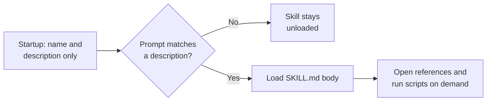
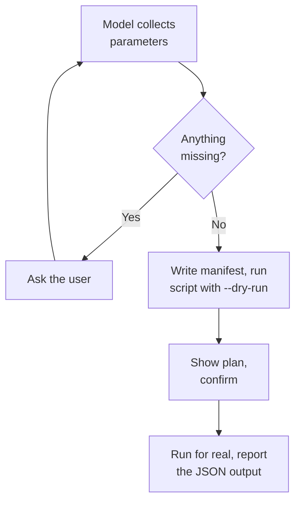

# Reusable Domain Knowledge with Skills

Instructions files shape how Copilot writes code, and prompt files package a request you fire on demand. Neither carries a procedure: the ordered, fiddly, project-specific sequence that a colleague would walk you through the first time and that you would otherwise re-explain in every chat. Agent Skills are that missing layer, packaged as a folder you commit next to the code it describes.

A skill is a directory containing a `SKILL.md` file and, optionally, the scripts, references, and templates it needs. Copilot reads only the skill's name and description at startup, then pulls the rest in when your request matches. That single design choice is why you can install forty skills without paying forty skills' worth of context on every turn.

Skills follow the [Agent Skills](https://agentskills.io/) open standard, originally released by Anthropic and now implemented by GitHub Copilot, Claude Code, Cursor, Gemini CLI, and dozens of other clients. A skill written for this repository works unchanged in the GitHub Copilot CLI, the Copilot coding agent, Copilot code review, and agent mode in VS Code and JetBrains IDEs.

## Anatomy of a Skill

The layout is a convention, not a schema. Only `SKILL.md` is required; the subdirectories exist so the agent can guess what it is looking at.

```text
qr-batch/
├── SKILL.md          # Required: frontmatter + instructions
├── scripts/          # Optional: executable code the agent runs
├── references/       # Optional: detail loaded on demand
├── evals/            # Optional: test cases for the skill itself
└── assets/           # Optional: templates, images, lookup data
```

Progressive disclosure happens in three levels, and each has a budget worth memorizing.

| Level | What loads | When | Budget |
|-------|------------|------|--------|
| Metadata | `name` and `description` only | At startup, for every installed skill | About 100 tokens |
| Instructions | The full `SKILL.md` body | When a request matches the description | Under 500 lines and 5000 tokens |
| Resources | Files under `scripts/`, `references/`, `assets/` | Only when the body tells the agent to open them | No fixed limit |



## The Frontmatter Contract

The YAML block at the top of `SKILL.md` is the only part of a skill that is standardized. Two fields are required and four are optional, and the constraints are enforced, not advisory.

| Field | Required | Constraint |
|-------|----------|------------|
| `name` | Yes | 1 to 64 characters, lowercase letters, digits, and hyphens. No leading, trailing, or doubled hyphens. Must match the folder name. |
| `description` | Yes | 1 to 1024 characters. States what the skill does and when to use it. |
| `license` | No | A license name, or the name of a bundled license file. |
| `compatibility` | No | Up to 500 characters naming environment requirements such as required packages or network access. |
| `metadata` | No | A free map of string keys to string values for anything the spec does not define. |
| `allowed-tools` | No | A space-separated list of pre-approved tools, for example `Bash(git:*) Read`. Experimental, and support varies by client. |

The `description` does more work than any other line in the file. It is the only text the model sees before deciding whether to load the skill, so it has to name the user's intent, not the implementation. Write it in imperative form, list the situations that apply, and include the cases where the user would not name the domain at all.

```yaml
---
name: qr-batch
description: Render a batch of QR code PNG files from a list of URLs, one image per link, with a shared size and error-correction setting. Use when the user needs QR codes for conference badges, printed handouts, product labels, stickers, or a set of campaign links, even if they do not say "QR" and only describe wanting scannable images for a list of URLs.
license: MIT
compatibility: Requires uv (or pipx) to run the bundled Python script
metadata:
  author: integrations.at
  version: "1.0"
---
```

> Note: `description: Helps with QR codes.` is the most common defect in a skill that "does not work". The instructions were fine; the model never got far enough to read them.

VS Code adds four fields on top of the standard, and they take effect only there. `user-invocable` (default `true`) controls whether the skill appears as a slash command, `disable-model-invocation` (default `false`) turns off automatic loading so the skill runs only when you type it, `argument-hint` supplies the placeholder text in the chat box, and the experimental `context: fork` runs the skill in its own subagent context instead of inline.

## Two Kinds of Skills

The spec allows both, and choosing wrongly is the most expensive mistake in this topic. An orchestration skill is instructions only: the model reads the procedure and does the work, applying judgement at every step. A deterministic skill inverts that: the model's only job is to collect parameters from the conversation and hand them to a script, which produces the output the same way every time.

| | Orchestration skill | Deterministic skill |
|---|---|---|
| What `SKILL.md` holds | The procedure, conventions, gotchas | The parameter list and the command to run |
| Who produces the output | The model | A bundled script under `scripts/` |
| Varies between runs | Yes, by design | No |
| Fails by | Wrong judgement, missed edge case | Bad parameters, missing runtime |
| Right when | The task needs taste, context, or code the model writes anyway | The output must be exact, or the model cannot produce it at all |

[.github/skills/dotnet-conventions](/.github/skills/dotnet-conventions/) is orchestration in this repository: it routes a .NET request to the one reference file that matches, and then the model writes the code. Nothing about that is reproducible, and nothing about it should be.

The deterministic case is the one people skip. If the answer must be identical every run, or the model physically cannot generate it (a PNG, a signed archive, a valid PPTX), then instructions are the wrong tool no matter how carefully you write them. Bundle a script, and the skill becomes a parameter-collection prompt wrapped around tested code.



## A Deterministic Skill End to End

[.github/skills/qr-batch](/.github/skills/qr-batch/) is the pattern in full, and it is deliberately a task the model cannot fake. A QR code either scans or it does not, and no amount of prose gets a language model to emit a correct module matrix. The skill therefore contains no image logic at all: it collects four parameters and calls [scripts/generate_qr_batch.py](/.github/skills/qr-batch/scripts/generate_qr_batch.py).

The body of `SKILL.md` is a parameter table plus a five-step workflow. Only two parameters are required, and the other two carry defaults with the reason attached, so the model knows when to override them rather than when to ask.

```markdown
1. Collect four parameters from the conversation. Ask only for what is missing.

   | Parameter | Required | Default | Notes |
   |-----------|----------|---------|-------|
   | Links | Yes | none | One `slug` and one `url` per code. |
   | Output directory | Yes | none | Where the PNG files land. |
   | Box size | No | `10` | Print needs 12 or more, screen is fine at 6. |
   | Error correction | No | `M` | Use `H` when printed on fabric or overprinted with a logo. |
```

The script is self-contained. A [PEP 723](https://peps.python.org/pep-0723/) block declares its own dependencies inline, so `uv run` builds an isolated environment on first launch and there is no virtual environment or `requirements.txt` to maintain.

```python
# /// script
# requires-python = ">=3.11"
# dependencies = [
#   "qrcode[pil]>=8.0",
# ]
# ///
```

Four design rules make a script usable by an agent rather than only by a human. Accept every input as a flag, because agents run in non-interactive shells and a script that waits on a TTY prompt hangs forever. Document the interface in `--help`, since that output is how the model learns to call you.

The last two are about what comes back. Print structured JSON to stdout and diagnostics to stderr, so the agent can parse the result without reading around your progress messages. Offer `--dry-run` as well, so a destructive step can be previewed before it commits.

```bash
uv run scripts/generate_qr_batch.py --manifest links.json --out-dir out --dry-run
```

```json
{
  "count": 2,
  "dry_run": true,
  "files": [
    { "slug": "class-repo", "url": "https://github.com/alexander-kastil/agentic-sw-engineering", "path": "out/class-repo.png" },
    { "slug": "homepage", "url": "https://www.integrations.at", "path": "out/homepage.png" }
  ]
}
```

The `Gotchas` section at the bottom of that `SKILL.md` is worth copying as a habit. It holds the three facts that defy a reasonable assumption: duplicate slugs overwrite silently, a long URL at box size 10 exceeds 1000 pixels per side, and the model must never try to draw the matrix itself. Every time you correct the agent on a real run, the correction belongs there.

## Installing and Invoking Skills

Copilot discovers skills from a fixed set of directories, and the same folders serve several agents at once, which is why a skill under `.claude/skills` is visible to Copilot too.

| Scope | Locations | Committed |
|-------|-----------|-----------|
| Project | `.github/skills/`, `.claude/skills/`, `.agents/skills/` | Yes, shared with the team |
| Personal | `~/.copilot/skills/`, `~/.claude/skills/`, `~/.agents/skills/` | No, follows you across projects |

Enable discovery and auto-loading in VS Code:

```json
{
  "chat.useAgentSkills": true,
  "chat.agent.enabled": true,
  "chat.detectParticipant.enabled": true
}
```

Two more settings matter in practice. `chat.agentSkillsLocations` adds directories beyond the defaults, and `chat.useCustomizationsInParentRepositories` lets a package inside a monorepo see skills defined at the repository root.

GitHub CLI v2.90.0 or later ships a `gh skill` command for discovering and installing skills straight from repositories. Preview before you install: a skill is executable instructions, and `gh skill preview` is the same reflex as reading a shell script before piping it to bash.

```bash
gh skill search qr
gh skill preview <owner>/<repo>
gh skill install <owner>/<repo>
gh skill list
```

> Note: The settings block above is for VS Code. JetBrains IDEs read the same project and personal directories through their own Copilot settings, and the Copilot coding agent and Copilot code review pick up `.github/skills/` from the repository with no client configuration at all.

## Testing and Optimizing a Skill

A skill has two independent failure modes, and they need two different tests. It can fail to trigger, which is a `description` problem, or it can trigger and produce poor output, which is a body problem. Fix them in that order, because output quality is unmeasurable while the skill is not loading.

### Testing whether it triggers

Write about twenty realistic prompts, roughly half labelled `should_trigger: true` and half `false`, and store them next to the skill.

```json
[
  { "query": "I need scannable images for the six session links on the printed handout", "should_trigger": true },
  { "query": "generate a barcode for SKU 44812 to print on the shelf label", "should_trigger": false }
]
```

The negative cases carry most of the value, and only near-misses count. "Write a fibonacci function" tests nothing; "generate a barcode for this SKU" shares the printing and scanning vocabulary while needing a different tool entirely, so it is the query that proves your description is precise instead of merely broad.

Run each query three times and record a trigger rate, since model behaviour is nondeterministic and a single run tells you nothing. A positive query passes above 0.5, a negative one passes below it. Split the set 60 percent train and 40 percent validation, tune the description against the train half only, and pick the iteration with the best validation score: it is often not the last one you wrote.

### Testing whether the output is good

Output quality is measured against a baseline, not against your expectations. Run every test case twice, once with the skill and once without it, and the difference is the skill's actual contribution.

```json
{
  "skill_name": "qr-batch",
  "evals": [
    {
      "id": 1,
      "prompt": "I need scannable images for the six session links in links.json for the printed handout, put them in ./handout",
      "expected_output": "Six PNG files in ./handout, one per link, at a print-suitable box size.",
      "assertions": [
        "Exactly six PNG files exist in ./handout",
        "The script was run with --dry-run before the real run",
        "The reported box size is 12 or greater"
      ]
    }
  ]
}
```

The full set for the sample skill lives in [.github/skills/qr-batch/evals/evals.json](/.github/skills/qr-batch/evals/evals.json). Write assertions only for what is objectively checkable, and require concrete evidence for a pass: a section titled "Summary" containing one vague sentence is a fail, because the label is there and the substance is not.

Aggregate the runs and read the delta rather than the raw pass rate. A skill that adds thirteen seconds and lifts the pass rate by fifty points is obviously worth it, while one that doubles token spend for two points is not.

| Signal in the results | What it means |
|-----------------------|---------------|
| An assertion passes with and without the skill | The model already handled it. Delete the assertion, it inflates your score. |
| An assertion fails with and without the skill | The assertion or the test case is broken, not the skill. |
| An assertion passes only with the skill | This is where the value is. Find the instruction responsible. |
| The same eval passes on some runs and fails on others | The instructions are ambiguous. Add an example rather than another rule. |
| Every run reinvents the same helper logic | Stop writing instructions. Bundle a tested script in `scripts/`. |

Validate the frontmatter mechanically before any of this, using the reference library from the standard:

```bash
skills-ref validate ./.github/skills/qr-batch
```

Three habits keep a skill lean as it grows. Add only what the model would get wrong without you, since it does not need to be told what a PDF is. Match prescriptiveness to fragility, giving freedom where several approaches work and an exact command sequence where one wrong flag breaks a migration.

The third is the one nobody does. When a rule stops paying for itself, delete it: pass rates that plateau while the file grows are the signature of an over-constrained skill.

## Skills in This Repository

The [.github/skills](/.github/skills/) folder ships the skills this class uses. Each row lists a prompt that should trigger it, which doubles as a live test of the description.

| Skill | Kind | Sample prompt |
|-------|------|---------------|
| [qr-batch](/.github/skills/qr-batch/) | Deterministic | `Make scannable images for these six session links for the printed handout` |
| [copilot-sdk](/.github/skills/copilot-sdk/) | Orchestration | `Set up a Python agent with Copilot SDK and MCP server integration` |
| [create-pptx](/.github/skills/create-pptx/) | Deterministic | `Create a PowerPoint about Azure DevOps best practices and validate the design` |
| [ado-import-pipeline](/.github/skills/ado-import-pipeline/) | Deterministic | `Import the angular-cd pipeline to Azure DevOps and fix any failures` |
| [dotnet-conventions](/.github/skills/dotnet-conventions/) | Orchestration | `Add an endpoint to the HR API following our conventions` |
| [react-skills](/.github/skills/react-skills/) | Orchestration | `Convert this design mockup to an accessible React component` |
| [react-state-mgmt](/.github/skills/react-state-mgmt/) | Orchestration | `Help me choose between Zustand and Jotai for state management` |
| [install-openclaw-raspi](/.github/skills/install-openclaw-raspi/) | Orchestration | `Deploy OpenClaw on my Raspberry Pi 4 over ssh` |

## Hands-On Demo: Run the qr-batch Skill

1. Confirm the setting `chat.useAgentSkills` is `true` in VS Code, then reload the window so the skills directory is rescanned.
2. Open Copilot Chat in agent mode and type `/qr-batch`. Expected result: the skill appears in the slash command list, which proves the frontmatter parsed and the folder name matches `name`.
3. Instead of the slash command, ask in plain language: `I need scannable images for the class repo and the integrations.at homepage, put them in ./out`. Expected result: the skill loads without you naming it, because the description covers the phrasing.
4. Watch what the agent asks for. Expected result: it asks nothing about box size or error correction, because both have defaults, and it uses the output directory you already gave.
5. Confirm it runs the dry run first and shows you the planned file list before writing. Expected result: JSON with `"dry_run": true` and two entries.
6. Approve the real run and open `out/class-repo.png`. Expected result: a QR code that resolves to the repository when scanned with a phone.

Run step 3 again with the phrase `generate a barcode for SKU 44812`. The skill must not load. If it does, the description is too broad and you have found your first real eval failure.

## Exercise: Write and Optimize Your Own Skill

Build a deterministic skill that renames and normalizes a folder of screenshots, then prove it works before you trust it.

1. Create `.github/skills/shot-normalize/` with a `SKILL.md` and a `scripts/normalize.py` that takes `--in-dir`, `--out-dir`, `--width`, and `--dry-run`, and prints a JSON summary. Declare the imaging dependency in a PEP 723 block.
2. Write the `description` in one pass without polishing it. Give the parameter table defaults with reasons attached, exactly as `qr-batch` does.
3. Write `evals/eval_queries.json` with ten prompts: five that should trigger and five near-misses, such as a request to crop a single image or to convert a PDF.
4. Run all ten through Copilot Chat, three times each, and record which loaded the skill. Expected result: at least two failures on the first attempt.
5. Rewrite the description to fix only the failures, without pasting keywords from the failing prompts. Rerun. Expected result: the failures clear and no near-miss starts triggering.
6. Add a `Gotchas` section holding every correction you had to give the agent during steps 4 and 5. Expected result: a rerun needs no corrections.

If step 5 keeps trading one failure for another, the description is the wrong shape rather than the wrong length. Rewrite it from scratch with a different opening clause instead of editing it further.

## Helpful Copilot Slash Commands

| Command | Usage |
|---------|-------|
| `/explain` | Explain why a skill did not load for a given prompt, or what a bundled script's flags actually do |
| `/fix` | Repair a `SKILL.md` that fails `skills-ref validate`, usually a name that does not match its folder |
| `@workspace` | Ask which skills this repository ships and which of them bundle scripts under `scripts/` |
| `@terminal` | Get the exact `uv run` or `gh skill` invocation for the skill you are testing |

A `user-invocable` skill also appears as its own slash command, so `/qr-batch` invokes the sample skill directly and bypasses description matching entirely.

## In Practice: The Onboarding Doc Nobody Reads

Your team has a deployment runbook in Confluence. It is accurate, it is thorough, and every new engineer still breaks staging in their first month, because the page describes what to do and not the three things that will surprise you.

Move it into a skill and the shape changes. The ordered steps become the workflow, the surprises become a `Gotchas` section, and the one command that must never be improvised becomes a script with `--dry-run` and a validation flag. The runbook was passive text somebody had to remember to open; the skill loads itself the moment somebody says "ship the API".

Then you run the eval loop once, and it tells you something the Confluence page never could: which half of your runbook the model already knew, and which three lines were carrying the whole thing. You delete the rest. What survives is shorter than the original and gets followed every time, which is the only measure of a runbook that has ever mattered.

## Links & Resources

- [Agent Skills specification](https://agentskills.io/specification) - the frontmatter contract, directory conventions, and progressive disclosure budgets
- [Best practices for skill creators](https://agentskills.io/skill-creation/best-practices) - calibrating control, gotchas sections, validation loops, and when to bundle a script
- [Optimizing skill descriptions](https://agentskills.io/skill-creation/optimizing-descriptions) - trigger eval queries, trigger rates, and the train/validation split
- [Evaluating skill output quality](https://agentskills.io/skill-creation/evaluating-skills) - test cases, assertions, grading, and reading the benchmark delta
- [Using scripts in skills](https://agentskills.io/skill-creation/using-scripts) - inline dependency declarations and designing a CLI an agent can drive
- [Agent Skills in VS Code](https://code.visualstudio.com/docs/copilot/customization/agent-skills) - the VS Code-only frontmatter fields, settings, and slash command behaviour
- [About agent skills for GitHub Copilot](https://docs.github.com/en/copilot/concepts/agents/about-agent-skills) - supported Copilot surfaces and the `gh skill` CLI
- [Awesome Copilot](https://github.com/github/awesome-copilot) - community skills, prompts, and instructions to install or read for reference
- [Skills.sh](https://skills.sh/) and [skills-collection](https://github.com/alexander-kastil/skills-collection) - directories of open-source skills across platforms
