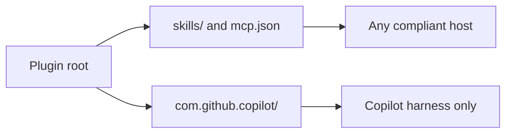

# Distributing Capabilities with Plugins

## Agent Plugins 1.0

Agent plugins are prepackaged bundles of chat customizations that you can discover and install from plugin marketplaces in Visual Studio Code. A single plugin can provide any combination of slash commands, agent skills, custom agents, hooks, and MCP servers. With Agent Plugins 1.0 (VS Code 1.133) the format is an open standard rather than a VS Code feature, so the portable parts of a plugin run in any host that implements the spec.

Portability has a boundary worth knowing before you author one. Skills and MCP servers are the portable core, discovered from a `skills/` folder and an `mcp.json` file that any compliant host understands. The Copilot-specific pieces, custom agents and hooks and slash commands, live in a `com.github.copilot/` directory at the plugin root and apply only where a Copilot harness is running. Bundle the portable parts first and treat the namespaced directory as the Copilot extension of a plugin that already stands on its own.

Plugins work alongside your locally defined customizations. When you install a plugin, its commands, skills, agents, hooks, and MCP servers appear in chat.

> **Note:** Agent plugins are currently in preview. Enable or disable support for agent plugins with the `chat.plugins.enabled` setting.

## What plugins provide

| Type | Discovered from | Portability |
| ---- | --------------- | ----------- |
| **Skills** | `skills/<name>/SKILL.md`, with scripts and resources beside it | Portable across hosts |
| **MCP servers** | `mcp.json` at the plugin root | Portable across hosts |
| **Agents** | `com.github.copilot/agents/*.agent.md` | Copilot only |
| **Hooks** | `com.github.copilot/hooks/hooks.json` | Copilot only |
| **Slash commands** | `com.github.copilot/commands/` | Copilot only |

Nothing in that table is declared in the manifest. Discovery is by convention: you put the file in the right place and the host finds it. This is the single most common thing to get wrong, because it is tempting to list your components in `plugin.json` and the manifest schema rejects every attempt.



## The sample: demo-quality

[demo-quality-plugin](./demo-quality-plugin/) is a real plugin in this repository that packages the quality gate this class uses on its own guides. It ships four of the five component types, so you can read each convention in a working example rather than a sketch.

```text
demo-quality-plugin/
  plugin.json                    Manifest: the required $schema, a name, metadata
  mcp.json                       MCP server definitions, its own schema
  mcp/
    topic_index.py               FastMCP stdio server, one list_topics tool
    requirements.txt
  skills/
    demo-readme-check/
      SKILL.md                   Skill instructions, discovered by convention
      check-readme.ps1           The checker the skill tells the agent to run
  com.github.copilot/
    agents/
      demo-reviewer.agent.md     Copilot custom agent
    hooks/
      hooks.json                 Copilot hook configuration
  scripts/
    brand-guard.ps1              The script the hook runs
    validate-manifests.py        Checks both manifests against the schemas they declare
```

| Piece | What it does |
| ----- | ------------ |
| `demo-readme-check` skill | Runs `check-readme.ps1` over a guide and reports em dashes, code fences with no language, and absolute internal links. Exits 0 when clean and 1 with one line per finding, so it doubles as a gate. |
| `topic-index` MCP server | Exposes one `list_topics` tool that walks `demos/` and returns the module and topic tree, so an agent can answer which topics exist without reading forty readmes. |
| `Demo Reviewer` agent | Runs the checker first, then reviews for the defects a script cannot see: invented commands, mechanisms described but never shown in their real syntax, setup blocks that rebuild what the topic folder already ships. |
| `brand-guard` hook | Fires after a file write. If the file is a readme under `demos/` or `labs/` and the checker fails, it hands the findings back to the agent as extra context so the next turn fixes them. |

## The manifest

`plugin.json` sits at the plugin root. Two fields are required: `$schema` and `name`.

```json
{
  "$schema": "https://agent-plugins.org/schemas/1.0.0/plugin.schema.json",
  "name": "demo-quality",
  "version": "1.0.0",
  "description": "Quality gate for the demo and lab guides in this masterclass.",
  "author": {
    "name": "Alexander Kastil"
  },
  "license": "MIT",
  "keywords": ["documentation", "brand-voice", "markdown", "course-authoring"]
}
```

The schema disallows additional properties, and the complete list of permitted top-level keys is `$schema`, `name`, `version`, `description`, `author`, `homepage`, `repository`, `license`, `keywords`, and `extensions`. There is no `skills` key, no `mcpServers` key, and no `com.github.copilot` key. A manifest that declares its own components is invalid, not merely unconventional, and an invalid manifest loads as nothing at all.

`extensions` is the one place client-specific data belongs, keyed by a reverse-domain namespace. It carries metadata, not components: the published marketplace plugins use it for things like a logo path. Agents and hooks are not listed there, because they are found in the `com.github.copilot/` directory instead.

```json
{
  "extensions": {
    "com.github.copilot": {
      "logo": "assets/logo.png"
    }
  }
}
```

## MCP servers live in their own file

MCP configuration is a separate file with a separate schema, not a block inside the manifest.

```json
{
  "$schema": "https://agent-plugins.org/schemas/1.0.0/mcp.schema.json",
  "mcpServers": {
    "topic-index": {
      "type": "stdio",
      "command": "python",
      "args": ["mcp/topic_index.py"]
    }
  }
}
```

Both keys are required here too. Paths in `args` resolve relative to the plugin root, which is what keeps a plugin self-contained: the server it ships travels with it.

## The Copilot namespace directory

Agents and hooks go under `com.github.copilot/`. An agent is an `.agent.md` file whose frontmatter names it and lists its tools:

```markdown
---
name: Demo Reviewer
description: Reviews a demo or lab readme for brand-voice and structural defects, then applies the fixes.
tools: ['read', 'search', 'execute', 'edit']
---

You review the teaching guides in this masterclass.
```

A hook is an entry in `com.github.copilot/hooks/hooks.json` pointing at a script the plugin ships:

```json
{
  "version": 1,
  "hooks": {
    "postToolUse": [
      {
        "type": "command",
        "powershell": ".\\brand-guard.ps1",
        "bash": "pwsh -NoProfile -File ./brand-guard.ps1",
        "cwd": "scripts",
        "matcher": "create_file|apply_patch|replace_string_in_file|multi_replace_string_in_file",
        "timeoutSec": 15
      }
    ]
  }
}
```

The script reads the tool payload from standard input and writes a JSON object carrying `additionalContext` to standard output to hand a message back to the agent. Exit 0 either way, and swallow a malformed payload: a hook that throws on unexpected input turns every file write into a failure.

## Installing a plugin you just authored

Marketplace discovery is for plugins someone else published. Search `@agentPlugins` in the Extensions view, or run **Chat: Open Customizations** and pick **Browse Marketplace** in the Plugins tab. To install from a Git repository, run **Chat: Install Plugin From Source**.

None of those loads the folder you are editing. For that, register the local path with `chat.pluginLocations`, which maps a plugin directory to an enabled or disabled state:

```json
{
  "chat.pluginLocations": {
    "demos/02-agentic-harness/06-plugins/demo-quality-plugin": true
  }
}
```

Set the value to `false` to keep a plugin registered but switched off, which is the quickest way to prove a capability came from the plugin rather than from somewhere else in your workspace.

## Demo: Load and Verify the Sample

The plugin already ships in this repository, so this walks the parts you can observe rather than having you retype them. Run every command from the plugin folder.

```bash
cd demos/02-agentic-harness/06-plugins/demo-quality-plugin
```

### Step 1: Validate the manifest

An invalid manifest loads as nothing, silently, so check it before anything else. The plugin ships the validator, which fetches whichever schema each file declares and checks the file against it.

```bash
python scripts/validate-manifests.py
```

```text
plugin.json: VALID
mcp.json: VALID
```

It exits 1 and names each violation otherwise. Add a `skills` key to `plugin.json` and run it again: the schema rejects it, which is the fastest way to convince yourself that components are never declared in the manifest.

The validator needs `jsonschema`, which `pip install jsonschema` provides.

### Step 2: Prove the checker works in both directions

A gate that was only seen passing was not tested.

```bash
pwsh -NoProfile -File skills/demo-readme-check/check-readme.ps1 -Path skills/demo-readme-check/SKILL.md
```

That prints `OK: <path>` and exits 0. Now point it at a file containing an em dash, a fence with no language, or a link starting with a slash, and confirm it exits 1 and names the offending line. Content inside fences is skipped, so a sample that legitimately contains one of those does not trip it.

### Step 3: Drive the MCP server over the protocol

Speak JSON-RPC to the server directly, with no client in the way, so you see the real tool name rather than the one the docs claim.

```bash
printf '%s\n' '{"jsonrpc":"2.0","id":1,"method":"initialize","params":{"protocolVersion":"2024-11-05","capabilities":{},"clientInfo":{"name":"probe","version":"1.0"}}}' '{"jsonrpc":"2.0","method":"notifications/initialized"}' '{"jsonrpc":"2.0","id":2,"method":"tools/list"}' | python mcp/topic_index.py
```

`tools/list` answers with `list_topics` and its input schema. Append a `tools/call` line to run it.

### Step 4: Feed the hook its real payload

Judge a hook by its exit code and its output, never by reading the source. Put the payload in a file: a Windows path inside an inline JSON string loses its backslashes to the shell, and the hook then sees a path that does not exist and correctly does nothing, which looks exactly like a passing check.

```bash
pwsh -NoProfile -File scripts/brand-guard.ps1 < payload.json
```

A clean readme produces no output. A failing one produces one line of JSON carrying the findings. Both exit 0.

### Step 5: Load it in the CLI with `--plugin-dir`

A plugin folder sitting in the repository is invisible. Nothing discovers it because it is in the workspace: it has to be registered, and `--plugin-dir` is the way to do that for a plugin you are still editing.

```bash
copilot --plugin-dir demos/02-agentic-harness/06-plugins/demo-quality-plugin plugin list
```

```text
Installed plugins:
  • azure (v1.0.1)
  ...
External Plugins (via --plugin-dir):
  • demo-quality (v1.0.0)
```

Now ask the CLI what it actually loaded, which is the only check that distinguishes a plugin it read from one it merely found:

```bash
copilot --plugin-dir demos/02-agentic-harness/06-plugins/demo-quality-plugin skill list
```

`demo-readme-check` appears with its description. Run the same command without `--plugin-dir` and it is gone, which is the difference between a capability your plugin supplies and one your workspace already had.

> Note: `skill list` is also where a broken skill surfaces. An unquoted `description:` containing a colon makes the frontmatter unparseable, and the loader prints `failed to parse YAML frontmatter` instead of your skill. Nothing warns you at author time, so run this after writing any `SKILL.md`.

### Step 6: Know which surfaces the CLI does not load

Run the MCP listing with the same flag:

```bash
copilot --plugin-dir demos/02-agentic-harness/06-plugins/demo-quality-plugin mcp list
```

`topic-index` does **not** appear, and that is not a bug in the plugin. The CLI loads MCP servers from installed plugins and from `copilot mcp add`, never from an `mcp.json` file in the workspace, so a plugin's `mcp.json` reaches the CLI only once the plugin is genuinely installed rather than pointed at. The same file does load when a host passes the plugin directory into a session, which is what the SDK's `pluginDirectories` option and the VS Code setting below both do.

Register it in VS Code with `chat.pluginLocations` as shown above, reload the window, and open **Chat: Open Customizations**: the Plugins tab lists `demo-quality`, the Agents tab gains **Demo Reviewer**, and `topic-index` appears among your MCP servers. Flip the setting to `false` and reload to watch all three disappear.

This split is the thing to take away. `skills/` and `com.github.copilot/` are read from a pointed-at directory; `mcp.json` needs an install. A demo that checks a server into the workspace and then demonstrates it on the command line demonstrates nothing.

## Links & Resources

- [Agent Plugins documentation](https://code.visualstudio.com/docs/copilot/customization/agent-plugins) - the folder layout, the discovery rules, and `chat.pluginLocations`
- [Plugin manifest schema](https://agent-plugins.org/schemas/1.0.0/plugin.schema.json) - the authoritative field list, with additional properties disallowed
- [VS Code 1.133 release notes](https://code.visualstudio.com/updates/v1_133) - Agent Plugins 1.0 as an open standard and the `com.github.copilot` namespace
- [Awesome Copilot plugins](https://github.com/github/awesome-copilot/tree/main/plugins) - published manifests worth reading before you write your own

[← Previous: Custom Agents](../05-agents/readme.md) | [Back to Agentic Harness](../readme.md) | [Next: Giving Copilot Memory →](../07-memory/readme.md)
