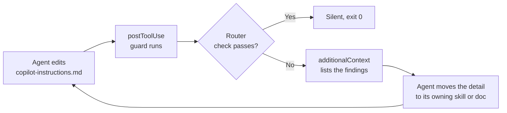

# GitHub Copilot Hooks


GitHub Copilot hooks allow you to extend and customize agent behavior by executing custom shell commands at key points during agent execution. Hooks run in response to specific events in the agent lifecycle, enabling you to implement logging, validation, notifications, and custom integrations without modifying the agent code.

## Hook Types

| Hook               | Trigger                                                              | Description                                                                                        |
| ------------------ | -------------------------------------------------------------------- | -------------------------------------------------------------------------------------------------- |
| Session Start      | When a new agent session begins or when resuming an existing session | Execute initialization logic, setup logging, or prepare your environment before the agent starts   |
| User Prompt Submit | When the user submits a prompt to the agent                          | Log user requests, validate input, or perform pre-processing before the agent processes the prompt |
| Pre-Tool Use       | Before the agent uses any tool                                       | Validate tool parameters, log tool invocations, or conditionally block tool execution              |
| Post-Tool Use      | After a tool completes execution successfully                        | Log results, update metrics, trigger notifications, or perform cleanup operations                  |
| Subagent Start     | When a subagent is started                                           | Track subagent lifecycle and manage resources                                                      |
| Subagent Stop      | When a subagent stops                                                | Log subagent completion or clean up state                                                          |
| Stop               | When the agent stops                                                 | Finalize logs, clean up resources, or trigger completion workflows                                 |

### Agent-Scoped Hook Types (Preview)

Agent-scoped hooks were introduced in VS Code 1.111 (Preview). They use the same lifecycle events as session hooks, but only run when the specific custom agent is selected or invoked via `runSubagent`.

| Agent Hook         | Trigger                                                 | Description                                                                                    |
| ------------------ | ------------------------------------------------------- | ---------------------------------------------------------------------------------------------- |
| Session Start      | When a new session starts with that agent               | Run agent-specific initialization logic, such as loading context or creating agent-local state |
| User Prompt Submit | When a user submits a prompt while that agent is active | Capture or validate prompts for that agent without affecting other agents                      |
| Pre-Tool Use       | Before that agent invokes any tool                      | Enforce agent-specific tool policies, parameter checks, or telemetry                           |
| Post-Tool Use      | After a tool call from that agent succeeds              | Record outcomes, collect agent-level metrics, or trigger follow-up processing                  |
| Subagent Start     | When that agent starts a subagent                       | Track subagent delegation initiated by that specific agent                                     |
| Subagent Stop      | When that agent's subagent stops                        | Finalize subagent tracking and cleanup for that agent workflow                                 |
| Stop               | When that active agent session ends                     | Run agent-specific finalization, such as flushing logs or post-processing output               |

## Use Cases

- Audit and Monitoring: Log all agent activities with timestamps, user information, and executed actions for compliance and debugging.
- Custom Validations: Validate tool parameters before execution or enforce security policies before the agent proceeds.
- Integration: Trigger external systems, send notifications to Slack or email, or integrate with CI/CD pipelines based on agent events.
- Performance Tracking: Measure execution time, monitor tool usage, and collect metrics for optimization.
- Conditional Execution: Block dangerous operations or prevent tools from running in certain contexts using hook validation.

## Hooks, Assisted Approvals, and the Sandbox

Hooks are not the only gate between an agent and your machine, and knowing the other two keeps you from writing a `preToolUse` hook for something the harness already handles. Assisted tool approvals (`chat.assistedPermissions.enabled`) let a language model judge the risk of each tool call and auto-approve the low-risk ones, which cuts the approval interruptions during a long agent run. Local harness sandboxing confines the agent at the process level, and it was rolled back to a 0% default in VS Code 1.135, so it is an opt-in toggle rather than something you can assume is on.

| Gate | Decides | Configured by |
|---|---|---|
| Sandbox | What the agent process can touch at all | Opt-in through the UI, off by default as of 1.135 |
| Assisted approvals | Which tool calls still need your confirmation | `chat.assistedPermissions.enabled` |
| Hooks | What runs before and after a tool call, and whether it is blocked | `hooks.json`, with `preToolUse` exit code `2` to deny |

Use the sandbox for containment, assisted approvals for noise reduction, and hooks for the policy only you can express: your repository's conventions, your audit trail, your integrations.

## Keeping Instructions Lean with a Hook

`.github/copilot-instructions.md` is loaded into every request, so everything added to it is paid for on every turn. It also bloats in a predictable way: an agent asked to "document what we just did" appends a background paragraph, an MCP server list, the dev commands and a table of agents, and none of that belongs in a file whose job is to route. [copilot-instructions-guard.ps1](/.github/hooks/copilot-instructions-guard.ps1) is a `postToolUse` hook that holds the file to that job: repo purpose, folder layout, one-line rules, and where the detail lives.

[.github/hooks/hooks.json](/.github/hooks/hooks.json) registers it for the edit tools only, so read and search calls never pay for it:

```json
{
  "version": 1,
  "hooks": {
    "postToolUse": [
      {
        "type": "command",
        "powershell": ".\\copilot-instructions-guard.ps1",
        "bash": "pwsh -NoProfile -File ./copilot-instructions-guard.ps1",
        "cwd": ".github/hooks",
        "matcher": "create_file|apply_patch|replace_string_in_file|multi_replace_string_in_file",
        "timeoutSec": 10
      }
    ]
  }
}
```

The script reads the hook payload from stdin, exits silently unless the payload mentions `copilot-instructions.md`, then checks the file as it ends up on disk:

| Check | Limit | What it keeps out |
|---|---|---|
| Non-empty lines | 90 (`-MaxLines`) | Growth of the whole file, not just one edit |
| Words per bullet | 30 (`-MaxBulletWords`) | Explanations disguised as rules |
| Heading depth | 2 (`-MaxHeadingDepth`) | Sub-sections that turn a router into a manual |
| Section order | `Project`, `Where the detail lives`, `Skills`, `Agents`, `Hard Rules`, `Working Method` | New sections that collect whatever did not fit elsewhere |
| Inventories | An agent/tool table, an MCP server list, dev commands | Lists that already live in the skill, agent or README that owns them |

Code fences are skipped. When the file passes, the hook prints nothing and exits `0`.

## Watching the Guard Push Back



Add a background paragraph under a `###` heading, an `## MCP Servers` list and a `dotnet watch run` line, and the next edit returns this as `additionalContext` (output from a real run):

```json
{
  "additionalContext": "copilot-instructions.md failed the router check. Fix these before continuing:\nLine 36: heading depth 3, limit is 2.\nLine 38: bullet is 34 words, limit is 30.\nSections are out of order or renamed.\nexpected: Project|Where the detail lives|Skills|Agents|Hard Rules|Working Method\nfound:    Project|Where the detail lives|Skills|Agents|Hard Rules|Working Method|MCP Servers\nFile carries an inventory again: an MCP server list, dev commands. Keep the rule, drop the list.\nThis file is a router: repo purpose, folder layout, one-line rules, where the detail lives."
}
```

The exit code stays `0`, so the edit is not blocked. The findings land in the agent's context, and the agent moves the detail to where it belongs on its next turn, without a reviewer catching it. Use `preToolUse` with exit code `2` when an edit should be denied outright; `postToolUse` fits here because the check needs the final file, which a patch payload does not show in advance.

## Guarding Skills the Same Way

Skills bloat the same way instructions do, and their `description` is the part that costs on every turn: every skill description loads so the agent can decide which skill to open. The same pattern carries over with three changes: point the payload filter at `SKILL.md` instead of `copilot-instructions.md`, loop over `.github/skills/*/SKILL.md` instead of one fixed file, and swap the rules for the ones a skill needs, such as a one-line `description` that names triggers rather than explaining the skill, a body cap that pushes detail into `references/`, and no copied inventories. The registration and the `additionalContext` feedback stay exactly as they are.

## Links & Resources

- [VS Code 1.135 release notes](https://code.visualstudio.com/updates/v1_135) - local agent harness sandboxing rolled back to an opt-in default
- [Using hooks with GitHub Copilot agents](https://docs.github.com/en/copilot/how-tos/use-copilot-agents/coding-agent/use-hooks)
- [Hooks configuration reference](https://docs.github.com/en/copilot/reference/hooks-configuration)
- [About GitHub Copilot hooks](https://docs.github.com/en/copilot/concepts/agents/coding-agent/about-hooks)

[← Previous: Giving Copilot Memory](../07-memory/readme.md) | [Back to Agentic Harness](../readme.md) | [Next: Agent Interop: One Repository, Several Harnesses →](../09-agent-interop/readme.md)
