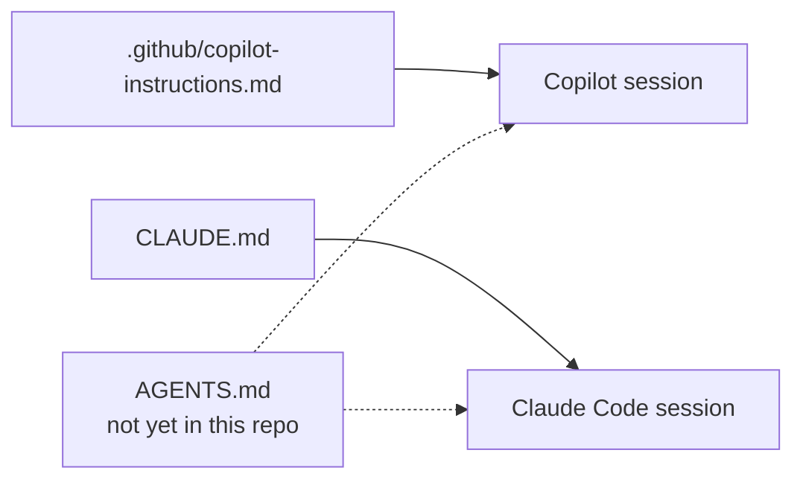
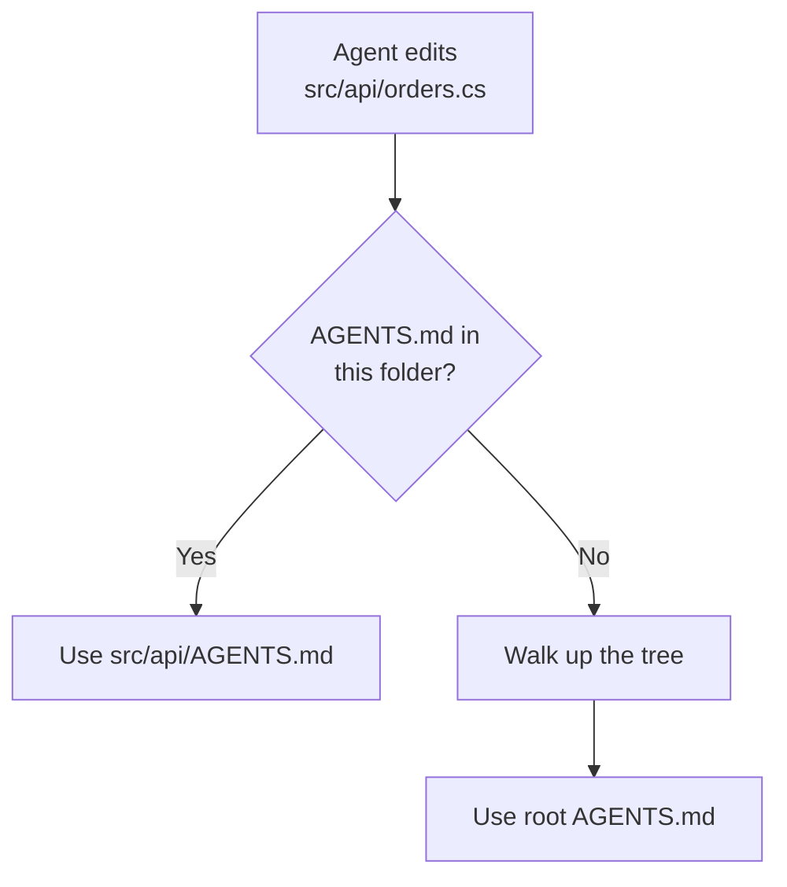

# Agent Interop: GitHub Copilot and Claude Code, One Repository

Everything earlier in this module is written in GitHub Copilot's own dialect: `.github/copilot-instructions.md`, `.instructions.md` files with an `applyTo` glob, `.prompt.md` files, `hooks.json`. That dialect is complete on its own, but this repository is not worked by Copilot alone. The `.claude/` tree sitting next to it is Claude Code's configuration, used by the author to maintain this class, and both trees are committed.

This topic answers one question: when a repository is worked by both harnesses, what does each one read, where do the two overlap, what has to be written twice, and what can be written once. The two harnesses read different filenames for the same job, so the answer is a mapping, not a merge.

This topic is optional. Nothing else in the module depends on it, and a team running only Copilot in only VS Code can skip it without losing anything.

## What Each Harness Reads

| GitHub Copilot | Claude Code | Notes |
|---|---|---|
| `.github/copilot-instructions.md` (repo root, always on) | `CLAUDE.md` (repo root, always on) | Both are repository-wide files reloaded on every turn. This repository has both, and today they duplicate almost the entire "Hard Rules" and "Working Style" sections. |
| `.github/instructions/*.instructions.md`, scoped with an `applyTo` glob (10 files here) | No equivalent | Claude Code has no per-file-type instructions mechanism. A rule scoped to `.tsx` or `.sql` files has nowhere Claude-specific to live except restating it in `CLAUDE.md` for every file type it should reach. |
| `.github/agents/*.agent.md` custom agents (12 files here) | `.claude/agents/*.md` custom agents (5 files here) | Same idea, a named agent with its own model, tool list, and system prompt, but a different filename convention (`.agent.md` under `.github/agents/` versus plain `.md` under `.claude/agents/`) and a different frontmatter shape. |
| `.github/prompts/*.prompt.md` reusable prompts (8 files here) | `.claude/skills/*/SKILL.md` skills (11 skills here) | Not a like-for-like swap. A prompt file is a single invocable template; a skill is a folder that can carry a `references/` directory and scripts alongside `SKILL.md`. |
| `.github/hooks/hooks.json` plus a PowerShell script | No equivalent in this repository | `.claude/settings.json` here carries no hook configuration, so nothing on the Claude side intercepts tool calls the way `instructions-guard.ps1` does for Copilot. |
| `.github/copilot/settings.json` | `.claude/settings.json`, `.claude/settings.local.json` | Both are harness-level settings files, but the keys do not correspond. Copilot's carries a model override and a hook kill switch; Claude Code's carries a schema reference and, in the `.local.json` variant, permission and MCP server grants. |

The two conventions differ even where the job is identical. `.github/agents/team-coder.agent.md` opens with `name`, `description`, `model`, and `tools` in its frontmatter; `.claude/agents/angular-agent.md` opens with the same four keys plus an `mcpServers` block that wires in stdio MCP servers directly. A file written for one harness is invisible to the other, so an agent that both harnesses should offer has to be defined twice.

## The Shared Surface: AGENTS.md

`AGENTS.md` is the file neither harness owns. It is a plain Markdown file at the repository root, with no frontmatter and no schema, that both Copilot and Claude Code read as always-on context alongside their own file. It is also read more widely than these two harnesses, by the Codex CLI, Cursor, and others, which is what makes it a genuine interop format rather than a Copilot-and-Claude convention.

This repository has no `AGENTS.md` today. That absence is exactly what makes it the interop surface worth demonstrating: a file that does not yet exist is the one place a rule can be written once instead of twice.



In VS Code, two settings control whether Copilot picks `AGENTS.md` up at all. `chat.useAgentsMdFile` turns root-level support on or off, and `chat.useNestedAgentsMdFiles` extends discovery into subfolders. Nested discovery is still experimental, so treat a root file as the reliable baseline and per-folder files as an enhancement.

```json
{
  "chat.useAgentsMdFile": true,
  "chat.useNestedAgentsMdFiles": true
}
```

When several `AGENTS.md` files exist, the one nearest the file being edited wins. A root file carries the conventions that hold everywhere, and a file under `src/api/` overrides them for that subtree only.



## Where a Rule Belongs

The formats overlap, which makes it tempting to write everything twice. Duplication is the wrong answer: `.github/copilot-instructions.md` and `CLAUDE.md` are both reloaded on every turn, so a rule stated in both is paid for twice on every request, whichever harness happens to be running.

| The rule is | Put it in |
|---|---|
| True for anyone touching the repository, whatever harness or IDE they open | `AGENTS.md` (once you create one) |
| Scoped to one file type or stack, such as `.tsx` or `.sql` files | `.github/instructions/*.instructions.md` with `applyTo`; restate it in `CLAUDE.md` if Claude Code also needs it, since there is no scoped equivalent |
| A Copilot-specific behaviour: tool or agent preferences, a hook that guards edits | `.github/copilot-instructions.md` or `.github/copilot/settings.json` |
| A Claude-Code-specific behaviour: the author's own working-style rules for maintaining this class | `CLAUDE.md` |
| A personal preference that should not be committed | `.claude/settings.local.json`, or user-level IDE settings, never the repository |

> Note: This repository already pays the duplication cost. `.github/copilot-instructions.md` and the root `CLAUDE.md` both spell out the same "Hard Rules," "Working Style," and "Token Efficiency" sections almost word for word today; only the opening framing, the CICD section, and a couple of Copilot-only lines (the Microsoft Learn MCP rule, the deployment-values rule) differ between them. Moving the shared part into `AGENTS.md` would cut that duplication to one copy.

## Picking Which Harness Runs the Session

VS Code's session creation flow includes a Session Target control that decides which engine executes a turn against the same instructions. Local and Copilot targets run in the editor's own process at no extra setup, and the Claude target runs the same session through Anthropic's Agent SDK, enabled by default once you sign in with a Copilot subscription or Anthropic credentials. Codex and a remote Cloud target exist in that same picker, but they sit outside the `.github/`-and-`.claude/` story this topic covers; they matter here only as the reason `AGENTS.md` is read more widely than the two harnesses this repository actually uses.

Sessions started against either target can outlive the editor window. The Agent Host Protocol is a state-first protocol between hosts and clients that both the Copilot and the Claude adapters plug into, broadcasting durable session state rather than harness-specific events, so a session survives closing the folder and can be watched from a browser over SSH or a dev tunnel.

## Demo: Interop This Repository

1. Open `.github/copilot-instructions.md` and the root `CLAUDE.md` side by side. Mark every rule that is duplicated word for word between the two ("Hard Rules," "Working Style," "Token Efficiency") and every rule that is specific to one harness (the CICD section and the Microsoft Learn MCP rule exist only in the Copilot file).
2. Create a root `AGENTS.md` and move the duplicated rules into it, leaving the harness-specific lines behind in their original file. Do not duplicate a rule across all three files.
3. Enable `chat.useAgentsMdFile`, open a fresh session against the Copilot target, and ask it to state the repository's rule on committing without opening any file. Confirm the answer matches the rule now sitting in `AGENTS.md`.
4. Switch the Session Target to Claude and ask the identical question. Because Claude Code also reads a root `AGENTS.md`, the answer should match, which is the interop this topic is about.
5. Open `.github/agents/team-coder.agent.md` and `.claude/agents/angular-agent.md` side by side and compare their frontmatter. The two filename conventions cannot be unified into one file, so an agent that both harnesses should offer has to be defined twice.

## Links & Resources

- [AGENTS.md](https://agents.md/) - the open format both harnesses read
- [Use custom instructions in VS Code](https://code.visualstudio.com/docs/agent-customization/custom-instructions) - `chat.useAgentsMdFile` and nested discovery
- [Copilot coding agent now supports AGENTS.md](https://github.blog/changelog/2025-08-28-copilot-coding-agent-now-supports-agents-md-custom-instructions/) - GitHub's own changelog entry for the feature
- [Manage Claude's memory](https://docs.anthropic.com/en/docs/claude-code/memory) - how Claude Code discovers `CLAUDE.md` and related context files

[← Previous: GitHub Copilot Hooks](../08-hooks/readme.md) | [Back to Agentic Harness](../readme.md)
