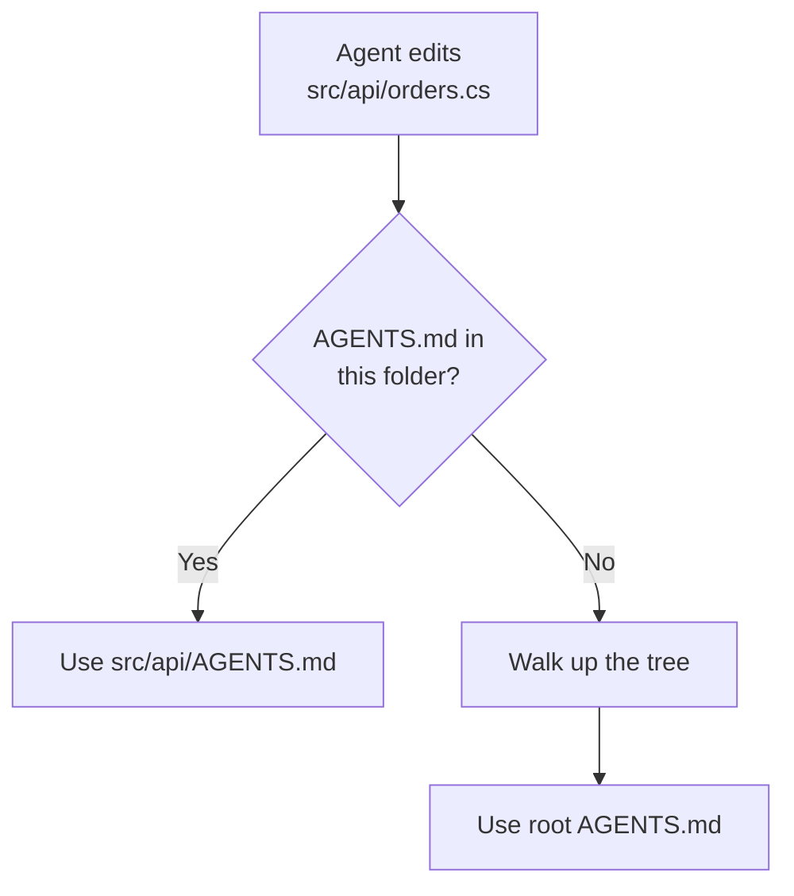
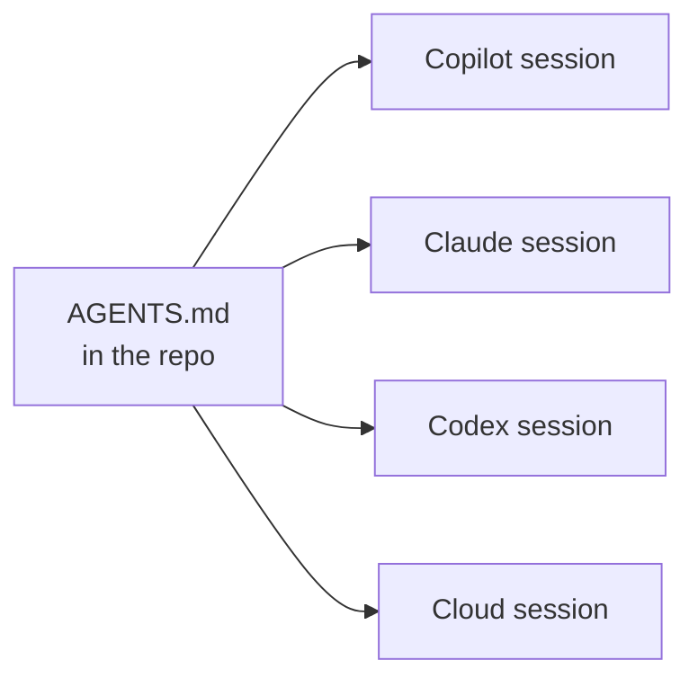

# Agent Interop: One Repository, Several Harnesses

Everything earlier in this module is written in GitHub Copilot's own dialect: `.github/copilot-instructions.md`, `.instructions.md` files with an `applyTo` glob, `.prompt.md` files, `hooks.json`. That dialect is fine while Copilot is the only agent in the repository. It stops being fine the moment a colleague runs Claude Code on the same checkout, or a pipeline hands the branch to a different coding agent, because none of those files mean anything to a tool that was not built to read them.

`AGENTS.md` is the answer the ecosystem converged on. It is a plain Markdown file at the repository root, with no frontmatter and no schema, that every major agent reads as always-on context. VS Code, Claude Code, the Codex CLI, Cursor, and the GitHub Copilot coding agent all pick it up.

This topic is optional. Nothing else in the module depends on it, and a team running only Copilot in only VS Code can skip it without losing anything.

## What VS Code Reads

VS Code loads several always-on instruction formats at once, so adopting `AGENTS.md` does not mean abandoning the Copilot-specific files.

| File | Scope | Read by |
|---|---|---|
| `.github/copilot-instructions.md` | Repository-wide | GitHub Copilot only |
| `.github/instructions/*.instructions.md` | Scoped by `applyTo` glob | GitHub Copilot only |
| `AGENTS.md` | Repository root, or nested per folder | Copilot, Claude Code, Codex, Cursor, and others |
| `CLAUDE.md` | Workspace root, `.claude/`, or user home | Claude Code, and VS Code when the Claude harness runs |

Two settings control the `AGENTS.md` half of that table. `chat.useAgentsMdFile` turns root-level support on or off, and `chat.useNestedAgentsMdFiles` extends discovery into subfolders. Nested discovery is still experimental, so treat a root file as the reliable baseline and per-folder files as an enhancement.

```json
{
  "chat.useAgentsMdFile": true,
  "chat.useNestedAgentsMdFiles": true
}
```

When several `AGENTS.md` files exist, the one nearest the file being edited wins. A root file carries the conventions that hold everywhere, and a file under `src/api/` overrides them for that subtree only.



## Choosing Where a Rule Belongs

The formats overlap, which makes it tempting to write everything twice. Duplication is the wrong answer: instruction files are reloaded on every turn, so a rule written in two places is paid for twice on every request.

| The rule is | Put it in |
|---|---|
| True for anyone touching the repository, whatever tool they use | `AGENTS.md` |
| Only meaningful to one file type or stack | `.github/instructions/*.instructions.md` with `applyTo` |
| A Copilot-specific behaviour, such as tool or agent preferences | `.github/copilot-instructions.md` |
| A personal preference that should not be committed | User-level settings, never the repository |

Keep `AGENTS.md` to the facts a newcomer would need on day one: how to build, how to test, what the folder layout means, which conventions are non-negotiable. That is the content every harness benefits from equally.

> Note: `AGENTS.md` has no `applyTo` frontmatter. If a rule needs to fire only for `.sql` or `.tsx` files, it belongs in a scoped `.instructions.md` file, or in a nested `AGENTS.md` if the split happens to follow folder boundaries.

## Picking a Harness

Portable instructions matter because VS Code no longer runs only one agent. Creating a session offers a Session Target control, and the harness you pick decides which engine executes the turn.

| Session target | Runs | Setup |
|---|---|---|
| Local | In the VS Code extension host on your machine | Default |
| Copilot | On the Agent Host, locally | Default |
| Claude | On your machine, via Anthropic's Agent SDK | Enabled by default; sign in with a Copilot subscription or Anthropic credentials |
| Codex | Locally, or experimentally on the Agent Host | Install the OpenAI Codex extension, or enable the experimental setting |
| Cloud | On the provider's infrastructure | Remote, no access to local tools |

Capabilities are not identical across those targets. Copilot sessions do not reach every built-in or extension-provided tool, and local MCP servers are limited to those that need no authentication. Cloud sessions have no local runtime context at all, which is what makes a committed `AGENTS.md` the only context they are guaranteed to see.



## Sessions That Outlive the Window

The August 2026 Agent Host release moved agent sessions out of the editor window and into a separate process that owns them. A session now survives closing the folder, syncs between the editor and the Agents window, and can run over SSH or a dev tunnel while you watch it from a browser.

The plumbing underneath is the Agent Host Protocol, an open protocol between hosts and clients. It is state-first: it broadcasts ordered actions and durable state rather than harness-specific events, which is how two clients stay in sync on one session. Each harness plugs in through an adapter, so the Claude adapter maps sessions, tools, permissions, and subagents onto the protocol while keeping its own slash commands and hooks. Client libraries ship for Rust, TypeScript, Kotlin, Go, and Swift.

> Note: Visual Studio 2026 uses a different mechanism for this layer. Custom agents there are `.agent.md` files under `.github/agents/`, which is an agent definition format rather than an always-on instructions file like `AGENTS.md`.

## Exercise: Make This Repository Harness-Agnostic

1. Read `.github/copilot-instructions.md` and mark every rule that would still be true if the reader were Claude Code or the Codex CLI instead of Copilot.
2. Move those rules into a root `AGENTS.md`, and leave only the Copilot-specific ones behind. Do not duplicate a rule across both files.
3. Enable `chat.useAgentsMdFile` and start a fresh session against the Copilot target. Ask the agent to state the repository's build command without opening any file, and confirm it answers from the new file.
4. Switch the Session Target to Claude and repeat the same question. The answer should be identical, which is the whole point of the exercise.
5. Add a nested `AGENTS.md` under one subfolder with a rule that contradicts the root file, enable `chat.useNestedAgentsMdFiles`, and confirm the nearest file wins for edits inside that folder.

## Links & Resources

- [AGENTS.md](https://agents.md/) - the open format
- [Use custom instructions in VS Code](https://code.visualstudio.com/docs/agent-customization/custom-instructions) - `chat.useAgentsMdFile` and nested discovery
- [Choose and use an agent harness](https://code.visualstudio.com/docs/agents/run/agent-harnesses) - session targets and their limitations
- [Introducing the Agent Host](https://code.visualstudio.com/blogs/2026/08/26/agent-host-architecture) - persistent sessions and the Agent Host Protocol
- [Copilot coding agent now supports AGENTS.md](https://github.blog/changelog/2025-08-28-copilot-coding-agent-now-supports-agents-md-custom-instructions/) - GitHub changelog
- [Configure Claude Code for Microsoft Foundry](https://learn.microsoft.com/azure/foundry/foundry-models/how-to/configure-claude-code) - running the Claude harness against Azure-hosted models
