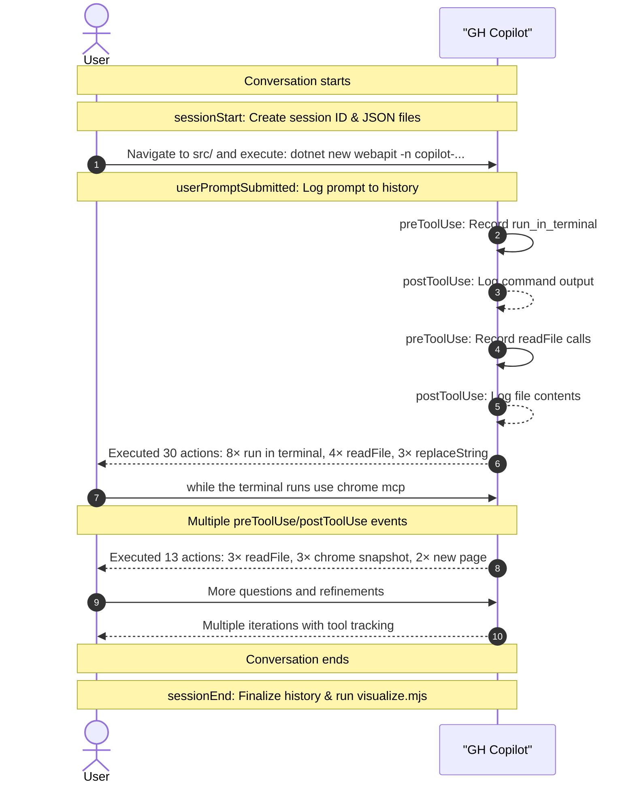
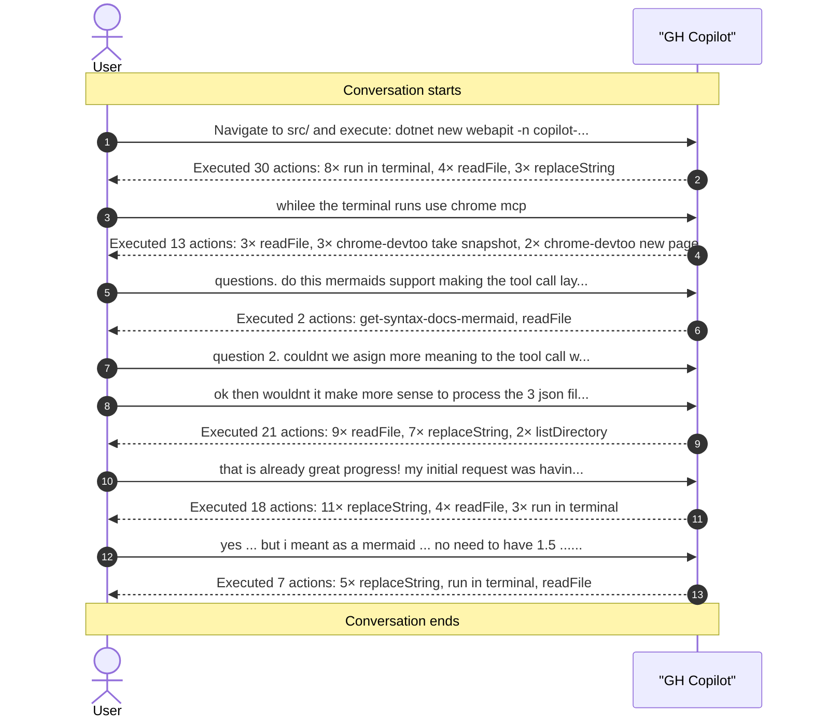

# GitHub Copilot Hooks

GitHub Copilot hooks allow you to extend and customize agent behavior by executing custom shell commands at key points during agent execution. Hooks run in response to specific events in the agent lifecycle, enabling you to implement logging, validation, notifications, and custom integrations without modifying the agent code.

## Hook Types

| Hook               | Trigger                                                              | Description                                                                                        |
| ------------------ | -------------------------------------------------------------------- | -------------------------------------------------------------------------------------------------- |
| Session Start      | When a new agent session begins or when resuming an existing session | Execute initialization logic, setup logging, or prepare your environment before the agent starts   |
| User Prompt Submit | When the user submits a prompt to the agent                          | Log user requests, validate input, or perform pre-processing before the agent processes the prompt |
| Pre-Tool Use       | Before the agent uses any tool                                       | Validate tool parameters, log tool invocations, or conditionally block tool execution              |
| Post-Tool Use      | After a tool completes execution successfully                        | Log results, update metrics, trigger notifications, or perform cleanup operations                  |
| Subagent Start     | When a subagent is started                                           | Track subagent lifecycle and manage resources                                                      |
| Subagent Stop      | When a subagent stops                                                | Log subagent completion or clean up state                                                          |
| Stop               | When the agent stops                                                 | Finalize logs, clean up resources, or trigger completion workflows                                 |

### Agent-Scoped Hook Types (Preview)

Agent-scoped hooks were introduced in VS Code 1.111 (Preview). They use the same lifecycle events as session hooks, but only run when the specific custom agent is selected or invoked via `runSubagent`.

| Agent Hook         | Trigger                                                 | Description                                                                                    |
| ------------------ | ------------------------------------------------------- | ---------------------------------------------------------------------------------------------- |
| Session Start      | When a new session starts with that agent               | Run agent-specific initialization logic, such as loading context or creating agent-local state |
| User Prompt Submit | When a user submits a prompt while that agent is active | Capture or validate prompts for that agent without affecting other agents                      |
| Pre-Tool Use       | Before that agent invokes any tool                      | Enforce agent-specific tool policies, parameter checks, or telemetry                           |
| Post-Tool Use      | After a tool call from that agent succeeds              | Record outcomes, collect agent-level metrics, or trigger follow-up processing                  |
| Subagent Start     | When that agent starts a subagent                       | Track subagent delegation initiated by that specific agent                                     |
| Subagent Stop      | When that agent's subagent stops                        | Finalize subagent tracking and cleanup for that agent workflow                                 |
| Stop               | When that active agent session ends                     | Run agent-specific finalization, such as flushing logs or post-processing output               |

## Use Cases

- Audit and Monitoring: Log all agent activities with timestamps, user information, and executed actions for compliance and debugging.
- Custom Validations: Validate tool parameters before execution or enforce security policies before the agent proceeds.
- Integration: Trigger external systems, send notifications to Slack or email, or integrate with CI/CD pipelines based on agent events.
- Performance Tracking: Measure execution time, monitor tool usage, and collect metrics for optimization.
- Conditional Execution: Block dangerous operations or prevent tools from running in certain contexts using hook validation.

## Copilot Conversation Tracker

The Copilot Conversation Tracker automatically records all agent activities—user prompts, tool calls, subagent lifecycle events—into a structured JSON format stored in [.copilot-conversation](/.copilot-conversation/). This enables full conversation history, detailed execution analysis, and automated visualization of agent behavior without requiring manual logging code.

### How It Works

Hooks fire at key agent lifecycle events, with each hook executing a script that captures relevant data. When the conversation starts, the session-start hook generates a unique session ID and creates baseline JSON files. As the agent executes, hooks log user submissions, record pre/post tool execution details, and monitor subagent lifecycle. Finally, the session-stop hook finalizes the session and runs [visualize.js](/.copilot-conversation/scripts/visualize.js) to generate a markdown diagram of the entire conversation flow.

### Hook Registration

Hooks are registered in a hooks.json configuration file, which maps each lifecycle event to one or more scripts. Each hook entry specifies the event type (sessionStart, userPromptSubmitted, preToolUse, etc.), the command to execute, working directory, and timeout. The configuration ensures scripts run in sequence without blocking the agent, with a minimum timeout required for the final sessionEnd hook to complete visualization.

### Conversation Flow

The tracker captures the full conversation lifecycle as a sequence of events leading from session initialization through prompt submission, tool execution, and eventual finalization:



The visualization generates a Mermaid sequence diagram showing the complete interaction pattern, making it easy to understand tool usage patterns, identify bottlenecks, and replay conversation flows for debugging or documentation purposes.

### Building a .NET Instructions API with Scalar UI

This example shows how hooks track a comprehensive development workflow—from project scaffolding through code refactoring, dependency injection setup, API documentation integration, build validation, and browser-based verification of a running .NET service.

Here's the prompt that generated this recorded conversation:

```
Navigate to src/ and execute: dotnet new webapi -n copilot-api
Navigate to src/copilot-api and execute: dotnet new .gitignore
In src/copilot-api i want you to apply my coding conventions for .NET and then remove all weather (controller) related data.
Next implement a InstructionsController with model name, description as a standalone controller and register it.
Use Microsoft Learn MCP for planning.
Provide Scalar UI in the root.
Build run and fix all errors. while keeping the .NET app running use your Chrome Dev Tools MCP visit the HTTP URL
and port it is configured to run on an check the result. no need to use HTTPS
```

The hooks recorded every tool call, file modification, terminal command, and browser interaction during this workflow:



## Guarding the Instructions File

A `postToolUse` hook can keep `.github/copilot-instructions.md` from drifting into prose. The instructions file is reloaded on every turn, so every sentence added to it is paid for on every request. This hook lints the file after any edit tool touches it and hands the findings back to the agent.

Registration in [.github/hooks/hooks.json](/.github/hooks/hooks.json) scopes the hook to the edit tools via a `matcher` regex, so read and search calls never pay for it:

```json
{
  "version": 1,
  "hooks": {
    "postToolUse": [
      {
        "type": "command",
        "powershell": ".\instructions-guard.ps1",
        "bash": "pwsh -NoProfile -File ./instructions-guard.ps1",
        "cwd": ".github/hooks",
        "matcher": "create_file|apply_patch|replace_string_in_file|multi_replace_string_in_file",
        "timeoutSec": 10
      }
    ]
  }
}
```

[instructions-guard.ps1](/.github/hooks/instructions-guard.ps1) reads the hook payload from stdin, exits silently unless the payload mentions `copilot-instructions.md`, then lints the file on disk:

| Rule                  | Limit     | Rationale                                          |
| --------------------- | --------- | -------------------------------------------------- |
| Non-empty lines       | 60        | Caps the whole file, not just each edit            |
| Total words           | 400       | Catches growth that stays under the line cap       |
| Sentences per paragraph | 3       | Prose blocks are the main bloat vector             |
| Words per bullet      | 25        | Keeps rules scannable                              |
| Heading depth         | 2         | Matches the repo rule on doc depth                 |

Code fences and table rows are skipped so structured content is never flagged.

The exit code stays `0` and the findings go back on stdout as `additionalContext`, which appends them to the agent's context instead of blocking the edit. The agent sees its own violation and rewrites the section on the next turn:

```json
{
  "additionalContext": "copilot-instructions.md failed the anti-bloat check. Rewrite the offending parts as terse rules, tables, or bullets before continuing:
Line 3: paragraph has 4 sentences, limit is 3. Cut it to a table row or a bullet.
Line 5: heading depth 3, limit is 2.
Instructions are context loaded on every turn. They carry rules, not explanations."
}
```

Use `preToolUse` with exit code `2` instead when the edit should be denied outright. `postToolUse` is the right event here because the check needs the file as it ends up on disk, which patch and multi-replace payloads do not reveal in advance.

## Links & Resources

- [Using hooks with GitHub Copilot agents](https://docs.github.com/en/copilot/how-tos/use-copilot-agents/coding-agent/use-hooks)
- [Hooks configuration reference](https://docs.github.com/en/copilot/reference/hooks-configuration)
- [About GitHub Copilot hooks](https://docs.github.com/en/copilot/concepts/agents/coding-agent/about-hooks)
