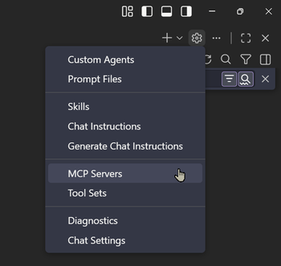

# Model Context Protocol

Model Context Protocol (MCP) is a standardized framework that enables GitHub Copilot to connect to external tools, services, and data sources. It acts as a bridge between Copilot and specialized systems—allowing Copilot to access real-time information, execute commands, and interact with platforms like Azure DevOps, GitHub, or deployment services. MCPs extend Copilot's capabilities beyond code generation to include infrastructure management, testing automation, and domain-specific tooling.



The MCP ecosystem provides both local executables for direct system access and remote HTTP endpoints for cloud services, enabling seamless integration of specialized capabilities into your Copilot workflows.

## Enable MCP Discovery and Auto-Start

Configure VS Code to auto-discover and start MCP servers:

```json
{
  "chat.mcp.discovery.enabled": {
    "claude-desktop": true
  },
  "chat.mcp.autostart": "newAndOutdated",
  "chat.mcp.gallery.enabled": true
}
```

## MCP Server Types & Integration

MCP servers can be integrated in multiple ways depending on their nature: **local executables** (via `npx` or `stdio` commands) and **remote HTTP endpoints** for cloud services.

You can configure MCPs in the following ways:

- **Global configuration**
  - Available across all workspaces for persistent access
  - `~/.mcp.json` on Linux/macOS,
  - `%USERPROFILE%\.mcp.json` on Windows
- **Workspace-level configuration**
  - Scoped to the current project to isolate tools for specific needs
  - (`.vscode/mcp.json` in the workspace root):

MCPs can come from:

- VS Code extensions
- npm packages
- Custom implementations

## MCP Configuration

The [mcp.json](/.vscode/mcp.json) file contains server definitions organized by name, with each server specifying its type (`stdio`, `http`), command/URL, and optional arguments. For sensitive data (API keys, passwords, organization names), MCPs support **input parameters** that prompt for values at runtime and pass them securely via environment or URL variables, preventing hardcoding of credentials.

### Structure Example

```json
{
  "servers": {
    "server-name": {
      "command": "npx",
      "args": ["@package/mcp", "--option=value"],
      "type": "stdio"
    }
  },
  "inputs": [
    {
      "type": "promptString",
      "id": "API_KEY",
      "description": "Your API key",
      "password": true
    }
  ]
}
```

## Common MCPs for Development Workflows

In this class we have [registered](/.vscode/mcp.json) several MCP servers that integrate with popular development tools and platforms. These MCPs enable Copilot to interact with Azure DevOps, GitHub, Microsoft 365, design systems, and remote servers directly from your VS Code environment.

| MCP             | Type            | Purpose                                                                                                  |
| --------------- | --------------- | -------------------------------------------------------------------------------------------------------- |
| Microsoft Learn | Remote (HTTP)   | Official Microsoft documentation and code samples for Azure, .NET, and Microsoft 365 services.           |
| Context7        | Remote (HTTP)   | Library documentation and code examples for any programming language or framework with up-to-date docs.  |
| Azure DevOps    | Local (`npx`)   | Programmatic access to Azure DevOps pipelines, repos, work items, and service connections via REST API.  |
| Azure Deploy    | Local (`npx`)   | Infrastructure deployment and management for Azure resources with CLI-based orchestration.               |
| GitHub          | Remote (HTTP)   | GitHub API integration for repositories, issues, pull requests, and project management.                  |
| WorkIQ          | Local (`stdio`) | Microsoft 365 integration for accessing emails, meetings, files, and work context across Microsoft apps. |
| Figma           | Remote (HTTP)   | Design system integration for extracting UI components, diagrams, and design metadata.                   |
| SSH MCP         | Local (`stdio`) | Remote server management via SSH for infrastructure provisioning, diagnostics, and system configuration. |
| Playwright      | Local (`stdio`) | Browser automation with vision support for automated visual testing, screenshot capture, and E2E tests.  |
| Chrome DevTools | Local (`stdio`) | Chrome DevTools protocol integration for browser debugging, performance profiling, and DOM inspection.   |
| Devcontainers   | Local (`stdio`) | Devcontainer configuration analysis and scaffolding for optimized development environments.              |

## MCP Use Cases & Sample Workflows

### Chrome DevTools

Chrome DevTools MCP enables browser debugging, performance profiling, and automated visual testing directly from Copilot. Use it to inspect DOM elements, capture screenshots, analyze network waterfall charts, and verify responsive design at specific breakpoints.

Sample prompt:

```
Navigate to http://localhost:3000, take a screenshot of the homepage,
then check the CSS for accessibility colors and contrast ratios on the
primary button element using the accessibility tree.
```

### Microsoft Learn

Microsoft Learn MCP provides access to official Microsoft documentation, code samples, and best practices for Azure, .NET, and Microsoft 365 services. Use it to retrieve the latest service APIs, architecture guidance, and implementation examples during development and architecture planning.

Sample prompt:

```
Search Microsoft Learn for Azure Cosmos DB best practices for
hierarchical partition keys and vector search, then fetch the
full documentation on modeling strategies for IoT scenarios.
```

### WorkIQ

WorkIQ MCP connects to Microsoft 365 data including emails, meetings, files, and organizational context. Use it to inspect work history, retrieve contextual information from recent communications, and integrate task management seamlessly into your development workflow.

Sample prompt:

```
Ask WorkIQ: What are the recent emails about the deployment
project? Summarize action items and blockers mentioned in
conversations from the last week.
```

## Key Topics Covered in This Section

- [VS Code MCP Servers Documentation](https://code.visualstudio.com/docs/copilot/customization/mcp-servers)
