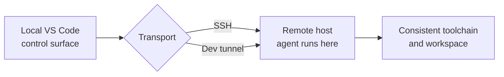

# Remote Agent Sessions over SSH & Dev Tunnels

Remote agent sessions, available since VS Code 1.121, run over SSH and dev tunnels so an agent executes in a consistent, cloud-backed environment rather than on your local machine. This is the reproducible-environment story that replaces GitHub Codespaces and Dev Containers in this course. You get isolation and consistent tooling without maintaining a local container setup, and the agent runs against the toolchain that lives on the remote host.

Two transports carry the session. SSH connects the agent to a machine you already reach that way, such as a build server or a cloud VM, so the agent inherits that host's runtimes and credentials. Dev tunnels connect through a secure tunnel without you opening inbound firewall ports, which suits machines behind NAT or a corporate network. In both cases the agent's work happens on the remote side, and your editor is the control surface.

## Choosing a Transport

| Transport | Reach for it when |
|---|---|
| SSH | You already have SSH access to the target host and want the agent to use its tools directly |
| Dev tunnel | The host sits behind NAT or a firewall and you cannot open inbound ports |

## Where the Work Runs

The mental model is the same as remote development generally: your editor stays local, the agent and its file system live on the remote host. The reproducibility win is that the remote environment is defined once and reused, so every session sees the same runtimes.

> Note: Remote agent sessions replace the Codespaces and Dev Container workflow used earlier in this course. If you have existing container definitions, treat the remote host as the equivalent reproducible target rather than re-creating the container locally.

## Exercise

1. Update to VS Code 1.121 or later and confirm you can reach a remote host over SSH or a dev tunnel.
2. Start an agent session and select the remote host as its execution target.
3. Ask the agent to run a command that reveals the environment, such as printing the runtime version, and confirm the output reflects the remote host, not your laptop.
4. Disconnect and reconnect to confirm the session is tied to the remote environment.
5. Compare the tooling the agent sees on the remote host against your local machine to verify the environments are isolated.

## Links & Resources

- [VS Code 1.121 release notes](https://code.visualstudio.com/updates/v1_121) - remote agent sessions over SSH and dev tunnels
- [VS Code Remote Development](https://code.visualstudio.com/docs/remote/remote-overview) - SSH and tunnel connection models the sessions build on
