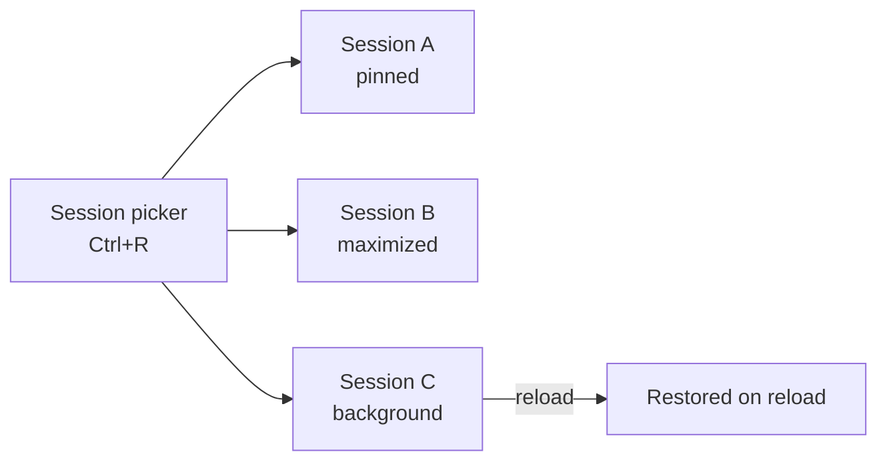
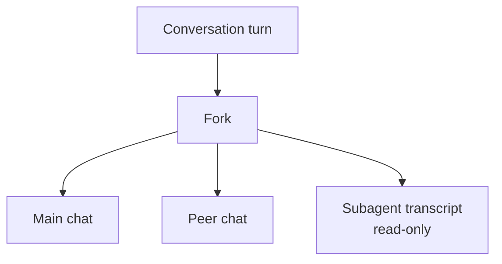

# Session Management

Once agents run across several windows, the bottleneck stops being the agent and becomes your ability to manage many sessions at once. The Agents window grew a management surface across VS Code 1.123 through 1.128 for exactly this: arrange sessions side by side, switch between them fast, send work to the background, and act on signals like failing CI without leaving the chat input. This topic is the hands-on core of the module, and the exercise below builds the lab.

The features arrived incrementally, so it helps to know which version introduced what. Layout and navigation came first, then background and restore, then multi-chat and server-side code-review, then grouping and actionable banners, and finally Claude multi-chat forking with read-only subagent transcripts. Treat the table below as the reference for what your version supports.

## Feature Timeline

| Version | Capabilities |
|---|---|
| 1.123 | Run sessions side by side, pin, and maximize |
| 1.124 | Session picker (Ctrl+R), background send, restore on reload, Close All |
| 1.126 | Multi-chat, server-side code-review comments (`addComment`, `listComments`, `resolveComments`) |
| 1.127 | Session groups with drag and drop, chat-input banners for failing CI and PR comments |
| 1.128 | Claude multi-chat fork, read-only subagent transcripts, workspace-less quick chats |

## Layout, Navigation, and Background Work

Side-by-side layout, pinning, and maximize (1.123) let you keep two related sessions visible and enlarge whichever one you are driving. The session picker on Ctrl+R (1.124) is the fast switch when you have more sessions than fit on screen, and Close All clears them in a single action. Background send lets a session keep working while you move on, and restore-on-reload means a window reload does not throw away in-flight sessions.

## Groups, Banners, and Multi-Chat

Session groups with drag and drop (1.127) let you organize related sessions the way you organize files. Chat-input banners (1.127) surface failing CI checks and incoming PR comments right where you type, with one-click actions to fix checks or address comments, so the signal and the response live in the same place. Multi-chat (1.126) lets you fork a turn and run peer chats in parallel, and in 1.128 the Claude harness adds forking together with read-only subagent transcripts so you can inspect what a delegated agent did without editing it. Workspace-less quick chats (1.128) let you start a session without first opening a folder.

Server-side code-review comments (1.126) expose `addComment`, `listComments`, and `resolveComments`, which lets a session participate in review threads programmatically rather than only through the UI.

## Exercise

1. Update to a VS Code version from the timeline above that covers the features you want to try (1.128 for the full set).
2. Start two agent sessions, then run them side by side; pin one and maximize the other (1.123).
3. Press Ctrl+R to open the session picker and switch between sessions, then send one to the background and let it keep working (1.124).
4. Reload the window and confirm the sessions are restored, then use Close All to clear them (1.124).
5. Create a session group and drag related sessions into it (1.127).
6. Trigger a failing CI check or a PR comment on a branch, then use the chat-input banner's one-click action to respond (1.127).
7. Fork a turn to run a peer chat in parallel, and open a read-only subagent transcript to inspect delegated work (1.126, 1.128).

## Links & Resources

- [VS Code 1.123 release notes](https://code.visualstudio.com/updates/v1_123) - side-by-side layout, pinning, and maximize for sessions
- [VS Code 1.124 release notes](https://code.visualstudio.com/updates/v1_124) - session picker, background send, restore, and Close All
- [VS Code 1.127 release notes](https://code.visualstudio.com/updates/v1_127) - session groups and chat-input banners for CI and PR comments
- [VS Code 1.128 release notes](https://code.visualstudio.com/updates/v1_128) - Claude multi-chat fork, read-only subagent transcripts, and quick chats
