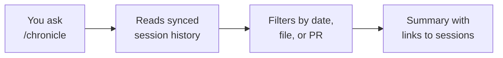

# Session Persistence & /chronicle

Agent sessions are durable objects, not throwaway chats. They sync to your GitHub account, so the work you started on your laptop is waiting for you on your desktop, and a window reload no longer wipes the conversation. Persistence turns a stream of agent turns into a searchable record of what was attempted, what changed, and why.

The `/chronicle` command is the query surface over that record. Instead of scrolling back through a transcript, you ask for what you need: a standup summary of yesterday's sessions, every session that touched a given file, or the session tied to a specific pull request. Because the history lives with your account rather than a single machine, a chronicle query can reach across the sessions you ran anywhere you were signed in.

> Note: The steps below use VS Code. GitHub Copilot signs in with the same GitHub account across Visual Studio, JetBrains IDEs, and GitHub.com, so a session started in one place is discoverable from the others once sync has run.

## What persistence gives you

| Capability | What it means day to day |
|---|---|
| Account-scoped sync | History follows your GitHub identity, not a machine or a window |
| Survives reload | Closing the window or reloading VS Code restores the session state |
| Cross-machine continuity | Start on one device, resume on another after signing in |
| Queryable record | `/chronicle` answers questions over past sessions instead of manual scrollback |

## How a chronicle query resolves

You type a question, `/chronicle` reads your synced session history rather than your live workspace, and it returns a summary with links back to the source sessions. It is a read over the record, so it never changes code.

## Common query shapes

| Query intent | What you get back |
|---|---|
| Standup report | A short summary of the sessions you ran in a time window |
| By file | Every session that read or edited a given path |
| By pull request | The session that produced or discussed a specific PR |

## Exercise

Goal: run a few short agent sessions, then use `/chronicle` to reconstruct what you did without scrolling through transcripts.

1. In VS Code, confirm you are signed in to GitHub Copilot with your GitHub account, using the account menu in the Activity Bar.
2. Open the Agents window and start a session. Ask the agent a small read-only question about the current repository, for example to summarize the top-level folders. Let it answer, then start a second session and ask it to explain one specific file.
3. Reload the window with the Command Palette action "Developer: Reload Window". Reopen the Agents window and confirm both sessions are still present, which shows they survived the reload.
4. In a chat, run `/chronicle` and ask for a standup-style summary of the sessions you ran today. Read the summary and follow one of its links back to the originating session.
5. Run `/chronicle` again and ask which sessions touched the file you inspected in step 2. Confirm the second session is listed.

You have now treated sessions as a durable, queryable record rather than transient chat, which is the core habit this topic builds.

## Links & Resources

- [Copilot in VS Code](https://code.visualstudio.com/docs/copilot/overview) - overview of agent sessions and chat inside the editor
- [VS Code release notes](https://code.visualstudio.com/updates) - monthly notes covering session sync and management changes
- [GitHub Copilot documentation](https://docs.github.com/en/copilot) - account, sign-in, and cross-surface behavior for Copilot
