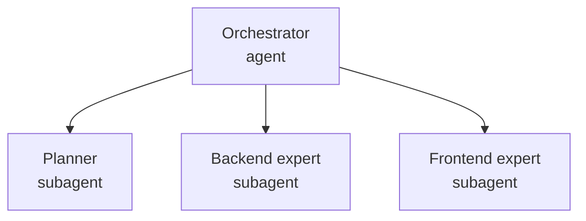

# Subagents as Subject-Matter Experts

Subagents let a primary agent delegate a focused slice of work to a helper that runs its own turns. The primary agent stays in charge of the overall task and hands off a bounded job, while the subagent works in its own transcript, which keeps the primary context clean. The real power is not the generic helper: it is that the helper can be a subject-matter expert with its own instructions, tools, and model.

## Subagents as subject-matter experts

A subagent becomes an expert when it is backed by a custom agent. A custom agent is an `.agent.md` file (in `/.github/agents/`) that carries a focused persona in its instructions, a curated tool allow-list, and a chosen model, as covered in [Custom Agents](../../02-agentic-harness/05-agents/). With the `chat.customAgentInSubagent.enabled` setting on, a primary agent can hand a slice of work to one of those experts as a subagent. A security question then goes to a security expert and a UI task to a frontend expert, each reasoning with only the rules and tools its domain needs.

## What makes a good expert subagent

| Ingredient | Why it matters |
|---|---|
| Focused scope | One domain per expert; a narrow remit produces sharper results than a generalist |
| Specialized instructions | The `.agent.md` body is the persona and the domain rules the expert always applies |
| Curated tools | A `tools` allow-list gives the expert only what its domain needs, and nothing that invites drift |
| Right model | Match the model to the task's difficulty and cost, per expert rather than per session |

## An orchestrated team of experts

This repository ships a team under `/.github/agents/`: a `team-orchestrator` that plans and routes, and `team-planner`, `team-coder`, and `team-frontend` specialists it delegates to. The orchestrator breaks a request into parts and hands each to the matching expert as a subagent, so a full-stack feature is built by a backend expert and a frontend expert working their own slices. Each specialist runs with its own instructions and tools, and you add capacity by adding an expert, not by growing one prompt.

## Observe and account for delegated work

As of VS Code 1.128 you can open a subagent's transcript as a read-only peer chat: you follow its reasoning and tool calls as they happen, but you cannot inject messages, so you never steer an expert mid-task and corrupt its focus. Each subagent also surfaces its own credit cost on hover, because a delegated turn spends credits just like a primary turn. Model choice and delegation depth are therefore budget decisions, which ties directly to the cost model in the [Governance module](../../08-governance/02-cost/).

| Aspect | Primary agent | Expert subagent |
|---|---|---|
| Scope | Owns the whole task | Handles one delegated slice in its domain |
| Behavior | The session you drive | A custom agent's instructions and tools |
| Your control | You steer it directly | You observe a read-only peer chat |
| Cost | Its own credits | Its own credits, shown on hover |

## Exercise

Goal: delegate to a subject-matter expert, watch it work read-only, and read its cost.

1. Open `/.github/agents/` and read the `team-orchestrator`, `team-coder`, and `team-frontend` definitions, noting each one's instructions and `tools` allow-list.
2. In VS Code settings, confirm `chat.customAgentInSubagent.enabled` is on.
3. Start a session with the orchestrator and give it a task that spans backend and frontend, so it must route work to both experts.
4. When an expert subagent appears, open its read-only peer chat and confirm it is applying that agent's specialized instructions and tools.
5. Hover over the subagent to read its credit cost, and note how cost is attributed to the delegated expert work specifically.

## Links & Resources

- [Custom agents in VS Code](https://code.visualstudio.com/docs/copilot/customization/custom-agents) - defining `.agent.md` experts with instructions, tools, and a model
- [Using Copilot agents](https://docs.github.com/en/copilot/how-tos/use-copilot-agents) - how coding agents and their delegated work behave
- [VS Code release notes](https://code.visualstudio.com/updates) - monthly notes covering subagents and read-only peer transcripts
