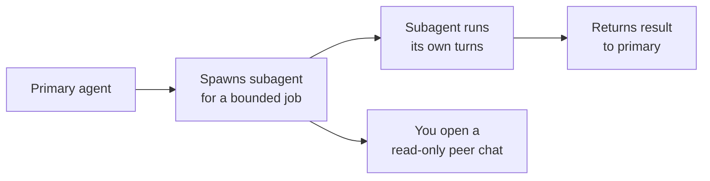

# Subagents

Subagents let a primary agent delegate a focused slice of work to a built-in helper that runs its own turns. The primary agent stays in charge of the overall task and hands off a bounded job, such as gathering context or drafting one file, while the subagent works in its own transcript. This keeps the primary agent's context clean and lets specialized work happen without derailing the main thread.

As of VS Code 1.128 you can open a subagent's transcript as a read-only peer chat. You follow the subagent's reasoning and tool calls as they happen, but you cannot inject messages into it, which is why the peer chat is read-only. That gives you visibility into delegated work without the risk of steering a helper mid-task and corrupting its focus.

Each subagent surfaces its own credit cost on hover. Because a delegated turn spends credits just like a primary turn, the hover cost makes the price of delegation visible at the point of use. Model choice and delegation depth are therefore budget decisions, which ties directly to the cost model in the [Governance module](../../08-governance/02-cost/).

## Primary agent versus subagent

| Aspect | Primary agent | Subagent |
|---|---|---|
| Scope | Owns the whole task | Handles one delegated slice |
| Transcript | The session you drive | A peer transcript you can open read-only |
| Your control | You steer it directly | You observe; you do not inject messages |
| Cost | Its own credits | Its own credits, shown on hover |

## How delegation flows

The primary agent spawns a subagent for a bounded job, the subagent runs its own turns and returns a result, and you can watch the whole thing in a read-only peer chat.

## When delegation helps

| Situation | Why a subagent fits |
|---|---|
| Context gathering | Keeps a large read effort out of the primary transcript |
| Parallel side task | Runs a focused job without stealing the primary agent's turn |
| Repeatable step | Isolates a well-defined slice you want to observe cleanly |

## Exercise

Goal: trigger a delegation, watch it in a read-only peer chat, and read the per-subagent credit cost.

1. In VS Code, open the Agents window and start a session on the current repository.
2. Give the primary agent a task that naturally decomposes, for example asking it to research how one feature is implemented across several files and then summarize the findings. Delegation-friendly phrasing encourages the primary agent to spawn a subagent.
3. When a subagent appears, open its transcript. Confirm it opens as a read-only peer chat and that you cannot type into it.
4. Hover over the subagent to read its credit cost. Note how the cost is attributed to the delegated work specifically, not lumped into the primary session.
5. Let the subagent finish and return its result to the primary agent. Read how the primary agent incorporates the subagent's output into its own answer.

You have now seen the full delegation loop: spawn, observe read-only, and account for the cost, which is the discipline this topic builds.

## Links & Resources

- [Copilot in VS Code](https://code.visualstudio.com/docs/copilot/overview) - agent sessions, delegation, and chat surfaces in the editor
- [VS Code release notes](https://code.visualstudio.com/updates) - monthly notes covering subagents and read-only peer transcripts
- [Using Copilot agents](https://docs.github.com/en/copilot/how-tos/use-copilot-agents) - how coding agents and their delegated work behave
