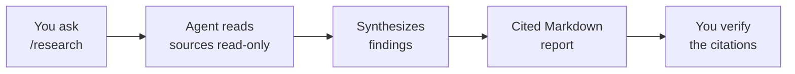

# Deep Research with /research

The `/research` command runs a read-only deep-research agent. It gathers information across your codebase and available sources, then produces a cited Markdown report that links each claim back to where it came from. The point is not to change anything but to understand something well enough to plan the change that comes next.

Because the research agent never writes to your repository, it needs no elevated permissions. That makes it the lowest-risk agent in the course and the ideal first hands-on exercise: you get the full experience of driving an agent session, reading its output, and judging its citations, with zero chance of an unwanted edit. Reach for it to scope a change, compare two approaches, or get oriented in an unfamiliar codebase before any code is touched.

> Note: A cited report is only as good as its sources. Treat `/research` output as a well-organized starting point and follow the citations before you act on a conclusion.

## Why research is the safe first lab

| Property | Effect |
|---|---|
| Read-only | Cannot edit, create, or delete files in your repository |
| No elevated permissions | Nothing to approve, nothing to sandbox |
| Cited output | Every claim links back to a source you can verify |
| Markdown report | A durable artifact you can keep, share, or paste into a PR |

## How a research run produces a report

You pose a question, the agent reads across the relevant sources without modifying them, and it synthesizes a Markdown report whose claims carry citations you can follow.

## Good and poor research prompts

| Weak prompt | Stronger prompt |
|---|---|
| "How does auth work?" | "Summarize how this repo authenticates API requests, and cite the files involved" |
| "Compare libraries" | "Compare how logging is done in the API versus the UI project, with citations" |
| "Explain the code" | "Trace the request path from the controller to the database for the orders endpoint" |

## Exercise

Goal: run your first agent session end to end using the read-only research agent, then judge the report by its citations.

1. In VS Code, open a repository you know reasonably well so you can sanity-check the output. Open the Agents window and start a new session.
2. In the chat, run `/research` and ask a scoped question about the codebase, for example: "Summarize how this project handles configuration and settings, and cite the files involved." Keep the question specific enough that a good answer will name concrete files.
3. Let the agent run. Notice that it reads files but never proposes an edit, and that no approval prompt for a write action ever appears.
4. When the Markdown report arrives, open two or three of its citations and confirm each one actually supports the claim it is attached to. Flag any claim whose citation does not back it up.
5. Refine once. Ask a sharper follow-up, for example narrowing to a single configuration file or a single environment, and compare how the second report's citations improve over the first.
6. Save the report. Because it is Markdown, keep it as a scoping artifact you could paste into an issue or a pull request description before writing any code.

You have now run a complete agent session with zero write risk and learned to trust an agent's output only as far as its citations hold up.

## Links & Resources

- [Copilot in VS Code](https://code.visualstudio.com/docs/copilot/overview) - agent sessions and chat commands in the editor
- [VS Code release notes](https://code.visualstudio.com/updates) - monthly notes covering the research agent and session commands
- [GitHub Copilot documentation](https://docs.github.com/en/copilot) - Copilot agents, permissions, and read-only behavior
