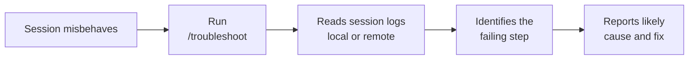

# Troubleshooting Agent Sessions

The `/troubleshoot` command, available since VS Code 1.127, analyzes session logs to diagnose problems in an agent session. It reads what actually happened, the prompts, the tool calls, and the failures, and reports back what went wrong and where. It is the successor to the older Agent Debug Panel, reworked as a command that goes wherever your session runs.

That last point matters most. A session can execute locally in your editor or on a remote agent host reached over SSH or a dev tunnel, and `/troubleshoot` works the same way in both cases. Instead of a panel bound to one execution surface, you get a single command that inspects local and remote agent-host sessions alike. Reach for it when a session stalls, a tool call fails, or a remote host behaves in a way the transcript alone does not explain.

## Debug Panel versus /troubleshoot

| Aspect | Old Agent Debug Panel | /troubleshoot (1.127+) |
|---|---|---|
| Form | A panel in the UI | A chat command |
| Reach | Tied to one execution surface | Local and remote agent-host sessions |
| Trigger | Open and read manually | Ask it to analyze the current session |
| Output | Raw view | A diagnosis of what went wrong |

## What it inspects

The command works over the session's own record: the prompts submitted, the tool calls attempted, and the errors or stalls that resulted. Because it reads that record rather than your live workspace, it can explain a failure after the fact.

## When to reach for it

| Symptom | Why /troubleshoot helps |
|---|---|
| Session stalls | Finds where the turn stopped making progress |
| Tool call fails | Surfaces the failing tool and its error |
| Remote host misbehaves | Inspects the remote agent-host session, not just the local view |

## Exercise

Goal: deliberately provoke a failing session, then use `/troubleshoot` to diagnose it.

1. In VS Code, open the Agents window and start a session on a small repository.
2. Give the agent a task that is likely to hit a wall, for example asking it to run a build or test command for a toolchain that is not installed, or to read a file at a path that does not exist. The aim is a real, observable failure rather than a clean success.
3. Watch the session fail or stall. Resist the urge to read the raw logs yourself first.
4. In the chat, run `/troubleshoot` and ask it to analyze the current session. Read how it identifies the failing step and names a likely cause rather than just echoing the error.
5. Act on the diagnosis. Install the missing tool or correct the path, rerun the task, and confirm the session now succeeds.
6. If you have access to a remote session over SSH or a dev tunnel, repeat step 2 there and run `/troubleshoot` again. Confirm the command diagnoses the remote agent-host session the same way it did the local one.

You have now used a single command to diagnose both a local and a remote failure, which is the reach the old Debug Panel could not offer.

## Links & Resources

- [Copilot in VS Code](https://code.visualstudio.com/docs/copilot/overview) - agent sessions, chat commands, and diagnostics in the editor
- [VS Code release notes](https://code.visualstudio.com/updates) - monthly notes covering /troubleshoot and remote agent-host sessions
- [Remote development in VS Code](https://code.visualstudio.com/docs/remote/remote-overview) - SSH and tunnel connections that back remote agent-host sessions
