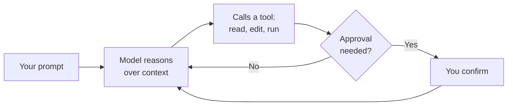

# Using Local Agents and Agent Mode

Agent mode is where agentic coding starts: the agent runs on your own machine, inside your workspace, with your local tooling and auth context already in place. This topic covers getting real work done that way, before the module scales out to [multi-agent orchestration](../03-orchestration/) and [cloud agents](../02-cloud/).

## The Agent Loop

An agent turn is not one model call. The agent reasons over the context it has, calls a tool, reads the result, and reasons again, repeating until the task is done, it needs your input, or you stop it. Tools are the verbs in that loop: read a file, edit a file, run a terminal command, call an MCP server.

Some of those verbs change your machine, so the loop has a gate in it where you approve what the agent is about to do. That gate is the part you configure, and it decides whether a run is productive or a babysitting session.

## Approvals and Permission Levels

The permission level is chosen per session from the dropdown in the chat input. Start on the default and loosen it deliberately, because the level decides how much of the run you actually see.

| Level | Behavior |
|---|---|
| Manual permissions | The default. Uses your tool, URL, and terminal approval settings; anything not auto-approved asks for confirmation |
| Assisted permissions | Experimental. An LLM judge assesses each tool call; calls it does not approve fall back to your confirmation (`chat.assistedPermissions.enabled`) |
| Allow all | Runs every tool call without confirmation |

Terminal commands get their own rules on top of that. `chat.tools.terminal.autoApprove` takes a map where `true` auto-approves, `false` forces a prompt, and a value wrapped in `/` is a regular expression. Auto-approval is a convenience, not a security boundary, so keep anything that deletes, deploys, or pushes out of the allow list.

> Note: Those are VS Code setting IDs. Visual Studio and the JetBrains IDEs expose the same approval prompts through their own Copilot settings pages.

## Steering, Queueing, and Checkpoints

A long run is a conversation, not a submission. Steering injects a correction into the request already in flight; queueing waits for it to finish and then runs next. `chat.requestQueuing.defaultAction` decides which one Enter gives you, and a message prefixed with `!` skips the model entirely and runs as a terminal command.

Checkpoints are the undo. Restoring one rolls back the affected workspace files and the chat history together, so a run that went sideways costs you the run and not the afternoon. Stopping a request is not the same thing: edits and commands that already completed stay completed.

## Demo

Goal: run a real task locally, tune the approval gate, and recover from a bad turn.

1. Open a project from `src/` (for example `doubler-api` or `tasks-ui`) and start an Agent Mode session at Manual permissions.
2. Give the agent a bounded task with a verifiable outcome, such as "add a health endpoint and a test that proves it returns 200", and watch each tool call and approval prompt.
3. Count how often you approved a harmless read-only command, add those to `chat.tools.terminal.autoApprove` as `true`, and confirm the next run stops asking.
4. Mid-run, steer the agent with a correction and watch it change course inside the same request. Then queue a follow-up and confirm it waits.
5. Restore a checkpoint from before the last edits and verify that the files and the chat history rolled back together.

## Links & Resources

- [Use agent mode in VS Code](https://code.visualstudio.com/docs/copilot/chat/chat-agent-mode) - the agent loop, steering and queueing, checkpoints, and the `!` terminal prefix
- [Manage approvals and permissions](https://code.visualstudio.com/docs/agents/run/approvals) - permission levels and terminal auto-approve rules
- [Build with agents in VS Code](https://code.visualstudio.com/docs/copilot/agents/overview) - harnesses, session targets, and worktree isolation

[← Back to Agentic Coding](../readme.md) | [Next: Delegating Tasks to Cloud Agents →](../02-cloud/readme.md)
