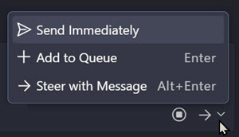

# Local Agents akn Agent Mode

Local agents execute within your current VS Code session with real-time feedback and full integration with your editor, terminal, and files. Execution is synchronous and blocking, making them ideal for focused single-task interactive agentic coding workflows.

> Note: Currently in VS Code Insiders, there is a an option to Queue or steer messages to the agent. Queuing allows you to stack up multiple messages for the agent to process sequentially, while steering lets you adjust the agent's behavior or focus in real-time based on the conversation flow.

| Aspect           | Details                                                                                                                                                                                |
| ---------------- | -------------------------------------------------------------------------------------------------------------------------------------------------------------------------------------- |
| Best For         | Single focused tasks, debugging, iterative exploration, immediate feedback, and rapid iteration cycles. Strengths: real-time feedback, tight developer loop, no configuration overhead |
| Integration      | Direct access to workspace files, terminal, editor state, npm scripts                                                                                                                  |
| Parallelism      | Single sequential task only                                                                                                                                                            |
| Auth Context     | Full access to local authentication: Azure CLI credentials, Git tokens, SSH keys, environment variables                                                                                |
| Online Resources | Yes, can interact with online resources through local tools: Azure DevOps MCP, GitHub API, cloud CLIs                                                                                  |
| Limitations      | Blocks editor; limited by local resources; cannot parallelize                                                                                                                          |

## Topics

| Name                                        | Description                                                                                              |
| ------------------------------------------- | -------------------------------------------------------------------------------------------------------- |
| **[Scaffold .NET API](./01-scaffold-net/)** | Create a starter .NET API using a local agent workflow.                                                  |
| **[Fixing Errors](./02-fix-err/)**          | Integrate with Azure AI Foundry using keyless authentication with DefaultAzureCredential.                |
| **[Update Agent Framework](./03-update/)**  | Upgrade Python agent implementations to the latest Microsoft Agent Framework libraries and dependencies. |
