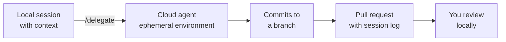

# Delegating Tasks to Cloud Agents

Cloud agents execute in ephemeral remote environments, offloading resource-intensive work from your local machine. Execution is asynchronous, keeping your editor responsive while the agent works independently. This model is designed for large-scale tasks, parallel operations, and resource-intensive workloads.

| Aspect           | Details                                                                                                                                                                                                                                                              |
| ---------------- | -------------------------------------------------------------------------------------------------------------------------------------------------------------------------------------------------------------------------------------------------------------------- |
| Best For         | Large-scale refactoring, parallel tasks, resource-intensive workloads, team consistency, and when tasks exceed local resources. Strengths: scalable resources, no local impact, consistent environments, long-running tasks, coordinate with local/background agents |
| Integration      | Clean, isolated container; configurable compute resources; requires explicit setup of credentials and network access                                                                                                                                                 |
| Parallelism      | Multiple cloud agents can run simultaneously                                                                                                                                                                                                                         |
| Auth Context     | Limited; does not inherit local auth. Credentials must be explicitly passed or configured in container environment                                                                                                                                                   |
| Online Resources | Depends on configuration; typically supports cloud resources with proper setup of credentials and network access                                                                                                                                                     |
| Limitations      | Network latency, container startup overhead, requires Azure setup, significant overhead for short tasks                                                                                                                                                              |

## Handing Off a Session

You do not have to start over to go remote. Typing `/delegate` in a running Copilot session continues the task in the cloud, carrying the conversation history and context across, and you can also pick Cloud from the Session Target dropdown when starting a new chat. Handoff is initiated from a local session, which stays the hub you return to.

The agent then works on its own branch, commits as it goes, and opens a pull request for review. The session stays visible in your sessions list while it runs, so you follow progress from the same window you delegated from.

## What the Cloud Agent Cannot See

The asynchronous win comes with a real loss of context, and most disappointing cloud runs trace back to it. Cloud sessions use the tools, MCP servers, and models configured by the cloud service, not the ones in your IDE. They have no access to VS Code built-in tools or local runtime context: no terminal output you just produced, no Problems panel diagnostics, no extension-provided capabilities, and none of your local credentials.

That is why the repository has to carry the context instead of you. A `.github/copilot-instructions.md` file gives every delegated task the build commands, test commands, and conventions the agent would otherwise have asked you for.

> Note: The GitHub Copilot coding agent runs in its own ephemeral environment powered by GitHub Actions, works on one repository and one branch per session, and has a hard execution limit of 59 minutes that cannot be extended.

## Scoping a Task Worth Delegating

A cloud task is a written brief, not a conversation, because nobody is there to answer a mid-run question. A good one carries three things: a clear description of the problem, acceptance criteria that say what a good solution looks like, and direction about which files should change.

That shape favors well-defined work: increasing test coverage, fixing a reproducible bug, updating config files or documentation, and mechanical refactors across many files. Exploratory work, anything needing your judgment turn by turn, and anything short enough that startup overhead dominates all belong in the local session instead.

## Demo

Goal: delegate a bounded task, watch it run remotely, and review what comes back.

1. Open a repository you can push to and add a short `.github/copilot-instructions.md` naming the build and test commands.
2. Start a local Agent Mode session and explore the task enough to identify the files involved.
3. Type `/delegate` and confirm the conversation context is carried into the cloud session.
4. While it runs, keep working locally and note that your editor is never blocked.
5. When the pull request appears, review the diff and the session log, then iterate with a comment on the PR rather than starting a new task.
6. Compare the run against the same task done locally, and note which context the cloud agent had to be told instead of being able to see.

## Links & Resources

- [About Copilot coding agent](https://docs.github.com/en/copilot/concepts/agents/coding-agent/about-coding-agent) - the ephemeral environment, branch and pull request model, and execution limits
- [Choose and use an agent harness](https://code.visualstudio.com/docs/copilot/agents/cloud-agents) - `/delegate`, session targets, and what cloud sessions can access
- [Best practices for using Copilot to work on tasks](https://docs.github.com/en/copilot/how-tos/agents/copilot-coding-agent/best-practices-for-using-copilot-to-work-on-tasks) - scoping issues and choosing the right tasks to delegate

[← Previous: Using Local Agents and Agent Mode](../01-local-agents/readme.md) | [Back to Agentic Coding](../readme.md) | [Next: Multi-Agent Orchestration with Subagents →](../03-orchestration/readme.md)
