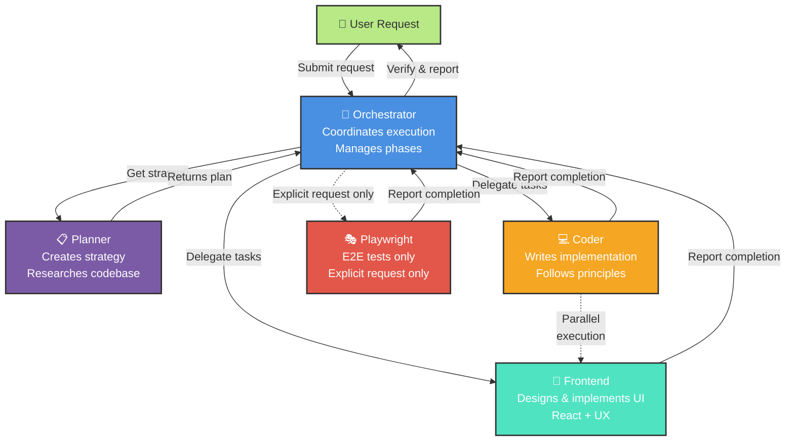

# Multi-Agent Orchestration with Subagents

Subagents let a primary agent delegate a focused slice of work to a helper that runs its own turns. The primary agent stays in charge of the overall task and hands off a bounded job, while the subagent works in its own transcript, which keeps the primary context clean. The real power is not the generic helper: it is that the helper can be a subject-matter expert with its own instructions, tools, and model.

Orchestration is what happens when you put several of those experts behind one coordinator. Instead of researching requirements, planning architecture, implementing code, and designing UI sequentially, an Orchestrator coordinates these activities in parallel phases, with later phases dependent only on critical outputs from earlier ones. That is the advantage worth learning: parallel execution at scale, without context bloat.

## Subagents as Subject-Matter Experts

A subagent becomes an expert when it is backed by a custom agent. A custom agent is an `.agent.md` file (in `/.github/agents/`) that carries a focused persona in its instructions, a curated tool allow-list, and a chosen model, as covered in [Custom Agents](../../02-agentic-harness/05-agents/). With the `chat.customAgentInSubagent.enabled` setting on, a primary agent can hand a slice of work to one of those experts as a subagent. A security question then goes to a security expert and a UI task to a frontend expert, each reasoning with only the rules and tools its domain needs.

| Ingredient | Why it matters |
|---|---|
| Focused scope | One domain per expert; a narrow remit produces sharper results than a generalist |
| Specialized instructions | The `.agent.md` body is the persona and the domain rules the expert always applies |
| Curated tools | A `tools` allow-list gives the expert only what its domain needs, and nothing that invites drift |
| Right model | Match the model to the task's difficulty and cost, per expert rather than per session |

## The Agent Team

This repository ships a team under `/.github/agents/` with four specialized agents and distinct responsibilities. The Orchestrator receives user requests and coordinates execution. Rather than implementing anything itself, it delegates planning work to the Planner, then orchestrates parallel implementation across Coder and Frontend based on the plan.

The Planner analyzes the codebase, verifies external documentation, identifies edge cases, and outputs a structured implementation strategy. The Coder receives well-defined tasks and writes code following mandatory principles: flat architectures, clear control flow, regenerable modules, and minimal coupling. The Frontend agent handles all UI/UX design and React implementation, prioritizing user experience and accessibility. You add capacity by adding an expert, not by growing one prompt.

## Execution Model

The Orchestrator follows a structured four-step execution pattern. First, it calls Planner with the user's request to get a detailed implementation strategy. Second, it parses the plan into execution phases by analyzing file assignments: tasks with no overlapping files run in parallel, tasks with shared files run sequentially.

Third, it executes each phase by spawning subagents simultaneously for parallel tasks, waiting for completion before proceeding to dependent phases. Finally, it verifies the work and reports results to the user.

Parallelization prevents unnecessary sequential work. When Coder implements the backend API and Frontend designs the UI component, these can happen simultaneously because they touch different files. But when the second phase needs to integrate the API with the UI, it waits for both phase one tasks to complete first.

## Avoiding File Conflicts

When delegating parallel tasks, you must explicitly scope each agent to specific files. Instead of telling multiple agents to update the same component, assign each agent distinct files or run those tasks sequentially. For example, if you need to both add theme context and apply theme to components, the first phase implements the context in ThemeContext.tsx and useTheme.ts while the second phase applies it across components.

This approach follows a critical principle: never tell agents how to do their work, describe what outcome is needed. Instead of "fix the bug by wrapping with useShallow," say "fix the infinite loop error in SideMenu." Instead of "add a button that calls handleClick," say "add a settings panel for the chat interface."

## Example Workflow

Building a feature like dark mode for an app demonstrates the power of orchestration. The Orchestrator calls Planner to create a strategy. Planner identifies three phases: design the color palette and toggle UI, implement the theme context and toggle component in parallel, then apply the theme across all components.

In phase one, both tasks run in parallel, so designer and coder work simultaneously. In phase two, Coder implements context logic while Frontend builds the toggle component, different files in the same phase. In phase three, Coder applies theme tokens throughout the app. The Orchestrator reports completion to the user with all work verified and integrated.

## Agent Configuration

Each agent is defined in a markdown file in the `.github/agents` directory with specific tools and model configuration. The configuration file specifies which tools each agent can access, preventing scope creep while ensuring each agent has what it needs. The Orchestrator itself only has tools to read files, invoke agents, and manage memory, so it coordinates through delegation and never implementation.

## Observe and Account for Delegated Work

As of VS Code 1.128 you can open a subagent's transcript as a read-only peer chat: you follow its reasoning and tool calls as they happen, but you cannot inject messages, so you never steer an expert mid-task and corrupt its focus. Each subagent also surfaces its own credit cost on hover, because a delegated turn spends credits just like a primary turn. Model choice and delegation depth are therefore budget decisions, which ties directly to the cost model in the [Governance module](../../08-governance/02-cost/).

| Aspect | Primary agent | Expert subagent |
|---|---|---|
| Scope | Owns the whole task | Handles one delegated slice in its domain |
| Behavior | The session you drive | A custom agent's instructions and tools |
| Your control | You steer it directly | You observe a read-only peer chat |
| Cost | Its own credits | Its own credits, shown on hover |

## Exercise

Goal: delegate to a subject-matter expert, watch the team work read-only, and read its cost.

1. Open `/.github/agents/` and read the `team-orchestrator`, `team-planner`, `team-coder`, and `team-frontend` definitions, noting each one's instructions and `tools` allow-list.
2. In VS Code settings, confirm `chat.customAgentInSubagent.enabled` is on.
3. Start a session with the orchestrator and give it a task that spans backend and frontend, so it must route work to both experts.
4. Watch how the Orchestrator splits the plan into phases, and confirm the two tasks that touch different files run in parallel.
5. When an expert subagent appears, open its read-only peer chat and confirm it is applying that agent's specialized instructions and tools.
6. Hover over the subagent to read its credit cost, and note how cost is attributed to the delegated expert work specifically.

## Links & Resources

- [Orchestrator Agent](/.github/agents/team-orchestrator.agent.md) - the coordinator that plans and routes
- [Planner Agent](/.github/agents/team-planner.agent.md) - the strategy and codebase-research expert
- [Coder Agent](/.github/agents/team-coder.agent.md) - the backend implementation expert
- [Frontend Agent](/.github/agents/team-frontend.agent.md) - the UI/UX and React expert
- [VS Code Subagents Documentation](https://code.visualstudio.com/docs/copilot/agents/subagents) - how delegation and peer transcripts behave
- [Custom agents in VS Code](https://code.visualstudio.com/docs/copilot/customization/custom-agents) - defining `.agent.md` experts with instructions, tools, and a model
- [Using Copilot agents](https://docs.github.com/en/copilot/how-tos/use-copilot-agents) - how coding agents and their delegated work behave
