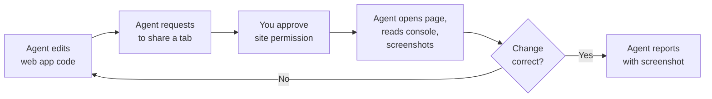

# Agentic Browser Automation

Browser tools went GA and on-by-default in VS Code 1.127, letting agents open pages, read console errors, take screenshots, click, type, and navigate without any external MCP server. Before this, driving a browser meant wiring up a Playwright or Chrome DevTools MCP server and managing its lifecycle yourself. Now the capability ships inside the agent, so the moment an agent finishes editing a web app it can open the running site and confirm the change actually rendered. This closes the loop for web work: the same agent that writes the code also verifies it in a real browser.

The tools are governed by the `BrowserChatTools` policy, which an administrator can set to control whether agents may reach the browser at all. That policy lives with the other managed settings covered in the [Governance module](../../08-governance/03-enterprise-policy/), alongside `ChatAgentNetworkFilter` for outbound network control. When the policy allows browser access, the defaults still keep you in the loop through per-site permission prompts and an explicit tab-sharing model. Nothing is shared with the agent silently.

## What the Browser Tools Can Do

The built-in tools give the agent a first-class view of a live page without any extra server process. Each capability maps to a concrete verification step the agent would otherwise ask you to perform by hand.

| Capability | What the agent does | Why it matters |
|---|---|---|
| Open and navigate | Loads a URL, follows links, goes back and forward | Reaches the exact route that changed |
| Read the console | Pulls errors and warnings from the page console | Catches a runtime failure the build did not surface |
| Screenshot into chat | Captures the viewport and pipes the image straight into the conversation | Gives you visual proof inline, no file juggling |
| Click and type | Interacts with buttons, links, and form fields | Exercises the actual user flow, not just the initial paint |
| Device emulation | Emulates a device profile, generating Playwright code to drive it | Verifies responsive layout at a target viewport |
| Favorites, history, proxy | Reuses saved sites, recent pages, and a remote proxy | Fits corporate networks and repeat targets |

Device emulation is worth calling out because the agent triggers it by generating Playwright code rather than clicking through a menu. That means the emulation step is reproducible and reviewable, and you can lift the generated snippet into a real test later. Tab placement, favorites, and history round out the surface so the agent lands on the right page and you can follow along.

## The Tab-Sharing and Permission Model

The agent never grabs a browser tab on its own. Sharing is explicit: the agent sends a share request, and you decide which tab it may observe and act on. On top of that, the first time the agent touches a given site it raises a per-site permission prompt, so approving `localhost` does not silently grant access to an internal admin portal on another host. These two gates, tab sharing and per-site consent, are what make on-by-default safe.

## Annotating a Page for the Agent

Describing a visual defect in words is the slow half of the loop. Since VS Code 1.132 you can select an element in the integrated browser with `Ctrl+Alt+C` (`Option+Cmd+C` on macOS) and attach a comment to it, which hands the agent the element and your note together instead of a paragraph of coordinates and class names. Pair it with `workbench.browser.autoReloadOnFileChange` (1.133), which reloads a local HTML page in the integrated browser whenever the file changes, so the agent's edit and the rendered result stay in step without a manual refresh.

## Exercise: Have an Agent Verify and Fix Its Own Change

The goal is to see the full change-then-verify loop end to end: an agent loads a running local app, finds a console error, screenshots the broken state, fixes the code, and confirms the fix in the same browser.

1. Start a local web app from `src/` (for example the `food-app` or the `angular` project) and note the URL it serves, such as `http://localhost:4200`. Leave it running.
2. In VS Code 1.127 or later, open the workspace and start an agent session in Agent Mode. Browser tools are on by default, so no MCP server or extra configuration is required.
3. Prompt the agent: "Open `http://localhost:4200`, read the browser console, and take a screenshot of the current page." Approve the tab-share request and the per-site permission prompt when they appear.
4. The agent pipes the screenshot into chat and reports any console errors it found. If the app is healthy, introduce a small defect first (for example, reference an undefined property in a component) so there is a real error to catch.
5. Prompt the agent: "Fix the console error you found, then reload the page and confirm the console is clean." The agent edits the source, navigates back to the page, and re-reads the console.
6. Confirm the follow-up screenshot shows the working page and an empty error list. Ask the agent to emulate a mobile device profile and screenshot again to check the responsive layout.
7. Select a misaligned element in the integrated browser with `Ctrl+Alt+C`, comment on it, and confirm the agent acts on the annotated element rather than on your description of it.

> Note: The steps above are written for VS Code. If your administrator has set the `BrowserChatTools` policy to a restricted value, the agent cannot open the browser; check the enterprise policy settings covered in the Governance module before starting.

## Links & Resources

- [VS Code 1.127 Release Notes](https://code.visualstudio.com/updates/v1_127) - browser tools GA and on-by-default, device emulation, and the tab-sharing model
- [VS Code 1.132 Release Notes](https://code.visualstudio.com/updates/v1_132) - selecting and commenting on web elements for agent feedback
- [VS Code 1.133 Release Notes](https://code.visualstudio.com/updates/v1_133) - `workbench.browser.autoReloadOnFileChange` for local HTML files
- [Copilot in VS Code documentation](https://code.visualstudio.com/docs/copilot/overview) - agent capabilities, tools, and permission prompts
- [About GitHub Copilot coding agent](https://docs.github.com/en/copilot/concepts/agents/coding-agent) - how agents plan, act, and verify work
