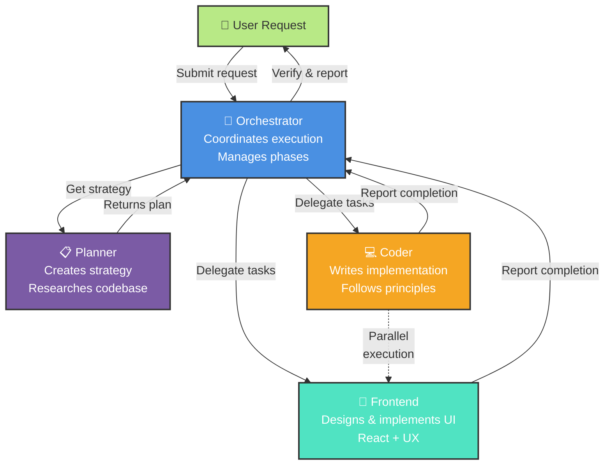

# Orchestration & Sub-Agents

Sub-agents enable one agent to delegate work to specialized agents, keeping the main agent's context window focused. The Orchestrator coordinates between specialists—Planner, Coder, and Frontend—breaking down complex requests into parallel work phases. This prevents context bloat while enabling simultaneous execution of independent tasks.

The key advantage is parallel execution at scale. Instead of researching requirements, planning architecture, implementing code, and designing UI sequentially, the Orchestrator coordinates these activities in parallel phases, with later phases dependent only on critical outputs from earlier ones.

## Agent Team

The team consists of four specialized agents with distinct responsibilities:

The Orchestrator receives user requests and coordinates execution. Rather than implementing anything itself, it delegates planning work to the Planner, then orchestrates parallel implementation across Coder and Frontend based on the plan. The Planner analyzes the codebase, verifies external documentation, identifies edge cases, and outputs a structured implementation strategy. The Coder receives well-defined tasks and writes code following mandatory principles—flat architectures, clear control flow, regenerable modules, and minimal coupling. The Frontend agent handles all UI/UX design and React implementation, prioritizing user experience and accessibility.

## Execution Model

The Orchestrator follows a structured four-step execution pattern. First, it calls Planner with the user's request to get a detailed implementation strategy. Second, it parses the plan into execution phases by analyzing file assignments—tasks with no overlapping files run in parallel; tasks with shared files run sequentially. Third, it executes each phase by spawning subagents simultaneously for parallel tasks, waiting for completion before proceeding to dependent phases. Finally, it verifies the work and reports results to the user.

Parallelization prevents unnecessary sequential work. When Coder implements the backend API and Frontend designs the UI component, these can happen simultaneously because they touch different files. But when the second phase needs to integrate the API with the UI, it waits for both phase one tasks to complete first.

## Avoiding File Conflicts

When delegating parallel tasks, you must explicitly scope each agent to specific files. Instead of telling multiple agents to update the same component, assign each agent distinct files or run those tasks sequentially. For example, if you need to both add theme context and apply theme to components, the first phase implements the context in ThemeContext.tsx and useTheme.ts while the second phase applies it across components.

This approach follows a critical principle: never tell agents how to do their work—describe what outcome is needed. Instead of "fix the bug by wrapping with useShallow," say "fix the infinite loop error in SideMenu." Instead of "add a button that calls handleClick," say "add a settings panel for the chat interface."

## Example Workflow

Building a feature like dark mode for an app demonstrates the power of orchestration. The Orchestrator calls Planner to create a strategy. Planner identifies three phases: design the color palette and toggle UI, implement the theme context and toggle component in parallel, then apply the theme across all components. In phase one, both tasks run in parallel—designer and coder work simultaneously. In phase two, Coder implements context logic while Frontend builds the toggle component—different files, same phase. In phase three, Coder applies theme tokens throughout the app. The Orchestrator reports completion to the user with all work verified and integrated.

## Agent Configuration

Each agent is defined in a markdown file in the .github/agents directory with specific tools and model configuration. The configuration file specifies which tools each agent can access, preventing scope creep while ensuring each agent has what it needs. The Orchestrator itself only has tools to read files, invoke agents, and manage memory—it coordinates through delegation, never implementation.

## Key Topics Covered in This Module

- [Orchestrator Agent](/.github/agents/team-orchestrator.agent.md)
- [Planner Agent](/.github/agents/team-planner.agent.md)
- [Coder Agent](/.github/agents/team-coder.agent.md)
- [Frontend Agent](/.github/agents/team-frontend.agent.md)
- [VS Code Subagents Documentation](https://code.visualstudio.com/docs/copilot/agents/subagents)
- [Custom Agents](https://code.visualstudio.com/docs/copilot/customization/custom-agents)
