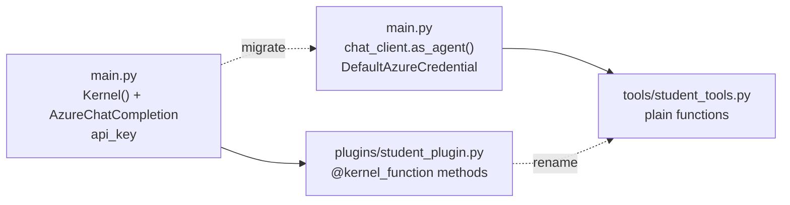

# Upgrading & Modernization with Python

This module demonstrates both the Semantic Kernel version (sk-students-ai-py) and the modernized Microsoft Agent Framework version (maf-students-ai-py), showing side-by-side how the same RAG-based student roster application evolves with the new framework.

This is the Python variant of [the upgrading demo](readme.md). The student roster, the five tools and the example prompts are the same; the application is a FastAPI and SQLite app, and the migration moves from the `semantic-kernel` package to the `agent-framework-core` and `agent-framework-openai` packages instead of the .NET NuGet packages.

## Migration Implementations

| Implementation | Description |
| -------------- | ----------- |
| **[Semantic Kernel Version (sk-students-ai-py)](./sk-students-ai-py/)** | RAG-based student roster application using Semantic Kernel for Python (legacy approach). |
| **[Agent Framework Version (maf-students-ai-py)](./maf-students-ai-py/)** | Modernized same application using Microsoft Agent Framework for Python with plain-function tools. |

Microsoft Agent Framework is a unified platform for building agentic AI applications with native support for multi-turn conversations, function calling, and tool orchestration. The framework replaces the earlier Semantic Kernel approach with a streamlined agent-centric model that makes it easier to build AI-powered applications.

The upgrade from Semantic Kernel to Microsoft Agent Framework involves these key migration tasks:

- Replace `semantic-kernel` with the `agent-framework-core` and `agent-framework-openai` packages
- Switch from the `Kernel()` plus `add_service()` pattern to direct agent creation using `chat_client.as_agent()`
- Rename the `plugins` folder to `tools` and replace `@kernel_function` methods with plain functions whose docstrings and `Annotated` parameters describe the tool
- Update authentication from API key configuration to `DefaultAzureCredential`
- Register the agent as a singleton FastAPI dependency instead of a module-level kernel



## Run Both Versions

Both apps read their settings from environment variables and ship the same `app.db` with 67 students. Run each from its own folder:

```powershell
cd sk-students-ai-py
python -m venv .venv
.\.venv\Scripts\pip install -r requirements.txt
$env:AZURE_OPENAI_MODEL = "gpt-4.1"
$env:AZURE_OPENAI_ENDPOINT = "https://<your-resource>.openai.azure.com/"
$env:AZURE_OPENAI_API_KEY = "<your-key>"
.\.venv\Scripts\python -m uvicorn main:app --port 8001
```

```powershell
cd maf-students-ai-py
python -m venv .venv
.\.venv\Scripts\pip install -r requirements.txt
az login
$env:AZURE_OPENAI_MODEL = "gpt-4o"
$env:AZURE_OPENAI_ENDPOINT = "https://<your-resource>.openai.azure.com/"
.\.venv\Scripts\python -m uvicorn main:app --port 8002
```

Open `http://127.0.0.1:8001` and `http://127.0.0.1:8002` and ask the same example prompt in both, for example "Which school has the most students?". Expected result: both name Nursing with 20 students, the Semantic Kernel version authenticating with the `api-key` header and the Agent Framework version with a bearer token from your `az login` session.

> Note: Install `agent-framework-core` and `agent-framework-openai`, not the `agent-framework` meta package. The meta package pulls in every provider, and one of them ships file paths long enough to fail `pip install` on Windows unless long path support is enabled.

## Proposed Prompts

Update project dependencies to Agent Framework. Replace `semantic-kernel` with `agent-framework-core`, `agent-framework-openai` and `azure-identity` in `requirements.txt`. Use Microsoft Learn MCP to find the latest stable versions and ensure compatibility.

```text
Use Microsoft Learn MCP to find the latest version information for the agent-framework Python packages. Identify which packages are required for a Semantic Kernel to Agent Framework migration of an app that calls Azure OpenAI chat completions. What are the key breaking changes I should be aware of?
```

Refactor `main.py` to use Agent Framework. Remove the `Kernel()` and `add_service()` pattern and replace it with direct agent creation. Use Microsoft Learn MCP to understand the `Agent` type and the `as_agent()` convenience method and how to configure them with instructions and tools.

```text
Use Microsoft Learn MCP to find documentation on creating agents with Agent and chat_client.as_agent() in Microsoft Agent Framework for Python. Show me how to migrate from a kernel-based architecture with get_streaming_chat_message_contents to a direct agent.run() call. What are the key API differences?
```

Rename the `plugins` folder to `tools` and update tool registrations. Use Microsoft Learn MCP to understand how plain Python functions and the `@tool` decorator replace Semantic Kernel plugins.

```text
Use Microsoft Learn MCP to research how tools work in Microsoft Agent Framework for Python. What is the difference between Semantic Kernel plugins with @kernel_function and Agent Framework tools? How do docstrings and Annotated parameters become the tool description, and when do I need the @tool decorator?
```

Update authentication to use `DefaultAzureCredential`. Remove the API key environment variable. Use Microsoft Learn MCP to understand why `DefaultAzureCredential` is the recommended approach for cloud-native applications.

```text
Use Microsoft Learn MCP to find best practices for Azure authentication in Agent Framework Python applications. Why is DefaultAzureCredential from azure-identity preferred over API key configuration? What security benefits does it provide?
```

Register the agent as a singleton. Replace the module-level kernel with a FastAPI dependency cached by `functools.lru_cache` and inject it into the route with `Depends`. Use Microsoft Learn MCP to understand agent lifetime management in Agent Framework applications.

```text
Use Microsoft Learn MCP to find guidance on agent lifetime in Microsoft Agent Framework for Python. Should one agent instance be shared across requests in a FastAPI app, and how do sessions keep per-user conversation state separate when the agent is a singleton?
```

## Links & Resources

- [Microsoft Semantic Kernel Documentation](https://learn.microsoft.com/en-us/semantic-kernel/overview/) - the legacy framework the sk-students-ai-py app is built on
- [Microsoft Agent Framework Documentation](https://learn.microsoft.com/en-us/agent-framework/overview/?pivots=programming-language-python) - agents, tools and chat clients in the Python SDK
- [Semantic Kernel to Agent Framework Migration Guide](https://learn.microsoft.com/en-us/agent-framework/migration-guide/from-semantic-kernel/?pivots=programming-language-python) - side-by-side Python mappings for packages, agent creation, tools and invocation

[← Previous: Agentic Browser Automation](../04-browser-tools/readme.md) | [Back to Agentic Coding](../readme.md)
