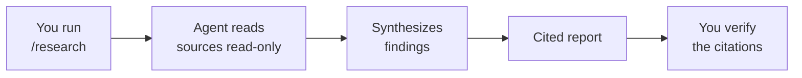

# Deep Research with /research

`/research` runs a read-only research agent from the interactive `copilot` shell. It gathers information across your codebase and the GitHub sources it can reach, then reports findings whose claims carry citations back to where they came from. The point is not to change anything but to understand something well enough to plan the change that comes next.

Because it never writes to your repository, it needs no elevated permissions. That makes it the lowest-risk agent in the course and the ideal first hands-on exercise: you get the full experience of driving an agent session, reading its output, and judging its citations, with zero chance of an unwanted edit. Reach for it to scope a change, compare two approaches, or get oriented in an unfamiliar codebase before any code is touched.

> Note: A cited report is only as good as its sources. Treat research output as a well-organized starting point and follow the citations before you act on a conclusion.

## Where It Lives

Research is one of the agents the CLI ships with, alongside explore, task, code-review, security-review, and rubber-duck. `/research` runs it directly, `/agent` lists them all, and the main agent can delegate to it mid-run, which is why a long session sometimes shows a research subagent working underneath it.

| Property | Effect |
|---|---|
| Read-only | Cannot edit, create, or delete files in your repository |
| No elevated permissions | Nothing to approve, nothing to sandbox |
| Cited output | Every claim links back to a source you can verify |
| Delegable | The main agent can call it as a subagent without you leaving the session |

## How a research run produces a report

You pose a question, the agent reads across the relevant sources without modifying them, and it synthesizes findings whose claims carry citations you can follow.

## Good and poor research prompts

| Weak prompt | Stronger prompt |
|---|---|
| "How does auth work?" | "Summarize how this repo authenticates API requests, and cite the files involved" |
| "Compare libraries" | "Compare how logging is done in the API versus the UI project, with citations" |
| "Explain the code" | "Trace the request path from the controller to the database for the orders endpoint" |

## Demo

Goal: run your first agent session end to end with zero write risk, then judge the result by its citations.

1. Run `copilot` in a repository you know well enough to sanity-check the output.
2. Run `/research` and pose a scoped question, for example: "Summarize how this project handles configuration and settings, and cite the files involved." Keep it specific enough that a good answer must name concrete files.
3. Watch the run. It reads files and never proposes an edit, and no approval prompt for a write action appears.
4. When the findings arrive, open two or three citations and confirm each one supports the claim attached to it. Flag any claim whose citation does not back it up.
5. Refine once. Narrow to a single configuration file or a single environment, and compare how the second answer's citations improve on the first.
6. Run `/share` to write the report to a Markdown file, an HTML file, or a gist, and keep it as a scoping artifact you could paste into an issue or a pull request before writing any code.

You have now run a complete agent session with zero write risk and learned to trust an agent's output only as far as its citations hold up.

## Links & Resources

- [About GitHub Copilot CLI](https://docs.github.com/copilot/concepts/agents/about-copilot-cli) - the interactive shell, its agents, and its commands
- [Using Copilot CLI](https://docs.github.com/copilot/how-tos/use-copilot-agents/use-copilot-cli) - working directories, file mentions, and sharing a session
- [GitHub Copilot CLI repository](https://github.com/github/copilot-cli) - releases, changelog, and usage examples
