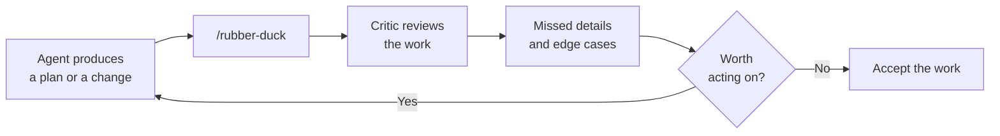

# A Second Opinion with /rubber-duck

An agent that just spent twenty turns on a problem is the worst available reviewer of that problem, because the reasoning that produced the code also produces the review. `/rubber-duck` answers that by handing the work to a critic whose whole job is to ask why this might not work. It reads what the session did and reports what it thinks was missed: a skipped edge case, an assumption nobody checked, a requirement that quietly dropped out. It is a review step rather than a fix step, so nothing changes on disk when you run it.

It is one of the agents the CLI ships with, run directly with `/rubber-duck`, and the main agent can also delegate to it mid-run. Its own description recommends calling it after planning and before implementing, which is earlier than most people reach for a review: the cheapest time to kill a bad approach is before the code exists.

| Aspect | `/rubber-duck` | A normal follow-up prompt |
|---|---|---|
| Role | A critic prompted to argue the opposite case | The same agent continuing its own reasoning |
| Scope | The work or the plan the session already has | Whatever you ask next |
| Output | Missed details and edge cases | New work |
| Side effects | None, it reports only | Edits, commands, and tool calls |

This is a cheap habit to build because it costs one turn and it runs where the mistakes are still cheap to fix. Treat its findings as candidates, not verdicts: you decide which ones earn a follow-up turn from the working agent.

## Demo

1. Run `copilot` in a repository you can safely edit.
2. Give the agent a task with real edge cases, such as adding input validation to an existing API endpoint, and let the run finish.
3. Read the agent's own summary of what it did, and note what it claims is complete.
4. Run `/rubber-duck` and let it review what the session just produced.
5. Compare the two. Anything the critic raises that the working agent never mentioned is the value of the step.
6. Decide which findings are worth acting on, then prompt the working agent to address only those.
7. Repeat the exercise one step earlier on your next task: review the plan before any code is written, which is where the agent's own description says it pays best.

## Links & Resources

- [About GitHub Copilot CLI](https://docs.github.com/copilot/concepts/agents/about-copilot-cli) - the interactive shell, its agents, and its commands
- [Using Copilot CLI](https://docs.github.com/copilot/how-tos/use-copilot-agents/use-copilot-cli) - running, reviewing, and sharing a session
- [GitHub Copilot CLI repository](https://github.com/github/copilot-cli) - releases, changelog, and usage examples
