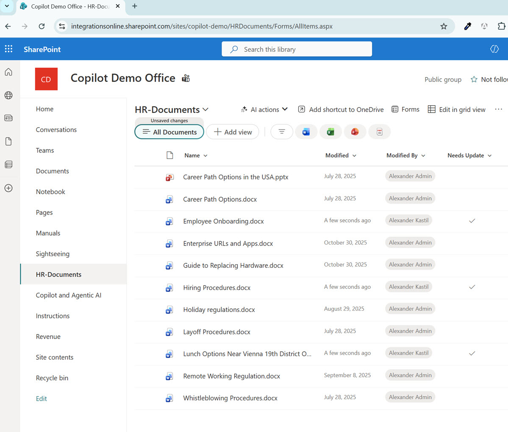

# Business Case: HR Document Updates Automation

## Scenario

The Copilot Demo Office maintains an HR-Documents library on SharePoint that contains critical personnel policies, procedures, and benefits information. Documents such as Career Path Options, Employee Onboarding, Enterprise URLs, Hiring Procedures, Holiday Regulations, Layoff Procedures, and Whistleblowing Procedures require periodic updates to stay current with company changes.

The HR team uses a "Needs Update" column to flag documents that require attention, but manually reviewing and sending update notifications is time-consuming and error-prone. Documents can remain flagged indefinitely without proper tracking.



### Problem

- HR administrators spend time manually checking SharePoint for flagged documents
- Update notifications are delayed or missed
- No centralized awareness of which documents need attention and who modified them last
- Decision-makers lack immediate visibility into document maintenance status

### Solution

Automate the document review process using Copilot CLI combined with Work IQ and SharePoint MCP servers to:

1. Query the HR-Documents library for all documents marked in the "Needs Update" column
2. Collect document metadata (name, modified date, modified by)
3. Generate a formatted summary report
4. Send the report via email to HR leadership

This workflow runs on-demand or on a schedule, ensuring documents stay current and stakeholders remain informed.

### Expected Outcome

- Reduced manual effort for document tracking
- Faster notification of pending updates
- Improved document governance and compliance
- Automated audit trail of what needed updating and when

---

## Implementation

### Prerequisites

- GitHub Copilot CLI installed and authenticated
- Access to https://integrationsonline.sharepoint.com/sites/copilot-demo
- Read permissions on HR-Documents library
- Ability to send emails to alexander.kastil@integrations.at

### Step 1: Install and Configure Copilot CLI

Open PowerShell and verify Copilot CLI is installed:

```powershell
copilot --version
```

If not installed, install via WinGet:

```powershell
winget install GitHub.Copilot
```

Start Copilot CLI interactive mode:

```powershell
copilot
```

### Step 2: Add Required MCP Servers

Inside Copilot CLI, add the Work IQ and SharePoint MCP servers:

```
/mcp add workiq
/mcp add @microsoft/sharepoint-lists-tools
```

Verify the servers are configured:

```
/mcp show
```

### Step 3: Query HR-Documents for Update Flags

Ask Copilot CLI to retrieve all documents in the HR-Documents library that need updates:

```
Query the HR-Documents library at https://integrationsonline.sharepoint.com/sites/copilot-demo
and find all documents where the "Needs Update" column is marked.
Include the document name, modified date, and modified by fields.
```

Copilot CLI will use Work IQ or the SharePoint MCP tools to execute the query and return results.

### Step 4: Format Results

Ask Copilot to format the results into a clean, readable report:

```
Format the results into an HTML table with columns: Document Name, Last Modified, Modified By.
Add a summary line saying how many documents need updating.
```

### Step 5: Send Email Report

Use Microsoft Graph API or Power Automate to send the report:

**Option A - Direct Graph API (from Copilot CLI):**

```
Send an email to alexander.kastil@integrations.at with the subject
"HR-Documents Update Status Report" and include the formatted results table in the body.
Use Microsoft Graph API to authenticate and send via Outlook.
```

**Option B - Power Automate (Manual Setup):**

1. Go to https://make.powerautomate.com
2. Create a new cloud flow triggered by an HTTP request
3. Add a SharePoint "Get items" action filtering the HR-Documents list
4. Filter condition: "Needs Update" equals "Yes"
5. Add a "Send an email (V2)" action to alexander.kastil@integrations.at
6. Format the email body with the document list
7. Call the flow URL from Copilot CLI using `/suggest` to generate the curl command

### Step 6: Automate with Scheduling (Optional)

To run this workflow on a schedule:

**Using Windows Task Scheduler:**

1. Create a PowerShell script file `update-report.ps1`:

```powershell
copilot -i "Query HR-Documents library at https://integrationsonline.sharepoint.com/sites/copilot-demo and find all documents where Needs Update is marked. Format as HTML table and send to alexander.kastil@integrations.at with subject 'HR-Documents Update Status Report'"
```

2. Open Task Scheduler and create a new task:
   - Name: Update HR-Documents Report
   - Trigger: Daily at 8:00 AM (or desired time)
   - Action: Run `powershell.exe -File C:\path\to\update-report.ps1`
   - Conditions: Run only if user is logged in

**Using GitHub Actions (if hosted in GitHub):**

Create `.github/workflows/hr-document-sync.yml`:

```yaml
name: HR Document Updates Report

on:
  schedule:
    - cron: '0 8 * * 1' # Every Monday at 8 AM UTC

jobs:
  check-updates:
    runs-on: ubuntu-latest
    steps:
      - name: Install Copilot CLI
        run: npm install -g @github/copilot

      - name: Run document check
        run: |
          copilot -i "Query HR-Documents and find Needs Update items. Send report to alexander.kastil@integrations.at"
```

### Step 7: Test the Workflow

1. Manually trigger the workflow by running the Copilot CLI command
2. Verify the email arrives at alexander.kastil@integrations.at
3. Confirm the document list is accurate and up-to-date
4. Check that metadata (dates, modified by) is correct

### Step 8: Monitor and Refine

- Review the email report weekly
- Confirm documents flagged for update are being addressed
- Adjust the query if needed (e.g., filter by modified date range, specific document types)
- Use Copilot CLI `/feedback` command to improve results
