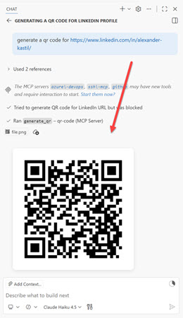

# Implementing & using MCP Apps

## What are MCP Apps?

MCP Apps extend the Model Context Protocol (MCP) by providing a standardized way to deliver interactive user interfaces directly from MCP servers. While MCP tools typically return text and structured data, MCP Apps enable rich, interactive experiences like charts, forms, dashboards, design canvases, and video players to render inline in chat clients such as Claude, ChatGPT, VS Code, and other compliant hosts.

This solves a critical gap: MCP provides the tools and data access, while MCP Apps provide the visual interface. Your UI renders in context, in the conversation, without requiring users to navigate away from their chat client.

## MCP Server Implementations

| Server                                 | Description                                                           |
| -------------------------------------- | --------------------------------------------------------------------- |
| **[QR Code MCP Server](./qr-server/)** | Generate QR codes from URLs and text directly in GitHub Copilot Chat. |

## How MCP Apps Work

MCP Apps are built on standardized specifications and SDKs maintained at the official Model Context Protocol repository. The protocol works through a clean separation of concerns:

1. Tool definition: Your MCP server tool declares a `ui://` resource containing its HTML interface
2. Tool call: The LLM calls the tool on your server
3. Host renders: The host fetches the resource and displays it in a sandboxed iframe
4. Bidirectional communication: The host passes tool data to the UI via notifications, and the UI can call other tools through the host

The MCP Apps specification (stable as of 2026-01-26) is maintained at the official repository and provides SDKs for multiple roles. App developers build interactive Views while host developers embed those Views in chat clients, and MCP server authors register tools with UI metadata. Supported frameworks include React, Vue, Svelte, and vanilla JavaScript.

## QR Code MCP Server Example

The [qr-server](./qr-server) demonstration shows a practical MCP App that generates QR codes from URLs and text. The server is written in Python using the FastMCP framework and the qrcode library, making it lightweight and easy to run.

When invoked through GitHub Copilot or other MCP clients, the QR Code server generates a PNG image and displays it in an interactive UI embedded directly in the chat. The UI is defined as an embedded HTML view with styling and JavaScript that handles receiving the generated QR code data from the MCP server.

Parameters like box size, border dimensions, error correction level, and colors can be customized, giving users full control over the generated output. The server accepts standard input/output (stdio) transport, making it simple to configure in `.vscode/mcp.json` or other MCP client configuration files.

### How it works

The server uses the FastMCP decorator pattern to expose the QR code generation as a tool with UI metadata. The `@mcp.tool` decorator registers the tool and specifies the `ui/resourceUri` pointing to the HTML view that will render the output.

The tool accepts parameters for customization: text (the content to encode), box_size (pixel dimensions 1-20), border (quiet zone size), and error_correction (L/M/Q/H levels ranging from 7% to 30% recovery). Color options (fill_color and back_color) support hex values or named colors.

The implementation generates QR codes using the Python qrcode library with configurable error correction levels mapped to the qrcode.constants module. The generated PIL image is encoded to PNG format and returned as base64-encoded ImageContent.

The UI layer is embedded as a single HTML resource that loads the MCP Apps SDK from a CDN (`@modelcontextprotocol/ext-apps`). The JavaScript App class receives tool results via the `ontoolresult` handler, extracts the image data, and renders it in an img element. It also handles host context changes to respect safe area insets on mobile or windowed clients.

The server supports two transport modes: stdio mode for CLI-based MCP clients (enabled with `--stdio` flag) suitable for GitHub Copilot Desktop and VS Code. HTTP mode uses Uvicorn with CORS middleware for web-based clients, making it compatible with any MCP-compliant host.

## Key Topics covered in this module

- [MCP Apps Specification](https://github.com/modelcontextprotocol/ext-apps)
- [MCP Introduction](https://modelcontextprotocol.io/introduction)
- [FastMCP Framework](https://www.anthropic.com/index/introducing-mcp)
