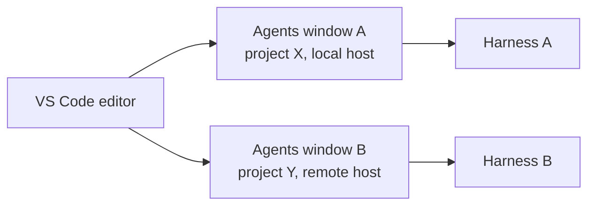

# The Agents Window

The Agents window is a dedicated companion window for running agents across multiple projects at once. It arrived as a preview in VS Code 1.120 and has since become the primary surface for agent work rather than an experiment beside it. It sits beside your editor rather than inside it, so agent work no longer competes with the file you are reading for screen space. Each window is independent: you can point one at a different model, a different project, or a different execution host while the others keep running.

The window matters because agentic work is no longer a single blocking conversation in the sidebar. A selectable agent harness lets you choose which backend runs a given session, remote execution lets that session run away from your laptop, and per-window setting overrides let each window carry its own configuration. Extensions opt in to appearing in the window through the `extensions.supportAgentsWindow` capability, so tools you already use can surface their agent surfaces here.

## What the Window Gives You

| Capability | What it gives you |
|---|---|
| Companion window | A separate window for agent sessions, kept out of the main editor layout |
| Selectable harness | Choose which agent backend runs a session, per window |
| Remote execution | Run a session on a remote host instead of the local machine |
| Per-window overrides | Model, project, and host settings scoped to one window |
| External sessions | View and continue Copilot or Claude sessions started in other applications |
| `extensions.supportAgentsWindow` | The capability an extension declares to appear in the window |

## How One Window Differs From the Next

The value of separate windows is that each one carries its own context and target. A window overriding the model and host does not change what any other window is doing, which is what makes several projects viable at the same time.

## Sessions Started Somewhere Else

Agent work does not only start in VS Code. With `chat.agentSessions.showExternal` (VS Code 1.135) the Sessions list shows up to two recent Copilot or Claude sessions created in other applications, such as the Copilot CLI or the standalone GitHub Copilot app. Select one and you see its conversation and continue it in VS Code against your own Copilot subscription. The Sessions list submenu filters which external sessions appear, so a busy machine does not flood the list.

> Note: The Agents window moves quickly from release to release. Confirm the exact toggles against the release notes for the version you are running before relying on a specific setting.

## Exercise

1. Update to a current VS Code release and open a workspace you use for agent work.
2. Open the Command Palette and search for the Agents window command to launch the companion window.
3. Start a session in the window and confirm it runs independently of the editor sidebar chat.
4. Open a second Agents window and point it at a different project or model using the per-window settings.
5. Confirm both windows run their sessions in parallel without interfering with each other.
6. Turn on `chat.agentSessions.showExternal`, start a session in the Copilot CLI, then find it in the Sessions list and continue it in VS Code.

## Links & Resources

- [VS Code 1.120 release notes](https://code.visualstudio.com/updates/v1_120) - the Agents window preview, selectable harness, and per-window overrides
- [VS Code 1.135 release notes](https://code.visualstudio.com/updates/v1_135) - external agent sessions and `chat.agentSessions.showExternal`
- [Copilot in VS Code documentation](https://code.visualstudio.com/docs/copilot/overview) - how Copilot agent surfaces integrate with the editor
