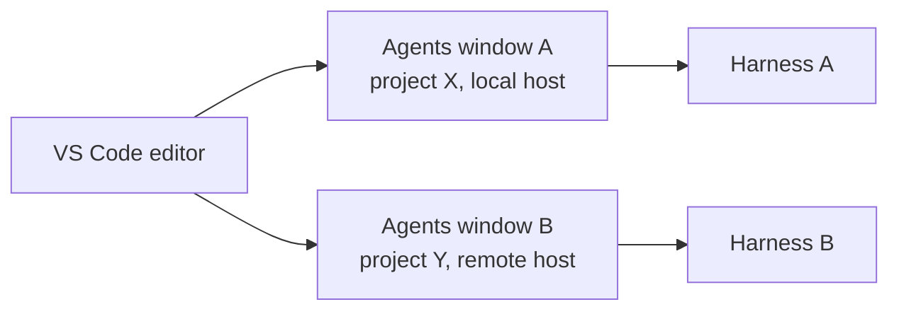

# The Agents Window

The Agents window is a dedicated companion window for running agents across multiple projects at once. It is the primary surface for agent work rather than an experiment beside it. It sits beside your editor rather than inside it, so agent work no longer competes with the file you are reading for screen space. Each window is independent: you can point one at a different model, a different project, or a different execution host while the others keep running.

The window matters because agentic work is no longer a single blocking conversation in the sidebar. A selectable agent harness lets you choose which backend runs a given session, remote execution lets that session run away from your laptop, and per-window setting overrides let each window carry its own configuration. Extensions opt in to appearing in the window through the `extensions.supportAgentsWindow` capability, so tools you already use can surface their agent surfaces here.

## What the Window Gives You

| Capability | What it gives you |
|---|---|
| Companion window | A separate window for agent sessions, kept out of the main editor layout |
| Selectable harness | Choose which agent backend runs a session, per window |
| Remote execution | Run a session on a remote host instead of the local machine |
| Per-window overrides | Model, project, and host settings scoped to one window |
| External sessions | View and continue Copilot or Claude sessions started in other applications |
| `extensions.supportAgentsWindow` | The capability an extension declares to appear in the window |

## How One Window Differs From the Next

The value of separate windows is that each one carries its own context and target. A window overriding the model and host does not change what any other window is doing, which is what makes several projects viable at the same time.

## Sessions Started Somewhere Else

Agent work does not only start in VS Code. With `chat.agentSessions.showExternal` the Sessions list shows recent Copilot or Claude sessions created in other applications, such as the Copilot CLI or the standalone GitHub Copilot app. Select one and you see its conversation and continue it in VS Code against your own Copilot subscription. The Sessions list submenu filters which external sessions appear, so a busy machine does not flood the list.

## Demo

1. Open the Agents window: the **Open in Agents** button in the title bar, `Chat: Open Agents window` from the Command Palette, or `code --agents` from a terminal.
2. Select **New**, or press `Ctrl+N`. The composer appears with three chips above the prompt box: the workspace, the harness, and the model.
3. Click the workspace chip and pick a folder from the **Local** tab, then type a prompt to start the session. Confirm it runs in this window, not in the editor's sidebar chat.
4. Start a second session against a different folder and a different model, and watch both run at once without interfering.
5. Press `Ctrl+R` for the Sessions picker to jump between them, holding `Ctrl` and pressing `R` to walk the list, and `Ctrl+Shift+T` to reopen the last chat you closed.
6. Switch the harness chip from Copilot to Claude or Codex on a new session, and confirm the window drives all three the same way.
7. Turn on `chat.agentSessions.showExternal`, start a session in the Copilot CLI, then find it in the Sessions list and continue it here.

## Links & Resources

- [Use the Agents window](https://code.visualstudio.com/docs/agents/run/agents-window) - opening the window, starting sessions, and the composer chips
- [Build with agents in VS Code](https://code.visualstudio.com/docs/agents/overview) - the agent surfaces and how they relate
- [Understand agent sessions and handoff](https://code.visualstudio.com/docs/agents/concepts/sessions) - continuing a session started somewhere else

[← Back to Agent Sessions](../readme.md) | [Next: Agent Host Protocol (AHP vs ACP) →](../02-host-protocol/readme.md)
