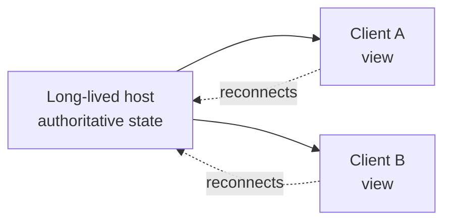

# Agent Host Protocol (AHP vs ACP)

The Agent Host Protocol (AHP) is an open specification where authoritative session state lives on a long-lived host and synchronizes out to one or more clients. Because the host outlives any single client, sessions survive disconnects and reconnect cleanly. This is an architect-track topic: the point is the boundary between where state lives and where you view it, not a set of buttons to click.

The design contrast worth internalizing is AHP against the Agent Client Protocol (ACP). Under a client-authoritative model, the session lives with the client, so closing the client risks losing the running work. Under AHP, the host is authoritative, the client is a view, and the same session can be attached from more than one place. The agent host is built on the Copilot SDK, which makes the SDK load-bearing for this whole module and links directly to [Module 5](../../05-cli-sdk/02-sdk/01-intro/).

## AHP vs ACP at a Glance

| Dimension | Agent Client Protocol (ACP) | Agent Host Protocol (AHP) |
|---|---|---|
| Authoritative state | Lives with the client | Lives on the host |
| Host lifetime | Bound to the client session | Long-lived, outlives clients |
| Disconnect behavior | Risk of losing running work | Session survives, reconnects cleanly |
| Client role | Owns the session | A view onto host state |
| Number of viewers | Typically one | One or more |

## Host-Authoritative State

Treat the host as the source of truth and every client as a window onto it. A client can drop off the network, come back, and resynchronize because the host never stopped tracking the session.

Because the host is built on the Copilot SDK, the same primitives that let you build an agent programmatically are the ones running the session behind the editor. That is why the SDK topic in Module 5 is not an optional aside: it describes the foundation this protocol stands on.

## What Runs on the Host

The host is not something you switch on. Every session you start in the Agents window already runs on it, and the harness is a chip in the composer next to the workspace: Copilot, Claude, and Codex all run on the same host. The Copilot agent there is powered by the Copilot SDK, so its behavior matches the Copilot CLI and the standalone GitHub Copilot app instead of diverging per surface. Because the host outlives any window, one session can be attached from several VS Code windows at the same time.

What you can configure is which harnesses and hosts are available, not the protocol itself:

| Setting | What it controls |
|---|---|
| `chat.agentHost.claudeAgent.enabled` | Whether the Claude harness is offered in the composer |
| `chat.agentHost.codexAgent.enabled` | Whether the Codex harness is offered |
| `chat.agentHost.allowSignedOutWhenUsable` | Opens the Agents window with an existing Claude API key and no GitHub sign-in, the offline path described in [Selecting Models](../../01-fundamentals/02-models/) |
| `chat.agentHost.forwardSSHAgent` | Forwards your SSH agent to a remote host, so a session there can reach your Git remotes |
| `chat.agentHost.devContainer.enabled` | Lets a session run inside a dev container rather than on the host directly |

## Demo

Prove that the session, not the window, owns the work.

1. Open the Agents window with the **Open in Agents** button in the title bar, `Chat: Open Agents window` from the Command Palette, or `code --agents`.
2. Select **New** (`Ctrl+N`) and start a task long enough to still be running a minute from now, such as a refactor spanning several files.
3. Close the window while the agent is still working, which under a client-authoritative model would end the run.
4. Reopen the Agents window. The session is in the Sessions list, still running, carrying the turns that completed while no client was attached.
5. Open the same session in a second window and confirm both views track one session rather than forking into two.
6. Switch the harness chip in the composer from Copilot to Claude or Codex and start another session, confirming the host is shared infrastructure rather than a Copilot-only feature.

## Links & Resources

- [Understand the VS Code Agent Host](https://code.visualstudio.com/docs/agents/concepts/agent-host) - the host process, its lifetime, and what attaches to it
- [Understand agent sessions and handoff](https://code.visualstudio.com/docs/agents/concepts/sessions) - what a session owns and how it moves between clients
- [Introducing the Agent Host](https://code.visualstudio.com/blogs/2026/08/26/agent-host-architecture) - why state moved off the client

[← Previous: The Agents Window](../01-agents-window/readme.md) | [Back to Agent Sessions](../readme.md) | [Next: Remote Agent Sessions over SSH & Dev Tunnels →](../03-remote-sessions/readme.md)
