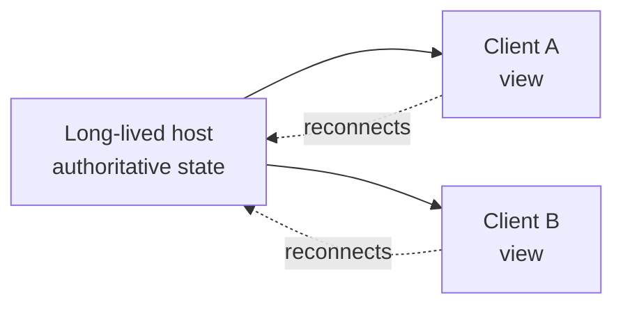

# Agent Host Protocol (AHP vs ACP)

The Agent Host Protocol (AHP), shipped in VS Code 1.121, is an open specification where authoritative session state lives on a long-lived host and synchronizes out to one or more clients. Because the host outlives any single client, sessions survive disconnects and reconnect cleanly. This is an architect-track topic: the point is the boundary between where state lives and where you view it, not a set of buttons to click.

The design contrast worth internalizing is AHP against the Agent Client Protocol (ACP). Under a client-authoritative model, the session lives with the client, so closing the client risks losing the running work. Under AHP, the host is authoritative, the client is a view, and the same session can be attached from more than one place. The agent host is built on the Copilot SDK, which makes the SDK load-bearing for this whole module and links directly to [Module 5](../../05-cli-sdk/02-sdk/01-sdk/).

## AHP vs ACP at a Glance

| Dimension | Agent Client Protocol (ACP) | Agent Host Protocol (AHP) |
|---|---|---|
| Authoritative state | Lives with the client | Lives on the host |
| Host lifetime | Bound to the client session | Long-lived, outlives clients |
| Disconnect behavior | Risk of losing running work | Session survives, reconnects cleanly |
| Client role | Owns the session | A view onto host state |
| Number of viewers | Typically one | One or more |

## Host-Authoritative State

Treat the host as the source of truth and every client as a window onto it. A client can drop off the network, come back, and resynchronize because the host never stopped tracking the session.

Because the host is built on the Copilot SDK, the same primitives that let you build an agent programmatically are the ones running the session behind the editor. That is why the SDK topic in Module 5 is not an optional aside: it describes the foundation this protocol stands on.

## Turning It On and What Runs on It

The host is enabled with `chat.agentHost.enabled`, and it is not Copilot-only: the Copilot, Claude, and Codex harnesses all run on it. The Copilot agent on the host is powered by the Copilot SDK, so its behavior matches the Copilot CLI and the standalone GitHub Copilot app instead of diverging per surface. Because the host outlives any window, one session can be attached from several VS Code windows at the same time.

Two changes matter for administrators. The `ChatAgentHostEnabled` policy was removed in VS Code 1.132, which makes the setting the single control point. The experimental `chat.agentHost.allowSignedOutWhenUsable` (1.133) opens the Agents window with an existing Claude API key configured and no GitHub sign-in, which is the offline path described in [Selecting Models](../../01-fundamentals/02-models/).

## Links & Resources

- [VS Code 1.121 release notes](https://code.visualstudio.com/updates/v1_121) - the Agent Host Protocol and host-authoritative sessions
- [VS Code 1.132 release notes](https://code.visualstudio.com/updates/v1_132) - removal of the `ChatAgentHostEnabled` policy in favor of `chat.agentHost.enabled`
- [VS Code 1.133 release notes](https://code.visualstudio.com/updates/v1_133) - `chat.agentHost.allowSignedOutWhenUsable` for signed-out access
- [Copilot in VS Code documentation](https://code.visualstudio.com/docs/copilot/overview) - how agent sessions integrate with the editor
