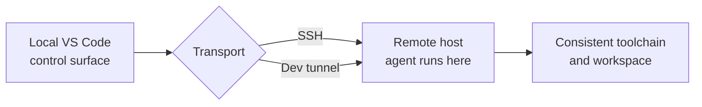

# Remote Agent Sessions over SSH & Dev Tunnels


Remote agent sessions run over SSH and dev tunnels so an agent executes in a consistent, cloud-backed environment rather than on your local machine. This is the reproducible-environment story that replaces GitHub Codespaces and Dev Containers in this course. You get isolation and consistent tooling without maintaining a local container setup, and the agent runs against the toolchain that lives on the remote host.

Two transports carry the session. SSH connects the agent to a machine you already reach that way, such as a build server or a cloud VM, so the agent inherits that host's runtimes and credentials. Dev tunnels connect through a secure tunnel without you opening inbound firewall ports, which suits machines behind NAT or a corporate network. In both cases the agent's work happens on the remote side, and your editor is the control surface.

## Choosing a Transport

| Transport | Reach for it when |
|---|---|
| SSH | You already have SSH access to the target host and want the agent to use its tools directly |
| Dev tunnel | The host sits behind NAT or a firewall and you cannot open inbound ports |

## Where the Work Runs

The mental model is the same as remote development generally: your editor stays local, the agent and its file system live on the remote host. The reproducibility win is that the remote environment is defined once and reused, so every session sees the same runtimes.



> Note: Remote agent sessions replace the Codespaces and Dev Container workflow used earlier in this course. If you have existing container definitions, treat the remote host as the equivalent reproducible target rather than re-creating the container locally.

## Prerequisites

- A current VS Code release with the Agents window (see [Agent Host Protocol](../02-host-protocol/readme.md)); the agent host needs no setting turned on
- A Linux host you can reach over SSH. This walkthrough uses a Raspberry Pi 4 named `raspi-4`
- An entry in `~/.ssh/config`, which is what makes the host selectable by name in VS Code
- A key whose public half is in `~/.ssh/authorized_keys` on the host. Pin it with `IdentityFile`, because VS Code otherwise offers your default key and stops on its passphrase prompt

```text
Host raspi-4
    HostName 192.168.0.143
    User alex
    IdentityFile ~/.ssh/raspi-4
    IdentitiesOnly yes
```

- `python3` on the remote host, which Raspberry Pi OS ships by default
- A free port on the host for the demo server, `8000` below
- Optional: `chat.agentHost.forwardSSHAgent` if the session needs to reach your Git remotes from the remote host

## Demo

Build and run a hello-world HTTP service on the Pi without installing anything on your laptop.

### Start the Session

1. Open the Agents window: the **Open in Agents** button in the title bar, `Chat: Open Agents window` from the Command Palette, or `code --agents` from a terminal.
2. Select **New**, or press `Ctrl+N` (`Cmd+N` on macOS).
3. Click the workspace chip in the composer, the one labeled with your current folder, and switch from the **Local** tab to the **Remote** tab.
4. Pick `raspi-4`, which is read from `~/.ssh/config`, or enter `alex@raspi-4`. On first connect the window installs the VS Code CLI on the Pi itself; nothing else has to be installed there.
5. Select `/home/alex` as the session folder.
6. Paste the first prompt and press Enter.

### Step 1: Write and Run the Service

```text
Create ~/hello/app.py using only the Python standard library: an http.server that listens on 0.0.0.0 port 8000 and answers GET / with the plain text "Hello from raspi-4" and GET /health with {"status": "ok"} as application/json. Send Content-Type and Content-Length on both. Then start it detached with setsid nohup python3 ~/hello/app.py > /tmp/h.log 2>&1 < /dev/null & so it survives the turn, wait two seconds, and curl both routes and show me the output.
```

The agent should come back with `Hello from raspi-4` and `{"status": "ok"}`. The `setsid nohup ... < /dev/null &` clause is the part that matters: a plain background start dies with the agent's shell turn, which is what makes most "run a server" prompts look broken.

Its curl ran on the Pi. Open `http://localhost:8000` in your own browser as well: VS Code forwards port 8000, so your laptop reaches the process on the Pi.

### Step 2: Change It

```text
Change ~/hello/app.py so that GET / returns "Hello from <hostname> on Python <version>", taking the two values from socket.gethostname() and platform.python_version(). Stop the running server with pkill -f "[p]ython3 .*hello/app.py", start it again with setsid nohup python3 ~/hello/app.py > /tmp/h.log 2>&1 < /dev/null &, then curl / and /health and show me the output.
```

You read the diff locally while the edit, the restart, and the test all happen on the Pi. Check that both the PID and the `Content-Length` changed: a 200 alone does not prove the new code is the code being served.

Three details in that prompt are load-bearing. Stopping the old process first is not optional, because re-running the start line while port 8000 is still held fails with `Address already in use`, and the detached start swallows that into `/tmp/h.log` so the restart looks clean while the old code keeps answering. The bracket in `[p]ython3` stops the pattern from matching the shell that carries it, which would otherwise kill the agent's own session. Repeating the whole start command instead of writing "start it the same way as before" is what lets a reader run this step on its own.

### Step 3: Reattach

Close the VS Code window, reopen the Agents window, and select the session from the list. The server is still serving and the conversation is intact, because the host owns the session and outlived the window.

### Step 4: Clean Up

```text
Stop the hello server with pkill -f "[p]ython3 .*hello/app.py", then delete the ~/hello folder and /tmp/h.log. Confirm that nothing is listening on port 8000 any more and that no python3 process from this demo is left.
```

Keep that order. Deleting the folder first leaves a live process serving a file that no longer exists and still holding port 8000, which is the stray server the next run of step 1 will collide with. Your laptop never ran the code and has nothing to clean up.

## Links & Resources

- [VS Code Remote Development](https://code.visualstudio.com/docs/remote/remote-overview) - SSH and tunnel connection models the sessions build on
- [Run and manage remote agent sessions](https://code.visualstudio.com/docs/agents/run/remote-agent-sessions) - the Remote tab, SSH connection strings, and folder selection step by step
- [Use the Agents window](https://code.visualstudio.com/docs/agents/run/agents-window) - opening the window and starting, listing, and reattaching to sessions

[← Previous: Agent Host Protocol (AHP vs ACP)](../02-host-protocol/readme.md) | [Back to Agent Sessions](../readme.md) | [Next: Managing Sessions in the Agents Window →](../04-session-management/readme.md)
