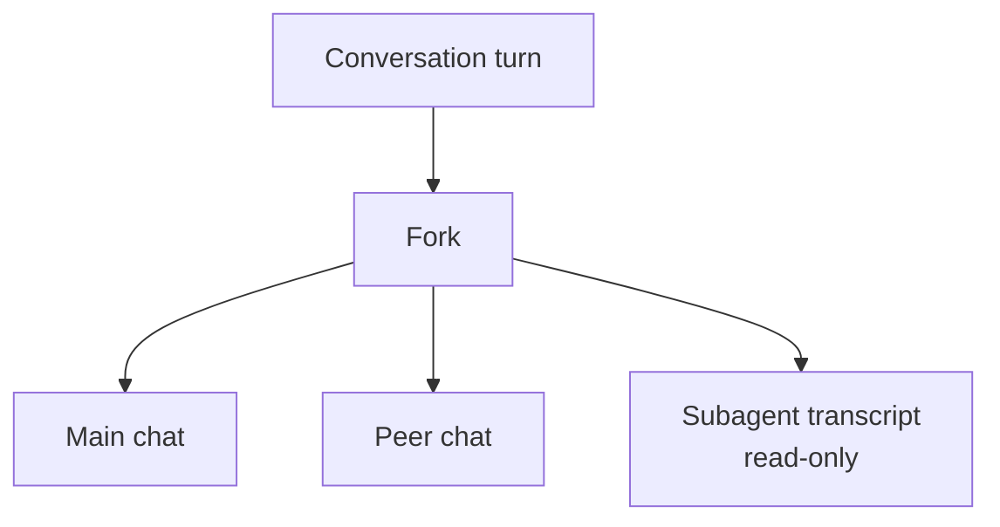
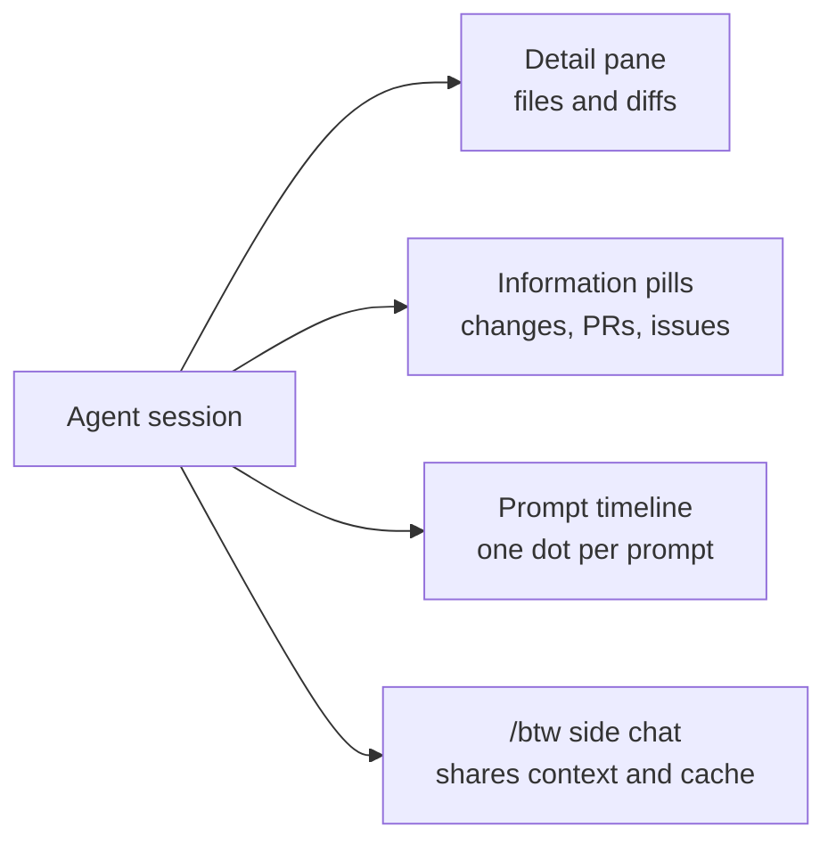

# Session Management

Once agents run across several windows, the bottleneck stops being the agent and becomes your ability to manage many sessions at once. The Agents window grew a management surface across VS Code 1.123 through 1.135 for exactly this: arrange sessions side by side, switch between them fast, isolate risky work, send it to the background, and act on signals like failing CI without leaving the chat input. This topic is the hands-on core of the module, and the exercise below builds the lab.

The features arrived incrementally, so it helps to know which version introduced what. Layout and navigation came first, then background and restore, then multi-chat and server-side code review, then grouping and actionable banners. Worktree isolation, side chats, and in-conversation search followed, and the layout was finally consolidated into a single detail pane. Treat the table below as the reference for what your version supports.

## Feature Timeline

| Version | Capabilities |
|---|---|
| 1.123 | Run sessions side by side, pin, and maximize |
| 1.124 | Session picker (Ctrl+R), background send, restore on reload, Close All |
| 1.126 | Multi-chat, server-side code-review comments (`addComment`, `listComments`, `resolveComments`) |
| 1.127 | Session groups with drag and drop, chat-input banners for failing CI and PR comments |
| 1.128 | Claude multi-chat fork, read-only subagent transcripts, workspace-less quick chats |
| 1.129 | Worktree checkbox for session isolation, session-management tools agents can call |
| 1.130 | Worktrees for the Claude and Codex harnesses, file-level diff stats, compact multi-file diffs |
| 1.132 | Side chats (`/btw`), chat references (`#chat:`), session activity pills |
| 1.134 | Grid layout for chats, Find in Chat (Ctrl+F), prompt timeline |
| 1.135 | Single-pane detail panel as default, session information pills, sticky scroll |

## Layout, Navigation, and Background Work

Side-by-side layout, pinning, and maximize (1.123) let you keep two related sessions visible and enlarge whichever one you are driving. The session picker on Ctrl+R (1.124) is the fast switch when you have more sessions than fit on screen, and Close All clears them in a single action. Background send lets a session keep working while you move on, and restore-on-reload means a window reload does not throw away in-flight sessions.

## Groups, Banners, and Multi-Chat

Session groups with drag and drop (1.127) let you organize related sessions the way you organize files. Chat-input banners (1.127) surface failing CI checks and incoming PR comments right where you type, with one-click actions to fix checks or address comments, so the signal and the response live in the same place. Multi-chat (1.126) lets you fork a turn and run peer chats in parallel, and in 1.128 the Claude harness adds forking together with read-only subagent transcripts so you can inspect what a delegated agent did without editing it. Workspace-less quick chats (1.128) let you start a session without first opening a folder.

Server-side code-review comments (1.126) expose `addComment`, `listComments`, and `resolveComments`, which lets a session participate in review threads programmatically rather than only through the UI.

## Isolation and Diffs

A session that rewrites your working tree while another session reads it is a race you will lose. The worktree checkbox (1.129) puts a session in its own Git worktree with one click, and 1.130 extended worktree support from Copilot to the Claude and Codex harnesses. The same release added file-level diff statistics with insertion and deletion counts, plus a compact multi-file diff view with aligned gutters, so reviewing what a long run changed no longer means opening every file. Agents also gained session-management tools in 1.129, which let a session enumerate, create, and observe other sessions instead of making you switch context for it.

## Side Chats, References, and Search

Asking a clarifying question used to mean interrupting the turn. Side chats (1.132) open with `/btw` and answer alongside the running conversation, sharing its context and its prompt cache so the detour stays cheap. Chat references let one conversation pull in another with `#chat:` or by dragging a chat tab, which is how you hand one session's output to the next without copying text. Find in Chat (1.134) searches the whole conversation with Ctrl+F, including content that is not currently rendered, and it expands collapsed work summaries that contain a match.

## Layout and Orientation

Grid layout (1.134) arranges related conversations into horizontal or vertical groups by drag and drop, and Alt+select in the Chats picker opens two chats side by side. The prompt timeline (1.134) puts one dot per prompt in the transcript gutter, with line addition and deletion counts on the prompts that changed files, so you jump straight to the turn you are looking for; `sessions.chatTimeline.display` turns it off. In 1.135 the single-pane detail panel became the default (`sessions.layout.singlePaneDetailPanel`), consolidating session details and editors into one shared side pane. Session information pills above the chat input show changes, pull requests, issues, browser interactions, and artifacts, and a right-click controls which of them appear.

## Exercise

1. Update to a VS Code version from the timeline above that covers the features you want to try (1.135 for the full set).
2. Start two agent sessions, then run them side by side; pin one and maximize the other (1.123).
3. Press Ctrl+R to open the session picker and switch between sessions, then send one to the background and let it keep working (1.124).
4. Reload the window and confirm the sessions are restored, then use Close All to clear them (1.124).
5. Create a session group and drag related sessions into it (1.127).
6. Trigger a failing CI check or a PR comment on a branch, then use the chat-input banner's one-click action to respond (1.127).
7. Fork a turn to run a peer chat in parallel, and open a read-only subagent transcript to inspect delegated work (1.126, 1.128).
8. Start a session with the worktree checkbox ticked, and confirm it edits an isolated checkout rather than your working tree (1.129, 1.130).
9. Ask a question with `/btw` while a turn is still running, and confirm the side chat answers without interrupting it (1.132).
10. Press Ctrl+F and search the conversation for a term that appears only inside a collapsed work summary (1.134).
11. Use the prompt timeline in the gutter to jump back to an earlier prompt, then read its line change counts (1.134).

## Links & Resources

- [VS Code 1.123 release notes](https://code.visualstudio.com/updates/v1_123) - side-by-side layout, pinning, and maximize for sessions
- [VS Code 1.124 release notes](https://code.visualstudio.com/updates/v1_124) - session picker, background send, restore, and Close All
- [VS Code 1.127 release notes](https://code.visualstudio.com/updates/v1_127) - session groups and chat-input banners for CI and PR comments
- [VS Code 1.128 release notes](https://code.visualstudio.com/updates/v1_128) - Claude multi-chat fork, read-only subagent transcripts, and quick chats
- [VS Code 1.129 release notes](https://code.visualstudio.com/updates/v1_129) - the worktree checkbox and session-management tools for agents
- [VS Code 1.130 release notes](https://code.visualstudio.com/updates/v1_130) - worktrees for Claude and Codex, file-level diff stats, and compact multi-file diffs
- [VS Code 1.132 release notes](https://code.visualstudio.com/updates/v1_132) - side chats with `/btw`, chat references, and session activity pills
- [VS Code 1.134 release notes](https://code.visualstudio.com/updates/v1_134) - grid layout, Find in Chat, and the prompt timeline
- [VS Code 1.135 release notes](https://code.visualstudio.com/updates/v1_135) - the single-pane detail panel default and session information pills
