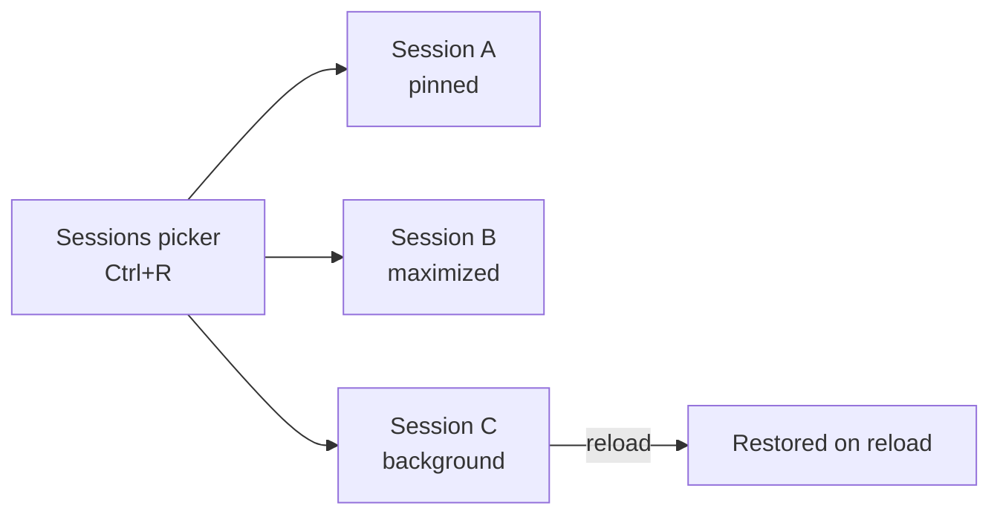
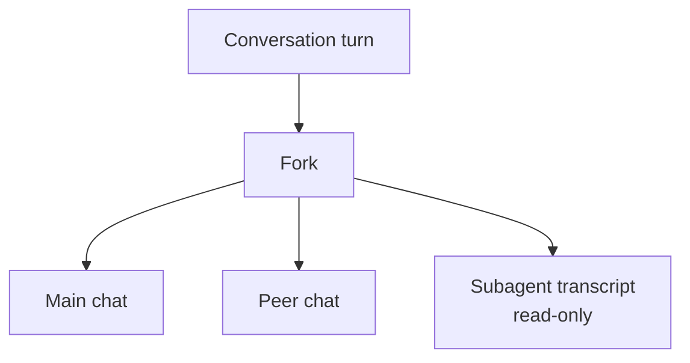
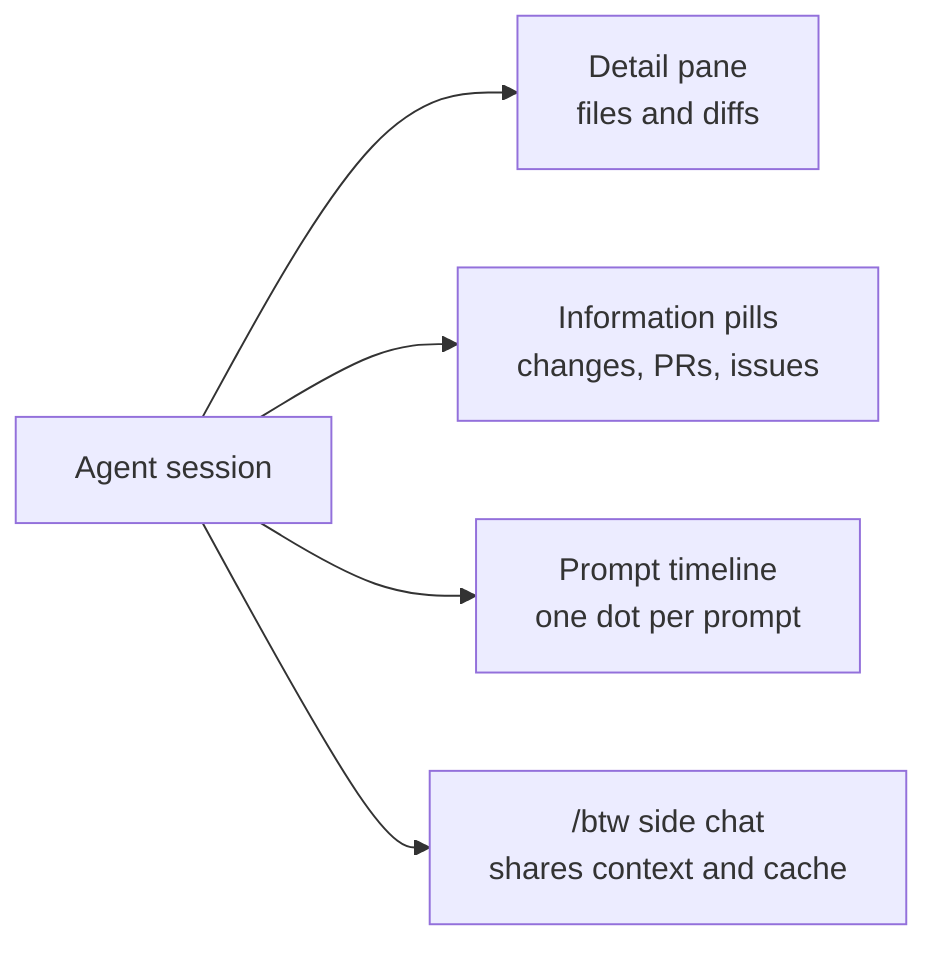
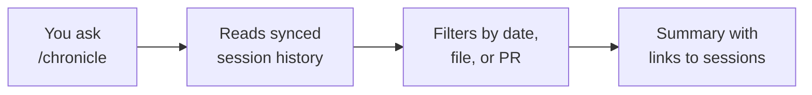
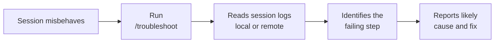

# Managing Sessions in the Agents Window

Once agents run across several windows, the bottleneck stops being the agent and becomes your ability to manage many sessions at once. The Agents window carries a management surface for exactly this: arrange sessions side by side, switch between them fast, isolate risky work, send it to the background, and act on signals like failing CI without leaving the chat input. Sessions are durable objects on top of that surface, so `/chronicle` queries what you already ran and `/troubleshoot` explains a run that went wrong. This topic is the hands-on core of the module, and the exercise below builds the lab.

## Layout, Navigation, and Background Work

Side-by-side layout, pinning, and maximize let you keep two related sessions visible and enlarge whichever one you are driving. The Sessions picker on `Ctrl+R` is the fast switch when you have more sessions than fit on screen: hold `Ctrl` and press `R` again to walk down the list, `Ctrl+Shift+R` to walk back. `Ctrl+Shift+O` is a different jump, Go to Chat in Session, which moves within the session you are already in, and `Ctrl+Shift+T` reopens the last chat you closed. Close All clears them in a single action. Background send lets a session keep working while you move on, and restore-on-reload means a window reload does not throw away in-flight sessions.

## Groups, Banners, and Multi-Chat

Session groups with drag and drop let you organize related sessions the way you organize files. Chat-input banners surface failing CI checks and incoming PR comments right where you type, with one-click actions to fix checks or address comments, so the signal and the response live in the same place. Multi-chat lets you fork a turn and run peer chats in parallel, and the Claude harness forks too, with read-only subagent transcripts so you can inspect what a delegated agent did without editing it. Workspace-less quick chats let you start a session without first opening a folder.

Server-side code-review comments expose `addComment`, `listComments`, and `resolveComments`, which lets a session participate in review threads programmatically rather than only through the UI.

## Isolation and Diffs

A session that rewrites your working tree while another session reads it is a race you will lose. The worktree checkbox puts a session in its own Git worktree with one click, on the Copilot, Claude, and Codex harnesses alike. File-level diff statistics carry insertion and deletion counts, plus a compact multi-file diff view with aligned gutters, so reviewing what a long run changed no longer means opening every file. Agents also have session-management tools, which let a session enumerate, create, and observe other sessions instead of making you switch context for it.

## Side Chats, References, and Search

Asking a clarifying question used to mean interrupting the turn. Side chats open with `/btw` and answer alongside the running conversation, sharing its context and its prompt cache so the detour stays cheap. Chat references let one conversation pull in another, which is how you hand one session's output to the next without copying text. Find in Chat searches the whole conversation with `Ctrl+F`, including content that is not currently rendered, and it expands collapsed work summaries that contain a match.

## Layout and Orientation

Grid layout arranges related conversations into horizontal or vertical groups by drag and drop, and Alt+select in the Chats picker opens two chats side by side. The prompt timeline puts one dot per prompt in the transcript gutter, with line addition and deletion counts on the prompts that changed files, so you jump straight to the turn you are looking for; `sessions.chatTimeline.display` turns it off. The single-pane detail panel is the default (`sessions.layout.singlePaneDetailPanel`), consolidating session details and editors into one shared side pane. Session information pills above the chat input show changes, pull requests, issues, browser interactions, and artifacts, and a right-click controls which of them appear.

## Session Persistence and /chronicle

Agent sessions are durable objects, not throwaway chats. They sync to your GitHub account, so the work you started on your laptop is waiting for you on your desktop, and a window reload no longer wipes the conversation. Persistence turns a stream of agent turns into a searchable record of what was attempted, what changed, and why.

The `/chronicle` command is the query surface over that record. Instead of scrolling back through a transcript, you ask for what you need: a standup summary of yesterday's sessions, every session that touched a given file, or the session tied to a specific pull request. It ships with subcommands, so `/chronicle standup` and `/chronicle search` get you there without composing a question, and `/chronicle reindex` rebuilds the index when a query comes back thin.

> Note: The steps below use VS Code. GitHub Copilot signs in with the same GitHub account across Visual Studio, JetBrains IDEs, and GitHub.com, so a session started in one place is discoverable from the others once sync has run.

| Capability | What it means day to day |
|---|---|
| Account-scoped sync | History follows your GitHub identity, not a machine or a window |
| Survives reload | Closing the window or reloading VS Code restores the session state |
| Cross-machine continuity | Start on one device, resume on another after signing in |
| Queryable record | `/chronicle` answers questions over past sessions instead of manual scrollback |

You type a question, `/chronicle` reads your synced session history rather than your live workspace, and it returns a summary with links back to the source sessions. It is a read over the record, so it never changes code.

| Query intent | What you get back |
|---|---|
| `/chronicle standup` | A short summary of the sessions you ran in a time window |
| `/chronicle search` | Sessions matching a term, a path, or a pull request |
| `/chronicle tips` | How to get more out of your own session history |
| `/chronicle reindex` | A rebuilt index when a query misses sessions you know exist |

## Diagnosing a Session with /troubleshoot

The `/troubleshoot` command analyzes session logs to diagnose problems in an agent session. It reads what actually happened, the prompts, the tool calls, and the failures, and reports back what went wrong and where. It is a command rather than a panel, so it goes wherever your session runs.

It is available in local sessions and in Copilot CLI sessions, and it reads the session's own record rather than your live workspace, which is what lets it explain a failure after the fact. Reach for it when a session stalls, a tool call fails, or a run ends in a way the transcript alone does not explain.

| Symptom | Why /troubleshoot helps |
|---|---|
| Session stalls | Finds where the turn stopped making progress |
| Tool call fails | Surfaces the failing tool and its error |
| A run ends with no visible reason | Reads the record behind the transcript, including the calls that never returned |

## Demo

1. Update to a current VS Code release, and confirm the Agents window opens. Check the account menu in the Activity Bar to confirm you are signed in to GitHub Copilot with your GitHub account.
2. Start two agent sessions, then run them side by side; pin one and maximize the other. Ask the first a read-only question about the current repository, such as summarizing the top-level folders, and ask the second to explain one specific file by name.
3. Press `Ctrl+R` to open the Sessions picker and switch between sessions, then send one to the background and let it keep working.
4. Run `Developer: Reload Window` from the Command Palette and confirm both sessions are restored, then use Close All to clear them.
5. Create a session group and drag related sessions into it.
6. On a repository with GitHub Actions configured, push a branch whose checks fail, then use the chat-input banner's one-click action to respond. Skip this step if the repository has no CI.
7. Fork a turn to run a peer chat in parallel, and open a read-only subagent transcript to inspect delegated work.
8. Start a session with the worktree checkbox ticked, and confirm it edits an isolated checkout rather than your working tree.
9. Ask a question with `/btw` while a turn is still running, and confirm the side chat answers without interrupting it.
10. Press `Ctrl+F` and search the conversation for a term that appears only inside a collapsed work summary.
11. Use the prompt timeline in the gutter to jump back to an earlier prompt, then read its line change counts.
12. Run `/chronicle standup` and read the summary of what you ran today. Follow one of its links back to the originating session.
13. Run `/chronicle search` for the file name you used in step 2, and confirm that session comes back. If either query misses a session you know exists, run `/chronicle reindex` and repeat it. The index, not the history, is what goes stale.
14. Start a fresh session and give the agent a task that is certain to hit a wall, such as running a build for a toolchain that is not installed, or reading a file at a path that does not exist. Watch it fail or stall, and resist reading the raw logs yourself first.
15. Run `/troubleshoot` and ask it to analyze that session. Read how it names the failing step and a likely cause rather than echoing the error text back at you, then act on the diagnosis, rerun the task, and confirm the session now succeeds.
16. Run the same failing task in a Copilot CLI session and `/troubleshoot` it there, confirming the diagnosis travels with the session rather than with the window.

## Links & Resources

- [Use the Agents window](https://code.visualstudio.com/docs/agents/run/agents-window) - layout, groups, the session picker, and background sessions
- [Understand agent sessions and handoff](https://code.visualstudio.com/docs/agents/concepts/sessions) - what a session owns, how it is resumed, and the record these commands read
- [Understand the VS Code Agent Host](https://code.visualstudio.com/docs/agents/concepts/agent-host) - what the host is doing when a session stalls
- [GitHub Copilot documentation](https://docs.github.com/en/copilot) - account, sign-in, and cross-surface behavior for Copilot
- [Build with agents in VS Code](https://code.visualstudio.com/docs/agents/overview) - the agent surfaces and how they fit together

[← Previous: Remote Agent Sessions over SSH & Dev Tunnels](../03-remote-sessions/readme.md) | [Back to Agent Sessions](../readme.md)
