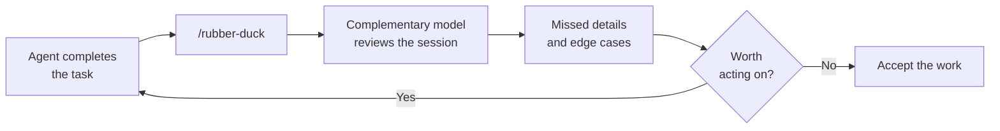

# A Second Opinion with /rubber-duck

An agent that just spent twenty turns on a problem is the worst available reviewer of that problem, because the reasoning that produced the code also produces the review. The `/rubber-duck` command, experimental in VS Code 1.135, answers that by handing the session to a complementary model for a second opinion. It reads what the session did and reports what it thinks was missed: a skipped edge case, an assumption nobody checked, a requirement that quietly dropped out. It is a review step rather than a fix step, so nothing changes on disk when you run it.

The value comes from the reviewing model being a different one. A second pass from the same model tends to confirm its own reasoning, while a different model brings different priors and catches different things. Run it at the point where you would otherwise say "looks right, ship it".

| Aspect | `/rubber-duck` | A normal follow-up prompt |
|---|---|---|
| Model | A complementary model, not the session's | The session's current model |
| Scope | The work the session already did | Whatever you ask next |
| Output | Missed details and edge cases | New work |
| Side effects | None, it reports only | Edits, commands, and tool calls |

This is a cheap habit to build because it costs one turn and it runs where the mistakes are still cheap to fix. Treat its findings as candidates, not verdicts: you decide which ones earn a follow-up turn from the working agent.

## Exercise

1. Update to VS Code 1.135 or later and start a Copilot agent host session in the Agents window.
2. Give the agent a task with real edge cases, such as adding input validation to an existing API endpoint.
3. Let the run finish and read the agent's own summary of what it did.
4. Run `/rubber-duck` in the same session and read the second opinion it returns.
5. Compare the two, and note anything the reviewing model raised that the working agent never mentioned.
6. Decide which findings are worth acting on, then prompt the working agent to address only those.

## Links & Resources

- [VS Code 1.135 release notes](https://code.visualstudio.com/updates/v1_135) - the experimental `/rubber-duck` command and its complementary-model review
- [Copilot in VS Code documentation](https://code.visualstudio.com/docs/copilot/overview) - agent sessions, slash commands, and the agent host
