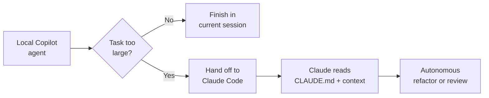

# Using Anthropic Claude Code Agents

Claude Code is a desktop application powered by Anthropic's Claude Agent SDK that operates autonomously within VS Code. Unlike browser-based chat, it has direct access to your file system and can read, modify, and execute code in your workspace. It runs alongside GitHub Copilot as a third-party agent, so you can reach for it when a task suits Claude's strengths while keeping the rest of your workflow in Copilot. This makes it a strong fit for large-scale refactoring, structured code review, and security audits.

Claude Code manages context efficiently through persistent markdown files and parallel sub-agent execution. A `CLAUDE.md` file at the workspace root carries the durable project context, and each sub-agent it spawns operates in its own context window. That isolation keeps the main agent from becoming overwhelmed during complex tasks, because the noisy exploration happens in a child context and only the result flows back. The pattern mirrors the [orchestration model](../03-orchestration/) you saw earlier, applied here by a desktop agent.

## Permission Modes

Configure permission modes to control how aggressively Claude Code acts in your workspace. The right mode depends on how much you trust the task and how closely you want to supervise it.

| Mode | Behavior | Best for |
|---|---|---|
| Plan first | Outlines the steps and waits for your approval before touching files | High-risk or unfamiliar changes |
| Approve edits | Applies changes only after you confirm each diff | Day-to-day supervised work |
| Auto | Applies changes without prompting for each step | Trusted, well-scoped tasks you can review at the end |

Plan-first mode is the safest starting point because you see the intended approach before any file changes. Auto mode is the fastest, but it assumes you will review the final diff rather than each step. Match the mode to the blast radius of the task, not to your impatience.

## Slash Commands

Use specialized slash commands to drive advanced workflows. The set below is specific to Claude Code and does not overlap with the Copilot Chat commands from earlier modules.

| Command | Purpose |
|---|---|
| `/init` | Generate a `CLAUDE.md` for the current project by scanning the workspace |
| `/agents` | Create and manage custom agents for specific tasks |
| `/hooks` | Define automations at key moments like session start or tool execution |
| `/memory` | Manage persistent context across sessions |
| `/review` | Analyze and provide feedback on pull request changes |
| `/security-review` | Identify vulnerabilities in pending code changes |

Skills extend this further by bundling a reusable workflow with its supporting code, so a team can share a proven procedure and invoke it by name. Where a slash command is a single action, a skill is a packaged capability that Claude selects when the task matches its description.

## Handoff from Local Agents

Claude Code integrates with VS Code's debugging and testing tools while working within your Copilot subscription. When a local Copilot agent starts a task that is too large or too specialized to finish in the current session, you can hand it off to Claude Code for autonomous execution. The `CLAUDE.md` file and any relevant context travel with the handoff, so Claude Code picks up with the same project knowledge.

## Exercise: Run a Structured Review with Claude Code

The goal is to feel the full loop once: seed project context, run a focused change, then have Claude review its own work.

1. Open a project from `src/` in VS Code with the Claude Code agent available. If there is no `CLAUDE.md` yet, run `/init` and let Claude scan the workspace to generate one.
2. Start the session in plan-first mode. Prompt Claude to perform a small, well-scoped refactor, for example: "Extract the duplicated validation logic in the service layer into a single helper and update the call sites."
3. Review the plan Claude proposes before approving. Confirm the plan touches only the files you expect, then let it apply the changes.
4. Run `/review` to get structured feedback on the resulting diff. Read Claude's findings and apply or dismiss each one.
5. Run `/security-review` on the same pending changes to check for vulnerabilities the refactor may have introduced or missed.
6. Compare the before-and-after behavior by running the project's tests. Confirm the refactor is behavior-preserving before you commit.

> Note: The path above assumes the Claude Code agent is installed as a third-party agent in VS Code. See the linked VS Code documentation for the current install and enablement steps.

## Links & Resources

- [VS Code Claude Agent Preview](https://code.visualstudio.com/docs/copilot/agents/third-party-agents#_claude-agent-preview) - enabling the Claude agent inside VS Code
- [Third-party Agents in VS Code](https://code.visualstudio.com/docs/copilot/agents/third-party-agents) - how third-party agents integrate with Copilot
- [Claude Code documentation](https://docs.anthropic.com/en/docs/claude-code/overview) - permission modes, CLAUDE.md, slash commands, and skills
- [Claude Code sub-agents](https://docs.anthropic.com/en/docs/claude-code/sub-agents) - spawning and configuring sub-agents for parallel work
