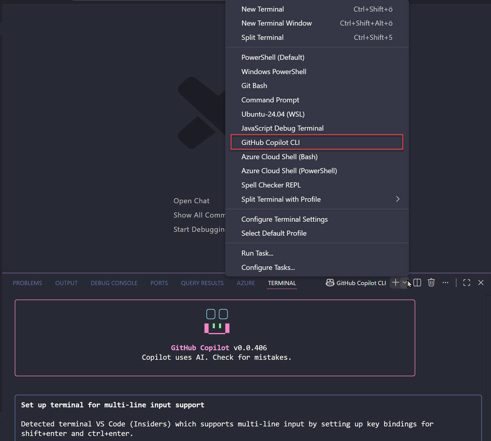

# GitHub Copilot CLI

GitHub Copilot CLI brings AI-powered code assistance directly to your terminal and command-line workflows. It provides intelligent suggestions for commands, scripts, and operations without leaving your development environment. This streamlines repetitive tasks and accelerates development cycles across any shell environment.

## Use Cases & Benefits

- Codebase maintenance: Tackle security-related fixes, dependency upgrades, and targeted refactoring without manual effort.
- Feature development: Implement incremental feature requests and new functionality with AI-assisted code generation.
- Documentation: Update and create project documentation automatically based on your codebase.
- Test coverage: Develop additional test suites to improve code quality and maintainability.
- Prototyping: Greenfield new projects and concepts quickly without starting from scratch.
- Environment setup: Run terminal commands to set up your local development environment for existing projects.
- Command discovery: Find the right command to perform tasks or get natural language explanations of unfamiliar commands.



> Note: Copilot can also be used in the VS Code terminal for an integrated development experience without context switching.

## Installation

Supported on Linux, macOS, and Windows (PowerShell v6 or higher on Windows).

Install with WinGet (Windows):

```bash
winget install GitHub.Copilot
```

Install with npm (macOS, Linux, and Windows):

```bash
npm install -g @github/copilot
```

On first launch, run `copilot` and use the `/login` slash command to authenticate with your GitHub account.

## Base Commands

GitHub Copilot CLI uses slash commands for core functionality:

| Slash Command                | Description                                                          |
| ---------------------------- | -------------------------------------------------------------------- |
| `/help`                      | Show available commands and options                                  |
| `/explain <command>`         | Ask Copilot to explain any shell command                             |
| `/suggest <task>`            | Ask Copilot to suggest a shell command for a task                    |
| `/revise`                    | Revise the last suggestion based on your instructions                |
| `/feedback`                  | Submit feedback on a response or suggestion                          |
| `/exit`                      | Exit interactive mode                                                |
| `/login`                     | Authenticate with your GitHub account or use a Personal Access Token |
| `/model <model>`             | Select which AI model to use                                         |
| `/experimental`              | Enable experimental features like Autopilot mode                     |
| `/theme [auto\|dark\|light]` | Change terminal theme                                                |
| `/skills`                    | Manage skills for enhanced capabilities                              |
| `/mcp`                       | Manage MCP server configuration                                      |
| `/list-dirs`                 | Show allowed directories for file operations                         |
| `/reset-allowed-tools`       | Reset allowed tools list                                             |
| `/lsp`                       | View Language Server Protocol configuration and status               |

Press `Shift+Tab` to cycle through modes including Autopilot, which encourages the agent to continue working until a task completes.

For comprehensive documentation and usage examples, see [GitHub Copilot CLI](https://github.com/github/copilot-cli) and the [official documentation](https://docs.github.com/copilot/concepts/agents/about-copilot-cli).

## Demos

### Authenticate with Copilot CLI

Start by opening your terminal and running the copilot command to launch the interactive shell.

```bash
copilot
```

When prompted, use the `/login` command to authenticate with your GitHub account.

```
/login
```

Follow the browser prompt to authorize the application. Once authenticated, you will return to the Copilot CLI prompt.

### Get Help Explaining a Command

Ask Copilot to explain a common terminal command you might be unfamiliar with. For example, list all files in the current directory including hidden files.

```bash
ls -la
```

Copilot will explain what the command does, each flag, and when you might use it.

### Explain

```text
copilot -i "explain brew install git"
copilot -i "suggest find large files and delete them"
```

### Generate a Command

Now ask Copilot to suggest a command for a task. For example, find all JavaScript files in your project directory that were modified in the last 7 days.

```bash
find . -name "*.js" -type f -mtime -7
```

Copilot will generate the appropriate command and explain what it does before execution.

### Enable Autopilot Mode

Press `Shift+Tab` to switch to Autopilot mode. This mode encourages Copilot to handle multi-step tasks autonomously. Ask Copilot to initialize a new Node.js project with Express and list the created files.

Autopilot will execute the setup steps automatically and show progress as it works.

Use @xxx to ask about a specific file, function, or variable in your project. For example:

```
@readme.md what is this file about?
```

### Switch Models (Optional)

Use the `/model` command to view available models and switch between Claude Sonnet 4.5, Claude Sonnet 4, or GPT-5 based on your preference.

```
/model
```

Select a different model to experience how various AI models handle the same requests.

### Exit Copilot CLI

Type `exit` to leave the Copilot CLI interactive shell and return to your standard terminal.

```bash
exit
```

### Key Takeaways

Copilot CLI eliminates context switching by bringing AI assistance directly to your terminal. It handles command discovery, generation, and explanation in one tool. Autopilot mode is particularly useful for complex multi-step tasks where manual command entry would be time-consuming. The ability to switch models allows you to choose the best AI behavior for your specific task.

## Links & Resources

- [GitHub Copilot CLI Repository](https://github.com/github/copilot-cli)
- [Official Copilot CLI Documentation](https://docs.github.com/copilot/concepts/agents/about-copilot-cli)
- [GitHub Copilot Overview](https://github.com/features/copilot)
