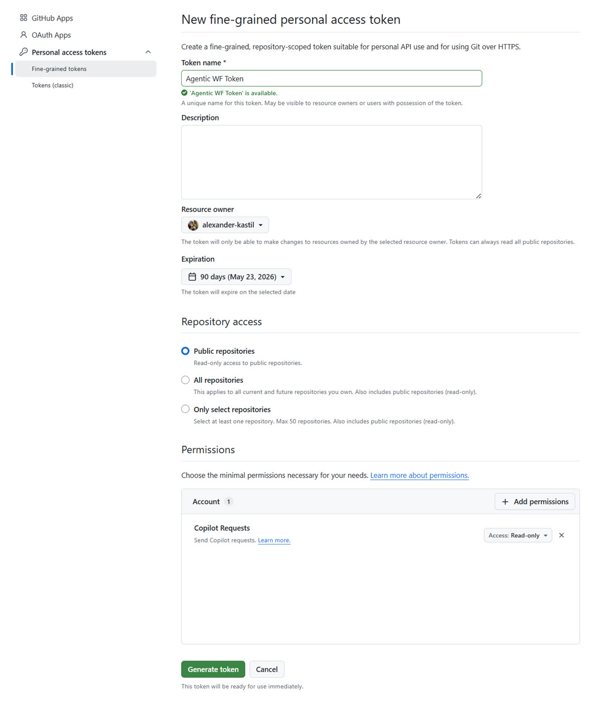
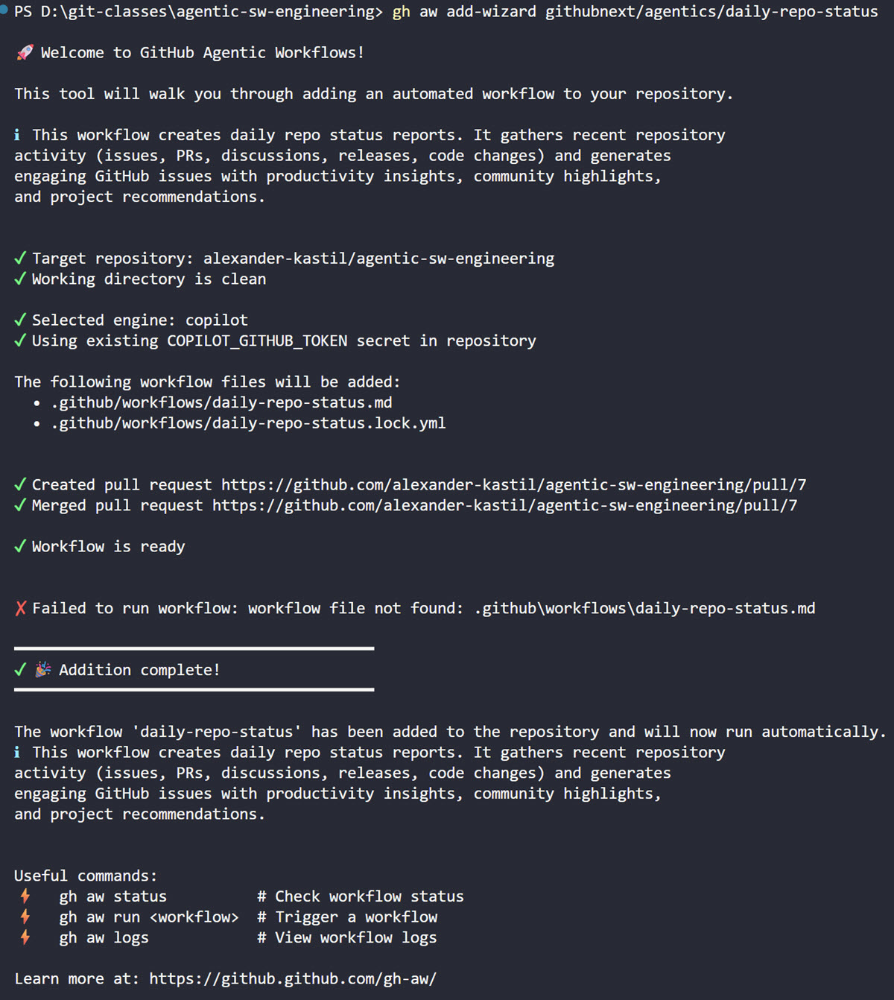

# GitHub Agentic Workflows

[GitHub Agentic Workflows](https://github.github.com/gh-aw/)

## Demo

### Installation and Requirements

> Note: [GitHub CLI](https://github.com/cli/cli/releases/download/v2.87.2/gh_2.87.2_windows_amd64.msi) is a required dependency for this demo.

Login to GitHub CLI:

```bash
gh auth login
```

Installation:

```bash
gh extension install github/gh-aw
```

### Add the sample workflow and trigger a run:

```bash
gh aw add-wizard githubnext/agentics/daily-repo-status
```

> Note: Before adding the workflow, make sure your repo is clean and you have committed all your changes. The workflow will be added to a new branch and a pull-request wil be issued.

Create the token:



Add the demo workflow and run it:



The output will be shown as [Issue](https://github.com/alexander-kastil/agentic-sw-engineering/issues/8)

### Add a custom workflow:

You can create your own workflow using the [GitHub Agentic Workflows Wizard](https://raw.githubusercontent.com/github/gh-aw/main/create.md). The wizard will guide you through the process of creating a workflow and will help you with the configuration.

```
Create a workflow for GitHub Agentic Workflows using https://raw.githubusercontent.com/github/gh-aw/main/create.md

The purpose of the workflow is to use check all markdown files under demos and make sure that all tables with links reflect the modules in in the file system. If there are any discrepancies, the workflow should update the tables in the markdown files to reflect the current state of the file system and make sure there are no broken links.
```

## Links & Resources

[GitHub Agentic Workflows Documentation](https://github.github.com/gh-aw/introduction/overview/)
