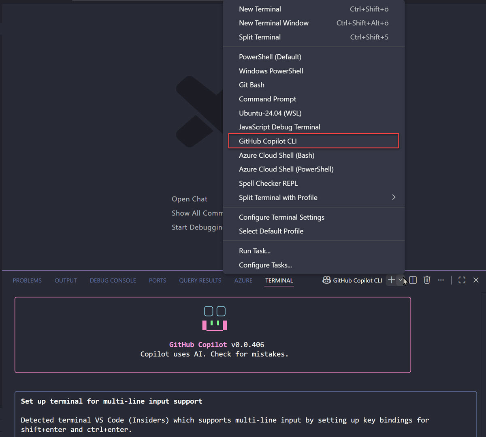

# GitHub Copilot CLI

GitHub Copilot CLI brings AI-powered code assistance directly to your terminal and command-line workflows. It provides intelligent suggestions for commands, scripts, and operations without leaving your development environment. This streamlines repetitive tasks and accelerates development cycles across any shell environment.

## Use Cases & Benefits

- Codebase maintenance: Tackle security-related fixes, dependency upgrades, and targeted refactoring without manual effort.
- Feature development: Implement incremental feature requests and new functionality with AI-assisted code generation.
- Documentation: Update and create project documentation automatically based on your codebase.
- Test coverage: Develop additional test suites to improve code quality and maintainability.
- Prototyping: Greenfield new projects and concepts quickly without starting from scratch.
- Environment setup: Run terminal commands to set up your local development environment for existing projects.
- Command discovery: Find the right command to perform tasks or get natural language explanations of unfamiliar commands.



> Note: Copilot CLI also runs inside the VS Code integrated terminal, so you get the same agent without switching windows.

## Installation

Supported on Linux, macOS, and Windows (PowerShell 6 or higher on Windows).

Install with WinGet (Windows):

```powershell
winget install GitHub.Copilot
```

Install with npm (macOS, Linux, and Windows):

```bash
npm install -g @github/copilot
```

Check what you have and start the shell:

```bash
copilot --version
copilot
```

On first launch, run the `/login` slash command inside the shell to authenticate with your GitHub account.

## Base Commands

The interactive shell is driven by slash commands. These are the ones you reach for most often when running the agent from a terminal.

| Slash Command | Description                                                          |
| ------------- | -------------------------------------------------------------------- |
| `/login`      | Log in to Copilot                                                     |
| `/model`      | Select the AI model for this session (use `auto` to let Copilot pick) |
| `/agent`      | Browse and select agents: `/agent [name]`                             |
| `/skills`     | Manage skills for enhanced capabilities                               |
| `/mcp`        | Manage MCP server configuration                                       |
| `/plugin`     | Manage plugins and plugin marketplaces                                |
| `/autopilot`  | Toggle autopilot mode, or set an autopilot objective                  |
| `/plan`       | Create an implementation plan before coding                           |
| `/diff`       | Review the changes made in the current directory                      |
| `/review`     | Run the code review agent to analyze changes                          |
| `/research`   | Run a deep research investigation using GitHub search and web sources |
| `/security-review` | Analyze staged and unstaged changes for security vulnerabilities |
| `/context`    | Show context window token usage and visualization                     |
| `/session`    | View and manage sessions                                              |
| `/theme`      | View or set color mode                                                |
| `/help`       | Show help for interactive commands                                    |
| `/exit`       | Exit the CLI                                                          |

Three input prefixes and one key round out the shell.

| Input       | Effect                                                |
| ----------- | ----------------------------------------------------- |
| `/`         | Open the command list                                 |
| `@`         | Mention a file so the agent reads it as context       |
| `!`         | Execute a shell command directly, without the agent   |
| `Shift+Tab` | Switch modes between interactive, plan, and autopilot |

> Note: `copilot help commands` prints the full interactive command list from the exact version you have installed, and `copilot --help` prints every flag.

## Running Without the Interactive Shell

Interactive mode is one of three ways to drive the CLI. Use `-i` to open the shell with a prompt already running, `-p` to execute a prompt and exit, and `--continue` or `--resume` to pick a previous session back up.

```bash
copilot -i "explain what this repository does"
copilot -p "list the failing tests and why they fail" --allow-all-tools
copilot --continue
```

Non-interactive `-p` runs need `--allow-all-tools` (or `--allow-all`), because nobody is at the keyboard to approve tool calls. Add `-s` to print only the agent response, which is what you want when a script consumes the output.

## Demos

### Authenticate with Copilot CLI

Start by opening your terminal and running the copilot command to launch the interactive shell.

```bash
copilot
```

When prompted, use the `/login` command to authenticate with your GitHub account.

```text
/login
```

Follow the browser prompt to authorize the application. Once authenticated, you return to the Copilot CLI prompt.

### Explain a Command

Ask Copilot to explain a terminal command you are unsure about. There is no `/explain` command: you ask in natural language and the agent answers.

```text
explain what ls -la does, flag by flag
```

The same question works as a one-shot run from your normal shell:

```bash
copilot -p "explain brew install git" --allow-all-tools
```

### Generate a Command

Ask for the command instead of the explanation. Describe the outcome you want and let the agent produce and explain the command before it runs.

```text
find all JavaScript files in this project modified in the last 7 days
```

### Read a File into the Conversation

Use `@` to pull a specific file into context, and `!` to run a shell command yourself without involving the agent.

```text
@readme.md what is this file about?
```

### Switch Modes and Use Autopilot

Press `Shift+Tab` to switch between interactive, plan, and autopilot mode, or run `/autopilot` to toggle it directly. Autopilot lets Copilot work through a multi-step task without pausing at each action, so reserve it for repositories you trust. You can also start a session already in one of those modes.

```bash
copilot --autopilot
copilot --plan
```

Ask it to initialize a new Node.js project with Express and list the created files, and it executes the setup steps and shows progress as it works.

### Switch Models

Use the `/model` command to see which models your account offers and pick one for the session. The list depends on your Copilot plan and your organization policy, so it is not the same for everyone.

```text
/model
```

You can also set the model for a single run with a flag.

```bash
copilot --model auto -p "summarize the open TODOs" --allow-all-tools
```

### Exit Copilot CLI

Run `/exit` to leave the Copilot CLI interactive shell and return to your standard terminal.

```text
/exit
```

## Business Case: Code Audit and Documentation Coverage Review

This scenario demonstrates how Copilot CLI streamlines repository maintenance for a training codebase with multiple languages and frameworks. A training coordinator needs to audit the repository to find all Python scripts, locate any TODO or FIXME comments indicating incomplete work, and ensure all demo folders have documentation.

### Scenario Setup

You are in the root of the training repository. The task is to assess code quality and documentation coverage across modules without manually exploring directories or writing complex search commands.

### Find All Python Files in the Demos

In Copilot CLI, ask it to locate all Python files in the demos directory:

```text
find all Python files in the demos directory and show their paths
```

Copilot generates and runs a find or grep command that lists every .py file, so you can see the Python sample coverage across modules.

### Search for Incomplete Work

Ask Copilot to find all TODO and FIXME comments in the codebase:

```text
search for all TODO and FIXME comments in the src and demos directories
```

Copilot generates a grep command that identifies work items and incomplete implementations, helping you prioritize fixes.

### Count Documentation Files

Ask Copilot to count how many readme.md files exist in the demos structure:

```text
count the total number of readme.md files in the demos directory
```

Copilot generates a find command that produces a count, giving you a quick metric on documentation coverage.

### Generate a Coverage Report

Ask Copilot to create a summary report showing the count of files by language in the src directory:

```text
count files by extension in the src directory and create a summary
```

Copilot generates commands using find and sort to produce a breakdown of code distribution across languages.

### Expected Outcome

Within minutes, you have audited code quality indicators, identified incomplete work, confirmed documentation coverage, and generated a coverage report. This workflow would normally require opening multiple terminals, writing complex commands, and manually navigating the repository structure. Copilot CLI accomplishes it in natural language from a single prompt.

### Key Takeaways

Copilot CLI eliminates context switching by bringing AI assistance directly to your terminal. It handles command discovery, generation, and explanation in one tool. Autopilot mode is particularly useful for complex multi-step tasks where manual command entry would be time-consuming. The ability to switch models lets you choose the best behavior for a specific task.

## Links & Resources

- [About Copilot CLI](https://docs.github.com/copilot/concepts/agents/about-copilot-cli) - what the CLI is, how sessions work, and which permissions it asks for
- [Using Copilot CLI](https://docs.github.com/copilot/how-tos/use-copilot-agents/use-copilot-cli) - install, sign in, and drive the interactive shell step by step
- [GitHub Copilot CLI repository](https://github.com/github/copilot-cli) - releases, changelog, and the issue tracker for the CLI itself
