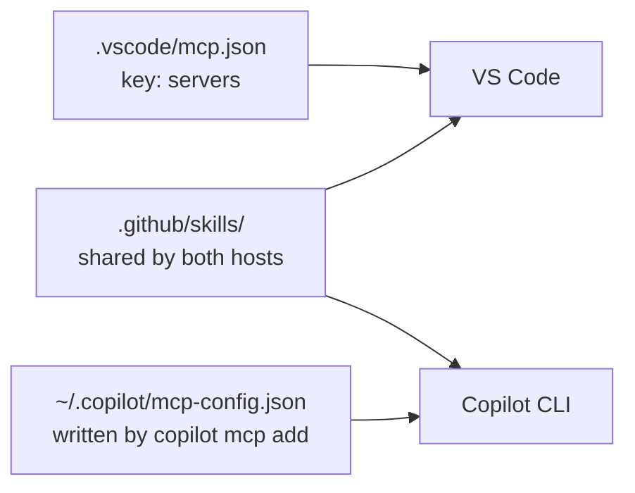
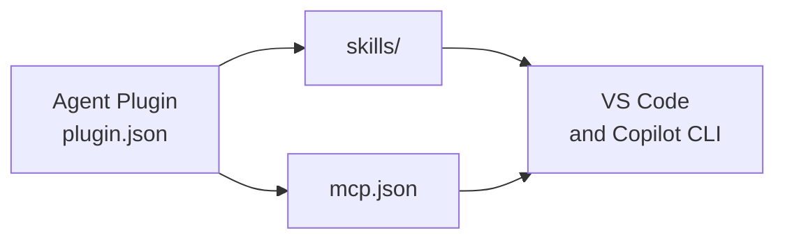

# Extending the CLI with MCP Servers & Skills

The Copilot CLI is not limited to shell help. Two mechanisms turn it into a domain-aware agent: MCP servers connect it to external tools and data, and Agent Skills load reusable, on-demand capabilities. Both are managed from inside the interactive shell, so you extend the agent without leaving the terminal.

The finished harness for the demo below lives in [mcp-skills-solution](./mcp-skills-solution/), verified against Copilot CLI 1.0.87. Build it yourself as you read; go there when a step misbehaves.

## MCP servers

The `/mcp` command manages the Model Context Protocol servers available to the session, and `copilot mcp add`, `list`, `get`, `remove`, `enable`, and `disable` do the same job from your normal shell. Point the CLI at a GitHub, SharePoint, database, or custom server and the agent can query and act on those systems as tools during a task. This is the same mechanism the HR Document Updates business case uses to reach SharePoint through Work IQ.

The registry is per host, and this is the detail that catches people out. The CLI reads `~/.copilot/mcp-config.json`, which `copilot mcp add` writes to, while VS Code reads `.vscode/mcp.json` in the repository, whose top-level key is `servers` rather than `mcpServers`. A server checked into `.vscode/mcp.json` is available to every teammate who opens the repo in the editor and to nobody on the command line, so this repository carries both. Skills, instructions, prompts, and agents under `.github/` are shared by both hosts; MCP servers are not.

`copilot mcp add` refuses a name that already exists rather than overwriting it, so a second run of the demo fails until you remove the server first.

## Agent Skills

The `/skills` command manages skills, portable folders of instructions, scripts, and resources that follow the open Agent Skills standard. From your normal shell the same job is `copilot skill list`, `add`, `remove`, `enable`, and `disable`, singular `skill`, not `skills`. The CLI discovers them from `.github/skills/` and `.claude/skills/` in the project, from `~/.copilot/skills/` for your account, and from any installed plugin. The CLI loads a skill on demand when a task matches it, so a capability you define once is reused across the CLI, VS Code, and coding agents without manual activation.

Discovery is scoped to the working directory, so a skill is only in play when you launch the CLI from the repository that carries it. A skill earns its place when it holds judgement the model would otherwise improvise: which tool to reach for, what counts as an acceptable answer, and what to do when the answer is not there. Its `description` is what decides whether the CLI loads it at all, so write that line for matching, not for marketing.



## Bundling both as a plugin

Managing servers and skills one command at a time works, but it does not travel. Agent Plugins replace those per-tool layouts with one open standard: a package carrying `plugin.json`, a `skills/` directory, and `mcp.json` at the plugin root, plus a `com.github.copilot/` namespace for agents, commands, rules, and `hooks.json`. The Copilot CLI supports that namespace, so a plugin you install brings the same servers and skills the editor gets.

The CLI manages them with `/plugin` in the shell, or `copilot plugin install`, `list`, `update`, `enable`, `disable`, `uninstall`, and `marketplace browse` outside it. Two marketplaces ship by default, `github/copilot-plugins` and `github/awesome-copilot`, and you can install straight from any GitHub repository. `copilot plugin install` takes a marketplace entry, an `owner/repo`, a repository subdirectory, or a git URL, never a local path, so a plugin you are still writing is loaded with `copilot --plugin-dir <folder>` instead. Reach for a plugin when a capability is worth sharing with your team or across your own machines, and keep `/mcp` and `/skills` for the one-off servers and skills that belong to a single session. [Agent Plugins](../../../02-agentic-harness/06-plugins/) covers the format in full.



## Demo

### Step 1: Register the MCP server with the CLI

```bash
copilot mcp add --transport http microsoft-learn https://learn.microsoft.com/api/mcp
copilot mcp list
copilot mcp get microsoft-learn
```

Expected result: `mcp list` prints `microsoft-learn (http)` under `User servers`. If you have run this demo before, the `add` exits 1 with `Server "microsoft-learn" already exists`; run `copilot mcp remove microsoft-learn` and add it again.

### Step 2: See why the editor already had it

Open [.vscode/mcp.json](../../../../.vscode/mcp.json) in this repository and find the same `microsoft-learn` entry.

Expected result: the server was available in VS Code all along, under a `servers` key, and the CLI still knew nothing about it until Step 1. Two hosts, two registries, one server definition worth keeping in both.

### Step 3: Confirm the CLI sees the project skill

```bash
cd demos/05-cli-sdk/01-cli/02-mcp-skills/mcp-skills-solution
copilot skill list
```

Expected result: `learn-docs-lookup` appears under `Project skills`, discovered from `.github/skills/` in that folder. Run `copilot skill list` from your home directory instead and it is gone, which is discovery being scoped to the working directory.

### Step 4: Let the CLI load the skill on its own

From the same folder, start the shell and ask something the skill's description matches, without naming the skill:

```bash
copilot
```

Then, at the prompt:

```text
Which Azure Storage redundancy option survives a regional outage, and what does the documentation say about its RPO?
```

Expected result: the CLI reaches for the `microsoft-learn` server and answers with Markdown links back to `learn.microsoft.com`. You never invoked the skill; the description did that. Ask the same question from a folder without the skill to see the difference an uncited answer makes.

### Step 5: Read what the session actually loaded

```text
/env
```

Expected result: one list per source, covering instruction files, MCP servers, skills, agents, hooks, plugins, LSPs, and extensions. This is the view that proves a component reached the session, rather than merely existing on disk.

### Step 6: Browse a marketplace

```bash
copilot plugin marketplace list
copilot plugin list
copilot plugin marketplace browse awesome-copilot
```

Expected result: `marketplace list` shows `copilot-plugins` and `awesome-copilot` under `Included with GitHub Copilot`, and `browse` prints that marketplace's catalog. `browse` shells out to `git`, so it fails with `Failed to spawn git: Access is denied` when endpoint protection blocks the CLI from starting child processes; trust the Copilot CLI executable in your security product rather than working around the error.

### Step 7: Clean up

```bash
copilot mcp remove microsoft-learn
```

Expected result: the server disappears from `copilot mcp list`. Do this before handing the machine on, because the entry lives in your user configuration and outlives the repository you added it from.

## Links & Resources

- [About Copilot CLI](https://docs.github.com/copilot/concepts/agents/about-copilot-cli) - CLI concepts including MCP servers and skills
- [About CLI plugins](https://docs.github.com/copilot/concepts/agents/copilot-cli/about-cli-plugins) - the plugin package format and the marketplaces the CLI ships with
- [Model Context Protocol](https://modelcontextprotocol.io/introduction) - the open standard for connecting agents to tools and data
