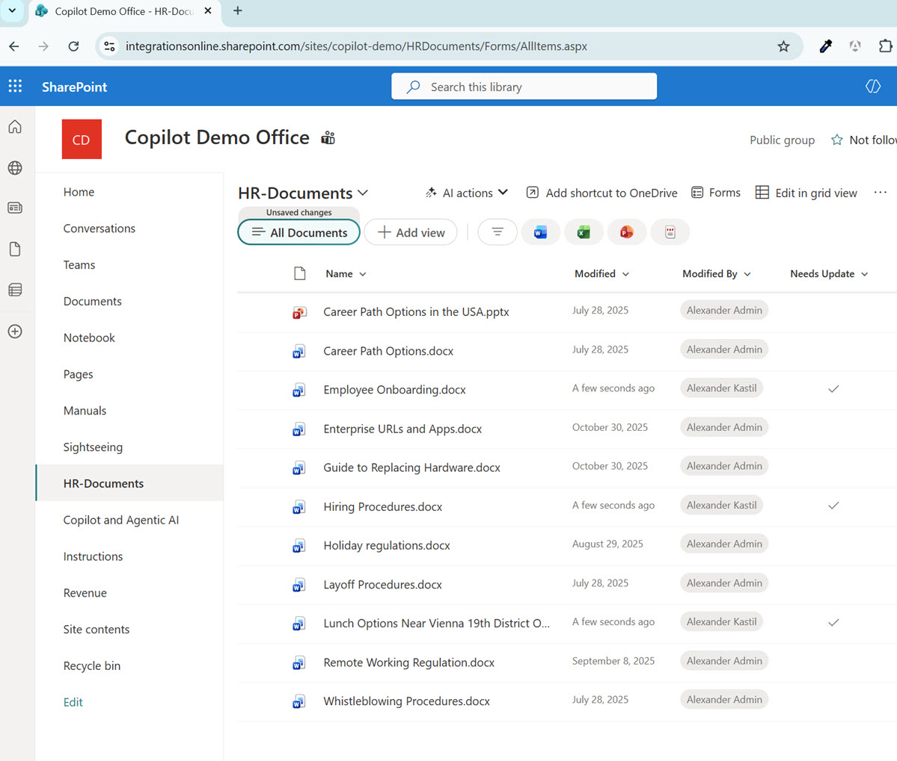
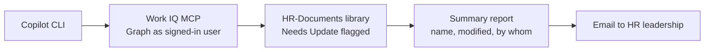
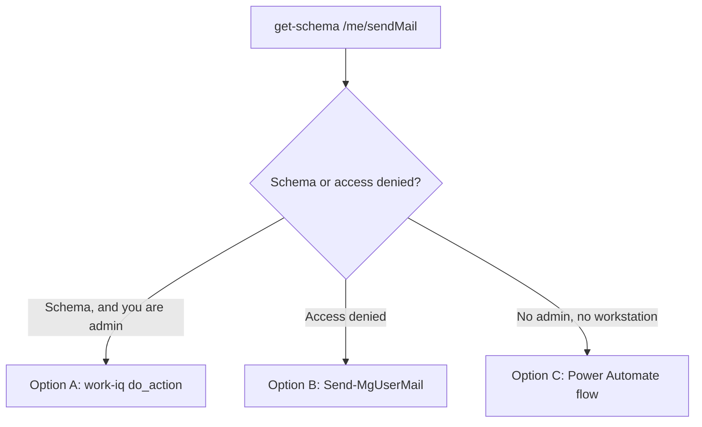

# Business Case: HR Document Updates Automation

## Scenario

The Copilot Demo Office maintains an HR-Documents library on SharePoint that contains critical personnel policies, procedures, and benefits information. Documents such as Career Path Options, Employee Onboarding, Enterprise URLs, Hiring Procedures, Holiday Regulations, Layoff Procedures, and Whistleblowing Procedures require periodic updates to stay current with company changes.

The HR team uses a "Needs Update" column to flag documents that require attention, but manually reviewing and sending update notifications is time-consuming and error-prone. Documents can remain flagged indefinitely without proper tracking.



### Problem

- HR administrators spend time manually checking SharePoint for flagged documents
- Update notifications are delayed or missed
- No centralized awareness of which documents need attention and who modified them last
- Decision-makers lack immediate visibility into document maintenance status

### Solution

Automate the document review process using Copilot CLI and the Work IQ MCP server, which reaches SharePoint through Microsoft Graph as the signed-in user, to:

1. Query the HR-Documents library for all documents marked in the "Needs Update" column
2. Collect document metadata (name, modified date, modified by)
3. Generate a formatted summary report
4. Send the report via email to HR leadership

This workflow runs on demand or on a schedule, ensuring documents stay current and stakeholders remain informed.



### Expected Outcome

- Reduced manual effort for document tracking
- Faster notification of pending updates
- Improved document governance and compliance
- Automated audit trail of what needed updating and when

The finished harness and scripts for every step below live in [business-case-solution](./business-case-solution/), verified against Copilot CLI 1.0.87 and Work IQ 1.0.0. Build them yourself as you read; go there when a step misbehaves.

## Implementation

### Prerequisites

- GitHub Copilot CLI installed and authenticated
- A Microsoft 365 Copilot license on the signing-in account, which Work IQ requires
- Access to https://integrationsonline.sharepoint.com/sites/copilot-demo
- Read permissions on HR-Documents library
- `Mail.Send` consented for whichever client does the sending, see Step 5

### Step 1: Install and Configure Copilot CLI

Open PowerShell and verify Copilot CLI is installed:

```powershell
copilot --version
```

If not installed, install via WinGet:

```powershell
winget install GitHub.Copilot
```

### Step 2: Add the Required MCP Servers

MCP servers are registered with `copilot mcp add`. A local server takes its command after `--`, and a remote server takes a URL plus a transport. Register them once from your normal shell, before you start a session. Work IQ is the server that reaches the SharePoint site. The CLI keeps its servers in `~/.copilot/mcp-config.json`, which `copilot mcp add` writes to, while VS Code reads `.vscode/mcp.json` in the repository under a `servers` key. Registering a server for the editor does not register it for the CLI, so this repository carries both.

```powershell
copilot mcp add work-iq -- npx -y @microsoft/workiq mcp
copilot mcp add --transport http microsoft-learn https://learn.microsoft.com/api/mcp
```

Confirm what is configured, and inspect one server in detail:

```powershell
copilot mcp list
copilot mcp get work-iq
```

> Note: Inside the interactive shell the same job is done with the `/mcp` command, which opens the server manager rather than taking `add` and `show` arguments.

Work IQ signs in as you, so it needs a one-time interactive login before any Copilot CLI session can use it. Accept the license, sign in, and confirm the account:

```powershell
npx -y @microsoft/workiq accept-eula
npx -y @microsoft/workiq auth login
npx -y @microsoft/workiq search-paths --filter "sites|lists"
```

The last command prints the entity paths your account may reach, with the operations allowed on each. In a default tenant every path comes back with `fetch` and nothing else, because Work IQ is deployed with read-only delegated permissions. Note that now: it is what decides which of the three Step 5 options you can use.

### Step 3: Query HR-Documents for Update Flags

Start the shell and ask Copilot CLI to retrieve all documents in the HR-Documents library that need updates:

```powershell
copilot
```

```text
Query the HR-Documents library at https://integrationsonline.sharepoint.com/sites/copilot-demo
and find all documents where the "Needs Update" column is marked.
Include the document name, modified date, and modified by fields.
```

Copilot CLI works the query out through Work IQ's `search_paths` and `fetch` tools. Watch the tool calls scroll past: it resolves the site by hostname and path, lists the libraries to find `HRDocuments`, reads that list's columns to learn the flag is stored as the boolean `NeedsUpdate`, then fetches the items with `$expand=fields`. It may take a wrong turn first, usually a `$search` on the site name, which fails on the hyphen in `copilot-demo`. It recovers on its own.

One detour is not a mistake and will happen on every run: `NeedsUpdate` is not an indexed column, so SharePoint refuses a server-side `$filter` on it. The agent falls back to fetching the items and filtering them itself, which is the right answer for a library this size. Indexing the column in list settings removes the detour.

### Step 4: Format Results

Ask Copilot to format the results into a clean, readable report:

```text
Format the results into an HTML table with columns: Document Name, Last Modified, Modified By.
Add a summary line saying how many documents need updating.
```

### Step 5: Send Email Report

Reading the library and sending the mail are two different permissions, and the second one is where this business case stops being a query demo. Work IQ reaches SharePoint because your account can read it. Sending mail needs `Mail.Send`, which is a write scope, and a read-only Work IQ deployment does not have it. Check before you prompt:

```powershell
npx -y @microsoft/workiq get-schema --path /me/sendMail --method post
```

If it returns `Access denied for CREATE path: /me/sendMail`, Work IQ cannot send and you take Option B or C. A returned schema is weaker evidence than it looks: it describes the shape the server would parse, not an operation you are allowed to run, so the send can still come back `Access denied for POST /me/sendMail. Path is not in the policy allowlist.` That allowlist is server-side and separate from the Graph scope, which is why consenting `Mail.Send` on its own does not open the path. Asking Copilot CLI to "use Microsoft Graph to send via Outlook" without one of these in place produces a confident-sounding failure: the model has no tool that can send, so it either retries the denied path or writes a script it cannot authenticate.



Option A, Work IQ sends it. This takes two grants, not one, and the second is the one people miss. Consent the Graph scope as yourself, then have a tenant admin add the path to the Work IQ allowlist:

```powershell
npx -y @microsoft/workiq auth consent --scopes Mail.Send
npx -y @microsoft/workiq policy list
```

`policy list` answering `Permission denied` means your account is not the tenant admin and Option A is not available to you. Take Option B instead rather than re-consenting scopes, which will not change the answer.

<!--
Work IQ's send path stays broken by design: `Access denied for POST /me/sendMail. Path is
not in the policy allowlist.` Consenting the Graph scope does not open it. The allowlist is
a separate server-side gate, and `workiq policy list` refuses a non-admin account, so adding
/me/sendMail needs the tenant admin.
-->


```text
Send an email to alexander.kastil@integrations.at with the subject
"HR-Documents Update Status Report" and the formatted table as the HTML body.
Use the work-iq do_action tool on /me/sendMail.
```

Option B, the Microsoft Graph PowerShell SDK, which leaves Work IQ read-only and gives the send its own consent. Install and connect once, in a real terminal, because the sign-in opens a browser:

```powershell
Install-Module Microsoft.Graph.Users.Actions -Scope CurrentUser
Connect-MgGraph -Scopes Mail.Send
```

Do the connect yourself; it is the one step an agent cannot do for you. Web Account Manager needs a parent window handle, so the browser flow fails with `A window handle must be configured` anywhere headless, including an agent's shell. Switch to `-UseDeviceCode` there:

```powershell
Connect-MgGraph -Scopes Mail.Send -UseDeviceCode
```

That prints a code and gives you 120 seconds to enter it before aborting with `Authentication timed out after 120 seconds due to inactivity`. Run it somewhere the code reaches you at once, such as Copilot CLI's own shell escape. Relaying the code through an agent's reply usually burns the window.

The token caches once you are through, so every later run is silent and the agent can drive the cmdlet without touching auth again:

```text
Send the table to alexander.kastil@integrations.at with the subject
"HR-Documents Update Status Report" by calling Send-MgUserMail in PowerShell.
Build the message hashtable with an HTML body and pass it as -BodyParameter.
```

Note that the Azure CLI is not a shortcut here. `az account get-access-token --resource https://graph.microsoft.com` returns a token whose `scp` claim has no `Mail.Send`, so a hand-rolled REST call with it comes back 403.

Option C, Power Automate with a manual setup:

1. Go to https://make.powerautomate.com
2. Create a new cloud flow triggered by an HTTP request
3. Add a SharePoint "Get items" action filtering the HR-Documents list
4. Filter condition: "Needs Update" equals "Yes"
5. Add a "Send an email (V2)" action to alexander.kastil@integrations.at
6. Format the email body with the document list
7. Ask Copilot CLI to build and run the curl command that calls the flow URL

### Step 6: Automate with Scheduling (Optional)

An unattended run uses `-p`, not `-i`. The `-i` flag opens the interactive shell and waits for a human, which never returns in a scheduled task. Pair `-p` with `--allow-all-tools` so tool calls are approved without a prompt, and add `-s` when a script reads the output.

Using Windows Task Scheduler, create a PowerShell script file `update-report.ps1`:

```powershell
copilot -p "Query the HR-Documents library at https://integrationsonline.sharepoint.com/sites/copilot-demo and find all documents where Needs Update is marked. Format as an HTML table and send it to alexander.kastil@integrations.at with subject 'HR-Documents Update Status Report'" --allow-all-tools
```

Then create the task:

- Name: Update HR-Documents Report
- Trigger: Daily at 8:00 AM (or your preferred time)
- Action: Run `powershell.exe -File C:\path\to\update-report.ps1`
- Conditions: Run only if user is logged in

That last condition is not a preference. Work IQ and the Graph SDK both cache their tokens in your Windows user profile, and the task can only read that cache while your session is loaded. "Run whether user is logged on or not" makes the task fire into a profile with no tokens and the run dies at the first tool call.

The same constraint rules out a hosted runner for this particular workflow, which is worth showing the class rather than hiding. A GitHub Actions job is a fresh machine with no browser, no user profile and no token cache, and Work IQ authenticates as a signed-in person: `workiq auth` offers `login`, `logout` and `consent`, and none of them take a client secret or a certificate. There is no app-only mode to fall back on. A workflow like this one runs, prints a plausible answer and reaches nothing:

```yaml
- name: Run document check
  run: |
    copilot -p "Query HR-Documents and send the report" --allow-all-tools
```

Two things are missing and only the first is fixable. It never runs `copilot mcp add`, so `~/.copilot/mcp-config.json` does not exist on that runner and no MCP server is registered; checking out the repository does not help, because the CLI never reads a server definition out of the workspace. And Work IQ has no credential it could use even once that is fixed.

`GITHUB_TOKEN` does not close that gap either. It authenticates the CLI to Copilot, which is a separate question from what the CLI may read in Microsoft 365, and a scheduled workflow has no `GITHUB_TOKEN` tied to a person's Microsoft account.

Schedule this business case on a workstation with Task Scheduler. If it has to run in CI, the SharePoint query and the mail send both move to app-only Graph credentials behind a Power Automate flow, as in Step 5 Option C, and the workflow's job shrinks to calling that flow's URL.

### Step 7: Test the Workflow

Test the query before you test the send, because a wrong list is easier to spot in the terminal than in an inbox. Run it non-interactively so the whole thing is one command:

```powershell
copilot -p "Query the HR-Documents library at https://integrationsonline.sharepoint.com/sites/copilot-demo using the work-iq MCP server and find all documents where the 'Needs Update' column is marked. Include the document name, modified date, and modified by fields. Output a plain markdown table only." --allow-all-tools -s
```

Check the result against the library itself rather than against the agent's own summary. The flag is the boolean `NeedsUpdate`, and documents that were never flagged have no value for it at all, so an agent that treats "not true" as "needs updating" hands you the whole library. Three rows out of twelve is the shape of a correct answer here.

Then run the send, and verify it in Outlook rather than in the transcript. Copilot CLI reports what its tool call returned, and a denied `sendMail` can still come back as a paragraph saying the report was sent.

### Step 8: Monitor and Refine

- Review the email report weekly
- Confirm documents flagged for update are being addressed
- Adjust the query if needed, for example filter by modified date range or document type
- Use the `/feedback` command in the interactive shell to report bad results to GitHub

## Links & Resources

- [About Copilot CLI](https://docs.github.com/copilot/concepts/agents/about-copilot-cli) - sessions, permissions, and how the CLI reaches external tools
- [Using Copilot CLI](https://docs.github.com/copilot/how-tos/use-copilot-agents/use-copilot-cli) - interactive and non-interactive invocation, including scripted runs
- [Model Context Protocol](https://modelcontextprotocol.io/introduction) - the open standard behind the Work IQ server used here
- [Microsoft Work IQ](https://github.com/microsoft/work-iq) - the CLI and MCP server, including the admin guide for the delegated permissions it needs
