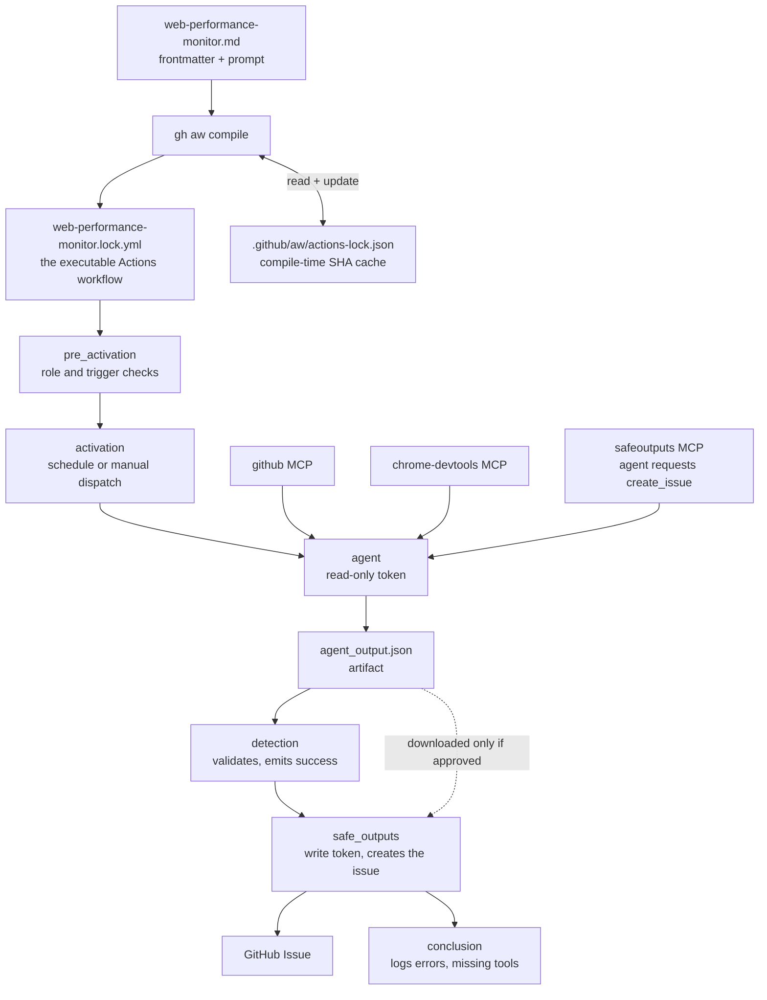
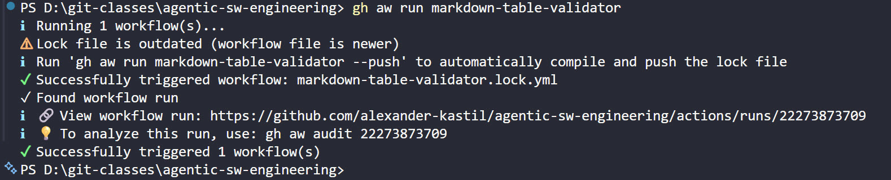
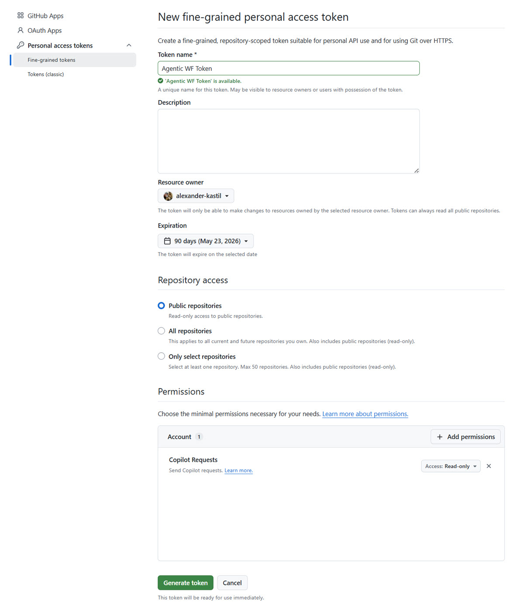
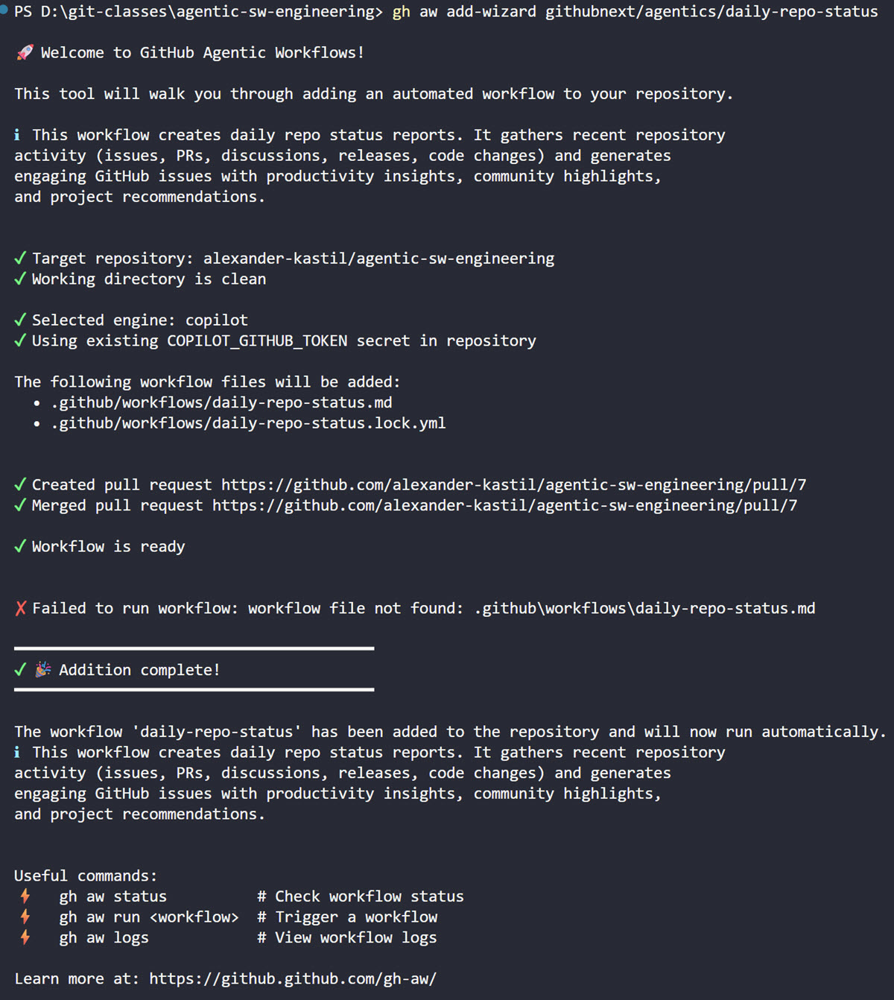

# GitHub Agentic Workflows

An agentic workflow is a GitHub Actions workflow whose body is a prompt rather than a script. You write it as a markdown file with YAML frontmatter, the frontmatter declares the trigger, the engine, the tools and the permissions, and the markdown below it states the goal in plain language. GitHub Agentic Workflows, the `gh aw` extension, compiles that file into a runnable `.lock.yml` that GitHub Actions executes like any other workflow.

The difference from a conventional workflow is who decides the steps. A CI job runs the commands you listed, in the order you listed them, and fails the moment reality differs from the script. An agentic workflow hands the goal to a coding agent on the runner, and the agent reads the repository, calls the MCP servers you allowed, and works out the steps for the situation it finds.

That freedom is bounded by the frontmatter, not by trust. The agent runs with a read-only token and cannot write to the repository; anything it wants to create, an issue, a comment, a pull request, is requested through the `safe-outputs` mechanism and written by a separate job after validation. Use these workflows for the recurring jobs no script captures well: triaging issues, auditing documentation, watching performance, summarizing activity.

## Understanding Agentic Workflows

### Agentic Workflows File Structure

When you create an agentic workflow, you typically work with the following files and directories:

#### The .lock.yml Files

When you create or compile an agentic workflow, the `.md` file is compiled into a `.lock.yml` file. The `.lock.yml` is the actual executable GitHub Actions workflow that runs. Do not edit this file directly: it is auto-generated. To make changes to your workflow, edit the `.md` file and run `gh aw compile` to regenerate the `.lock.yml`.

#### The .github/aw Folder

The `.github/aw` folder contains `actions-lock.json`, a cache that only `gh aw compile` reads and writes. It stores which commit SHA each `action@version` resolved to, checked before the GitHub API and the pins embedded in `gh aw`, so a restricted token such as the Copilot coding agent's still compiles to the same SHAs. The pins themselves end up in the `.lock.yml`: every `uses:` line carries the full SHA with the version as a comment, and the runner never reads `actions-lock.json`.

Commit `actions-lock.json` so every contributor compiles to the same pins, and refresh it with `gh aw upgrade`. Deleting it breaks no running workflow; it only affects the next compile.

Both files feed one pipeline. The compile step turns your markdown into the Actions workflow that runs, and the run itself is split across jobs so the agent never holds a write token:



The `safe-outputs` frontmatter is what produces that split. The agent cannot call the GitHub API to open an issue; it sends the request to the `safeoutputs` MCP server running inside the agent job, which writes it to the `agent_output.json` artifact. A separate `detection` job validates it, and only the `safe_outputs` job holds the permission to create the issue. They are separate jobs rather than steps because a shared filesystem would let the agent tamper with its output between phases. A prompt injected through a page the agent visits therefore cannot escalate into a write.

### Basic Commands

The `gh aw` CLI provides essential commands for managing agentic workflows. Here are the most commonly used commands:

| Command                           | Purpose                                                         |
| --------------------------------- | --------------------------------------------------------------- |
| `gh aw init`                      | Set up your repository for agentic workflows                    |
| `gh aw add (workflow)`            | Add workflows from other repositories to your project           |
| `gh aw add-wizard (workflow)`     | Add a workflow interactively, picking engine and secrets        |
| `gh aw new (workflow)`            | Create a new workflow template in `.github/workflows/`          |
| `gh aw compile`                   | Convert markdown workflows to GitHub Actions YAML after editing |
| `gh aw list`                      | List all workflows without status checks                        |
| `gh aw status`                    | Check current state and configuration of all workflows          |
| `gh aw run (workflow)`            | Execute workflows immediately in GitHub Actions                 |
| `gh aw logs (workflow)`           | Download and analyze workflow logs with metrics                 |
| `gh aw audit (run-id)`            | Analyze specific workflow runs and identify issues              |
| `gh aw health`                    | Display workflow health metrics and success rates               |
| `gh aw enable/disable (workflow)` | Enable or disable one or more workflows                         |
| `gh aw update (workflow)`         | Update workflows based on source field with merge strategy      |
| `gh aw doctor`                    | Diagnose CLI authentication and repository setup                |
| `gh aw trial (workflow)`          | Run a workflow against a simulated repository before committing |
| `gh aw forecast (workflow)`       | Forecast AI Credit usage for a workflow                         |
| `gh aw upgrade`                   | Apply codemods, refresh action pins, and recompile every workflow |

> Note: Example trigger a wf run



Run `gh aw upgrade` after every `gh extension upgrade github/gh-aw`. A new extension release can retire frontmatter keys and ships new action pins, so lock files compiled by the previous version are stale. The command applies the codemods, refreshes `.github/aw/actions-lock.json`, and recompiles each `.md` into its `.lock.yml` in one pass. Keys that no codemod covers still fail the compile, which is the signal to open the workflow and fix the frontmatter by hand.

## Advanced Sample: Web Performance Monitor with MCP

The `web-performance-monitor` workflow demonstrates how to use Model Context Protocol (MCP) servers within agentic workflows. This workflow integrates the Chrome DevTools MCP to automatically audit web performance metrics.

### What It Does

- Monitors Core Web Vitals (LCP, INP, CLS, FCP)
- Audits pages for performance regressions
- Creates GitHub issues when metrics exceed thresholds
- Provides actionable optimization recommendations
- Runs on a schedule (daily on weekdays) or manually

### Key Features

- Uses `chrome-devtools` MCP for performance analysis
- Compares metrics against WCAG standards
- Safe outputs configured for secure issue creation
- Daily scheduling with manual trigger support

### Workflow Definition

Located in [`.github/workflows/web-performance-monitor.md`](../../../../.github/workflows/web-performance-monitor.md), alongside the compiled `web-performance-monitor.lock.yml`.

Run it manually:

```bash
gh aw run web-performance-monitor
```

### MCP Integration

The workflow registers the Chrome DevTools MCP in its frontmatter. Built-in tools such as `github` live under `tools:`, while every third-party MCP server goes under its own `mcp-servers:` key:

```yaml
tools:
  github:
    toolsets: [default]
mcp-servers:
  chrome-devtools:
    command: npx
    args: ["-y", "chrome-devtools-mcp@latest", "--headless", "--isolated"]
    allowed: ["*"]
```

`command` and `args` start the server as a process on the runner; `allowed` restricts which of its tools the agent may call. This gives the agent access to browser automation and performance measurement capabilities, enabling sophisticated monitoring workflows beyond traditional CI/CD.

Earlier `gh aw` releases accepted a bare `chrome-devtools: {}` entry under `tools:`, and that shorthand is gone. A workflow still carrying it fails to compile with `Unknown property: chrome-devtools`, naming the built-in tools as the only valid values.

## Demo

### Installation and Requirements

> Note: The [GitHub CLI](https://github.com/cli/cli/releases) is a required dependency for this demo. Install the current release for your platform, then verify it with `gh --version`.

Login to GitHub CLI:

```bash
gh auth login --scopes repo,workflow
```

Installation:

```bash
gh extension install github/gh-aw
```

### Add the sample workflow and trigger a run

```bash
gh aw add-wizard githubnext/agentics/daily-repo-status
```

> Note: Before adding the workflow, make sure your repo is clean and you have committed all your changes. The workflow will be added to a new branch and a pull request will be issued.

Create the token:



Add the demo workflow and run it:



The output will be shown as [Issue](https://github.com/alexander-kastil/agentic-sw-engineering/issues/8)

### Add a custom workflow

Initialize the repository for agentic authoring once. This adds the skills, instructions, and custom agent that let a coding agent create and edit workflows:

```bash
gh aw init
```

Start Copilot CLI in the repository:

```bash
copilot
```

Then, at the prompt, mention the `agentic-workflows` skill and describe the workflow:

```text
/agentic-workflows Create a new workflow that creates a daily report on
recent activity in the repository, delivered as
an issue.
```

Expected result: the agent creates the workflow under `.github/workflows/` and compiles it with `gh aw compile`. Review it, then ask the agent to commit and push the files.

Trigger it from the Actions tab, or from the GitHub CLI:

```bash
gh aw run YOUR-WORKFLOW-NAME
```

## Links & Resources

- [GitHub Agentic Workflows](https://github.github.com/gh-aw/introduction/overview/) - the `gh aw` extension, workflow frontmatter, and the compile step
- [About Copilot CLI](https://docs.github.com/copilot/concepts/agents/about-copilot-cli) - the agent runtime the workflows invoke on the runner
- [GitHub CLI releases](https://github.com/cli/cli/releases) - current `gh` builds for every platform
