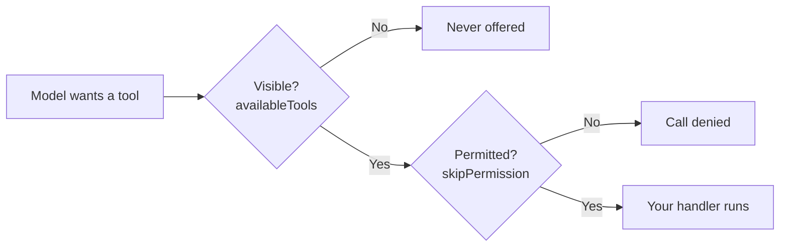

# Building Agents with Custom Tools

The GitHub Copilot SDK enables you to embed AI-powered agentic workflows directly into your applications. These demos show how to build intelligent agents that understand code context and execute complex tasks autonomously, from code review and security auditing to weather lookup and document analysis. The SDK handles planning, tool invocation, and code execution: you define the behavior using TypeScript and Node.js, and Copilot handles the rest. Whether you are creating development tools, security auditors, documentation generators, or specialized analysis agents, the SDK provides a straightforward way to define custom tools and let AI decide when to use them.

The finished code for every step below lives in [sdk-demos-solution](./sdk-demos-solution/), verified against `@github/copilot-sdk` 1.0.14 and Copilot CLI 1.0.87. Build the files yourself as you read; go there when a step misbehaves.

## Building a Weather Assistant Agent (5 minutes)

This demo walks through building a practical agent that can query weather for multiple cities. You will learn how to define custom tools, create a session with streaming, and let the AI agent decide when to call your tools.

### Prerequisites

The SDK needs Node.js 20.19 or later (or 22.12 or later). It bundles the Copilot CLI, so you only have to be signed in.

```bash
node --version
copilot --version
```

If you have not authenticated yet, run `copilot` and then `/login` to authenticate with your GitHub account.

> Note: The model names below are examples. Run `/model` in the CLI, or call `client.listModels()` in code, to see which models your account and organization policy allow.

### Step 1: Create a Node.js Project and Install the SDK

Create a new directory and initialize your project:

```bash
mkdir copilot-weather-agent
cd copilot-weather-agent
npm init -y --init-type module
npm install @github/copilot-sdk@1.0.14 tsx@4.20.6 typescript@5.9.3 @types/node@24.10.1
```

Pin the SDK rather than floating it. The runtime underneath moves, and a floating install means the code you run is not the code this guide was verified against.

Add a `tsconfig.json` in the same folder so you can typecheck:

```json
{
  "compilerOptions": {
    "target": "ES2022",
    "module": "NodeNext",
    "moduleResolution": "NodeNext",
    "strict": true,
    "noEmit": true,
    "skipLibCheck": true,
    "types": ["node"]
  },
  "include": ["*.ts"]
}
```

`tsx` executes TypeScript without typechecking it, so run `npx tsc --noEmit` whenever a tool handler behaves oddly. Two of the defects this guide used to contain were invisible at runtime and obvious to the compiler.

### Step 2: Define a Custom Tool for Weather Lookup

Create a file named `agent.ts`:

```typescript
import { CopilotClient, defineTool, SessionEvent } from "@github/copilot-sdk";

// Define a custom tool that Copilot can call automatically
const getWeather = defineTool("get_weather", {
  description: "Get the current weather for a city",
  skipPermission: true,
  parameters: {
    type: "object",
    properties: {
      city: {
        type: "string",
        description: "The city name to get weather for",
      },
    },
    required: ["city"],
  },
  handler: async (args: { city: string }) => {
    // In a real app, this would call a weather API
    const conditions = ["sunny", "cloudy", "rainy", "partly cloudy"];
    const temp = Math.floor(Math.random() * 30) + 50;
    const condition = conditions[Math.floor(Math.random() * conditions.length)];

    return {
      city: args.city,
      temperature: `${temp}°F`,
      condition,
      timestamp: new Date().toISOString(),
    };
  },
});

async function main() {
  try {
    const client = new CopilotClient();
    const session = await client.createSession({
      model: "gpt-5-mini",
      streaming: true,
      tools: [getWeather],
    });

    // Stream responses as they arrive
    session.on((event: SessionEvent) => {
      if (event.type === "assistant.message_delta") {
        process.stdout.write(event.data.deltaContent);
      }
      if (event.type === "session.idle") {
        console.log("\n");
      }
    });

    // Send a prompt that requires the agent to use tools
    await session.sendAndWait({
      prompt: "What's the weather like in Seattle and Tokyo? Give me the temperatures.",
    });

    await client.stop();
    process.exit(0);
  } catch (error) {
    console.error("Error:", error);
    process.exit(1);
  }
}

main();
```

`skipPermission: true` is the line that makes this run. Every tool call passes through the session's permission gate, and a session that supplies no `onPermissionRequest` handler denies the call. The agent then answers around the refusal, reporting that it could not reach the weather API, which reads like a broken tool rather than a missing permission. Set it on tools whose handler only computes; for anything that touches a real system, supply a handler and decide per call:

```typescript
import { approveAll } from "@github/copilot-sdk";

const session = await client.createSession({
  model: "gpt-5-mini",
  tools: [getWeather],
  onPermissionRequest: approveAll,
});
```

`approveAll` is a convenience for demos. In an application, inspect the request and return your own decision.

### Step 3: Run the Agent

Execute the agent:

```bash
npx tsx agent.ts
```

The Copilot agent analyzes your prompt, calls the `get_weather` tool for each city, and streams the response back to your terminal in real-time. A healthy run prints the reasoning line, then the tool's own numbers:

```text
Seattle: 54°F (partly cloudy)
Tokyo: 78°F (rainy)
```

The temperatures are random, so yours will differ. What matters is that they came from your handler rather than from the model.

### Step 4: Build an Interactive CLI Assistant

Extend your agent to be a multi-turn interactive assistant. One session carries the whole conversation, so the agent remembers the earlier turns:

```typescript
import { CopilotClient, defineTool, SessionEvent } from "@github/copilot-sdk";
import { createInterface } from "node:readline";

const getWeather = defineTool("get_weather", {
  description: "Get the current weather for a city",
  skipPermission: true,
  parameters: {
    type: "object",
    properties: {
      city: {
        type: "string",
        description: "The city name",
      },
    },
    required: ["city"],
  },
  handler: async ({ city }: { city: string }) => {
    const conditions = ["sunny", "cloudy", "rainy", "partly cloudy"];
    const temp = Math.floor(Math.random() * 30) + 50;
    const condition = conditions[Math.floor(Math.random() * conditions.length)];
    return { city, temperature: `${temp}°F`, condition };
  },
});

async function main() {
  const client = new CopilotClient();
  const session = await client.createSession({
    model: "gpt-5-mini",
    streaming: true,
    tools: [getWeather],
  });

  session.on((event: SessionEvent) => {
    if (event.type === "assistant.message_delta") {
      process.stdout.write(event.data.deltaContent);
    }
  });

  const rl = createInterface({
    input: process.stdin,
    output: process.stdout,
    prompt: "You: ",
  });

  let closed = false;
  rl.on("close", () => {
    closed = true;
  });
  process.on("SIGINT", () => rl.close());

  console.log("Weather Assistant (type 'exit' to quit)");
  console.log("Try: 'What's the weather in Paris and London?'\n");
  rl.prompt();

  for await (const line of rl) {
    const input = line.trim();
    if (input.toLowerCase() === "exit") {
      break;
    }
    if (input.length > 0) {
      process.stdout.write("Assistant: ");
      await session.sendAndWait({ prompt: input });
      console.log("\n");
    }
    if (closed) {
      break;
    }
    rl.prompt();
  }

  rl.close();
  await client.stop();
}

main().catch((error) => {
  console.error("Error:", error);
  process.exit(1);
});
```

Three details in that loop are load-bearing, and the obvious version of it fails on all three.

The handler parameter is annotated. `defineTool` defaults its type parameter to `unknown`, so destructuring `{ city }` from an unannotated parameter does not compile: `tsc` reports `TS2322: Type 'unknown' is not assignable to type '{ city: any; }'`. Either annotate it as above, or pass the shape to the generic as `defineTool<{ city: string }>("get_weather", { ... })`.

The loop iterates the interface rather than re-calling `rl.question` from inside its own callback. A recursive callback has no way to notice that input ended, so it prompts again on a closed interface and the process dies with `ERR_USE_AFTER_CLOSE: readline was closed`. You will hit this the first time you pipe input instead of typing it.

The `close` event is tracked. End of input, or Ctrl+C, can close the interface while a turn is still awaiting a response, so the loop checks before prompting again. Without that check the same `ERR_USE_AFTER_CLOSE` surfaces one turn later.

Type `exit`, or press Ctrl+C, and the client shuts down cleanly.

### Step 5: Add Code Analysis Tools

Extend your agent with multiple specialized tools to build a code security analyzer:

```typescript
import { CopilotClient, defineTool, SessionEvent } from "@github/copilot-sdk";

const analyzeCode = defineTool("analyze_security", {
  description: "Analyze code for common security vulnerabilities",
  skipPermission: true,
  parameters: {
    type: "object",
    properties: {
      code: {
        type: "string",
        description: "The code snippet to analyze",
      },
    },
    required: ["code"],
  },
  handler: async (args: { code: string }) => {
    const issues: string[] = [];

    if (args.code.includes("eval(")) issues.push("Dangerous eval() detected");
    if (args.code.includes("innerHTML"))
      issues.push("Potential XSS via innerHTML");
    if (args.code.match(/\bpassword\b.*=.*['"][^'"]*['"]/i))
      issues.push("Hardcoded secret/password detected");
    if (!args.code.includes("try") && args.code.includes("fetch"))
      issues.push("Unhandled Promise in fetch");

    return {
      issues: issues.length > 0 ? issues : ["No major issues detected"],
      severity: issues.length > 2 ? "high" : issues.length > 0 ? "medium" : "low",
      timestamp: new Date().toISOString(),
    };
  },
});

const getFileContent = defineTool("read_code_file", {
  description: "Read a code file to analyze",
  skipPermission: true,
  parameters: {
    type: "object",
    properties: {
      filename: {
        type: "string",
        description: "The filename to read",
      },
    },
    required: ["filename"],
  },
  handler: async (args: { filename: string }) => {
    // Simulate reading a file
    const sampleCode = `
      const password = "admin123";
      fetch('/api/data').then(r => r.json())
        .then(data => document.getElementById('container').innerHTML = data);
    `;
    return { filename: args.filename, content: sampleCode };
  },
});

async function main() {
  try {
    const client = new CopilotClient();
    const session = await client.createSession({
      model: "gpt-5-mini",
      streaming: true,
      tools: [analyzeCode, getFileContent],
      availableTools: ["custom:*"],
      systemMessage: {
        content:
          "You are a security-focused code reviewer. Be thorough and specific in your analysis.",
      },
    });

    session.on((event: SessionEvent) => {
      if (event.type === "assistant.message_delta") {
        process.stdout.write(event.data.deltaContent);
      }
      if (event.type === "session.idle") {
        console.log("\n");
      }
    });

    await session.sendAndWait({
      prompt:
        "Read the code file 'app.js' and analyze it for security vulnerabilities.",
    });

    await client.stop();
    process.exit(0);
  } catch (error) {
    console.error("Error:", error);
    process.exit(1);
  }
}

main();
```

`availableTools: ["custom:*"]` is what makes this demo teach what it claims to teach. A session exposes the runtime's built-in tools alongside yours, and the model prefers a built-in with a similar job: asked to "read the code file", it reaches for the built-in file reader rather than your `read_code_file`, and then reports that the environment denied it. Restricting the session to `custom:*` leaves only your two tools reachable, so the agent calls `read_code_file`, feeds the result into `analyze_security`, and reports on what your handlers returned.

The patterns are source-qualified: `builtin:*`, `mcp:*`, `custom:*`, or a bare name to match across every source. `excludedTools` takes the same syntax and always wins over `availableTools`.

## Key Concepts

A CopilotClient connects to the Copilot runtime. A session represents a conversation where Copilot maintains context and manages tool definitions. When you define a tool, you tell Copilot its description, parameter schema, and handler function, and Copilot then automatically invokes it when appropriate based on the user's prompt.

Streaming via session events like `assistant.message_delta` lets you process responses incrementally, reading each chunk from `event.data.deltaContent`. System messages shape agent behavior, allowing you to define specialized roles like security auditors or code reviewers.

When tool execution completes, the result is sent back to Copilot for incorporation into the final response. Multiple tools can work together, and Copilot orchestrates their execution based on reasoning about what the user needs.

Two session-level controls decide whether any of that happens. The permission gate stands in front of every tool call, so a tool is reachable only with `skipPermission` on the tool or an `onPermissionRequest` handler on the session. Tool visibility is separate: `availableTools` and `excludedTools` decide which tools the model is offered at all, across the `builtin:`, `mcp:`, and `custom:` sources. A tool can be permitted and invisible, or visible and denied, and the two failures look nothing alike from the transcript.




## Error Handling

Always wrap your code in try-catch and ensure cleanup:

```typescript
const client = new CopilotClient();

try {
  const session = await client.createSession({ model: "gpt-5-mini" });
  // ... use session ...
} catch (error) {
  if ((error as any).code === "ENOENT") {
    console.error("Copilot CLI runtime not found");
  } else {
    console.error("Error:", (error as any).message);
  }
} finally {
  await client.stop();
}
```

Declare the client outside the `try` block. If you create it inside, the `finally` block cannot see it and the cleanup call does not compile.

## Links & Resources

- [Getting Started Guide](https://github.com/github/copilot-sdk/blob/main/docs/getting-started.md) - client, session, and first message end to end
- [Node.js SDK reference](https://github.com/github/copilot-sdk/blob/main/nodejs/README.md) - `CopilotClient`, `CopilotSession`, and `defineTool` signatures
- [Streaming events](https://github.com/github/copilot-sdk/blob/main/docs/features/streaming-events.md) - every session event, including `assistant.message_delta` and `session.idle`
- [Copilot SDK cookbook](https://github.com/github/awesome-copilot/blob/main/cookbook/copilot-sdk/nodejs/README.md) - runnable samples for tools, MCP, and multi-agent setups
